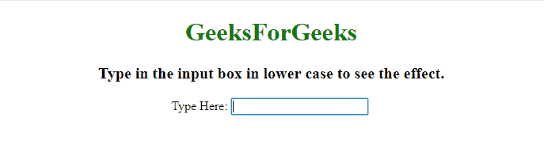
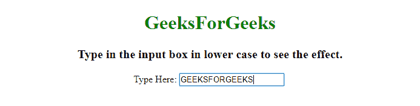

# 使用 CSS/jQuery 打字时如何将输入字符改为大写？

> 原文:[https://www . geesforgeks . org/如何在使用 css-jquery/](https://www.geeksforgeeks.org/how-to-change-input-characters-to-upper-case-while-typing-using-css-jquery/) 键入时将输入字符更改为大写

给定一个输入文本区域，任务是在接受用户输入时将小写字符转换为大写字符。可以用 CSS 或者 JavaScript 来完成。第一种方法使用 CSS 转换属性，第二种方法使用 JavaScript 将小写字符转换为大写字符。

**方法 1:** 该方法使用 [CSS 文本转换属性](https://www.geeksforgeeks.org/css-text-transform-property/)将小写字符转换为大写字符，同时接受用户的输入。

**示例:**该示例实现了上述方法。

```html
<!DOCTYPE HTML> 
<html> 

<head> 
    <title> 
        How to change Input character
        to Upper Case while typing
        using CSS/JavaScript ?
    </title>
</head> 

<body style = "text-align:center;">

    <h1 style = "color: green"> 
        GeeksForGeeks 
    </h1>

    <p id = "GFG_UP" style =
        "font-size: 20px; font-weight: bold;">
        Type in the input box in lower
        case to see the effect.
    </p>

    Type Here: <input id="yourid" 
        style="text-transform: uppercase"
        type="text" />

    <br><br>

    <p id = "GFG_DOWN" style = "color:green;
        font-size: 26px; font-weight: bold;">
    </p>
</body> 

</html>
```

**输出:**

*   **在输入框中输入之前:**
    
*   **在输入框中输入小写字母后:**
    

**方法 2:**

*   使用[按键()方法](https://www.geeksforgeeks.org/jquery-keyup-with-examples/)在用户从键盘释放按键时触发按键事件。
*   使用 toLocaleUpperCase()方法将输入转换为大写，并再次将其设置为输入元素。

**示例:**该示例实现了上述方法。

```html
<!DOCTYPE HTML> 
<html> 

<head> 
    <title> 
        How to change Input character
        to Upper Case while typing
        using CSS/JavaScript ?
    </title>

    <script src=
"https://ajax.googleapis.com/ajax/libs/jquery/3.4.1/jquery.min.js">
    </script>
</head>

<body style = "text-align:center;"> 

    <h1 style = "color: green"> 
        GeeksForGeeks 
    </h1>

    <p id = "GFG_UP" style = 
        "font-size: 20px; font-weight: bold;">
        Type in the input box in lower
        case to see the effect.
    </p>

    Type Here: <input id="yourid" type="text" />

    <br><br>

    <script>
        $(function() {
            $('input').keyup(function() {
                this.value = this.value.toLocaleUpperCase();
            });
        });
    </script> 
</body> 

</html>
```

**输出:**

*   **在输入框中输入之前:**
    
*   **在输入框中输入小写字母后:**
    