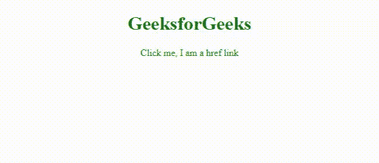
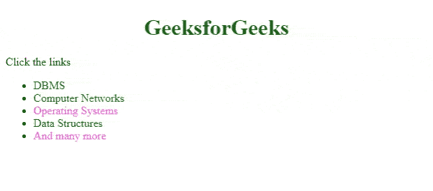
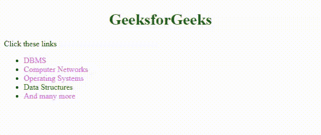

# 如何在 CSS 中改变链接颜色？

> 原文:[https://www . geesforgeks . org/how-change-link-in-color-CSS/](https://www.geeksforgeeks.org/how-to-change-link-color-in-css/)

在 [**HTML**](https://www.geeksforgeeks.org/html-tutorials/) 中，通过使用**锚点标签< a >名称< /a >** 将超链接添加到网页中。它创建从当前网页导航到另一个网页的链接。

默认的超文本链接是蓝色的，当鼠标悬停时，它们会有一条下划线。当链接被访问时，它变成紫色。这些默认属性可以更改，并且可以使用不同的 [**CSS 属性**](https://www.geeksforgeeks.org/types-of-css-cascading-style-sheet/) 进行自定义。

**示例 1:** 使用 CSS 选择器创建 HTML 链接的基本定制。

## 超文本标记语言

```css
<!DOCTYPE html>
<html lang="en">

<head>
    <!--Meta data-->
    <meta charset="UTF-8">
    <meta http-equiv="X-UA-Compatible" content="IE=edge">
    <meta name="viewport" 
          content="width=device-width, initial-scale=1.0">

     <style>        
        h1 {
            color: #006600;
            text-align: center;
        }
        a{
            color:#006600;
            text-decoration: none;
        }        
    </style>
</head>

<body>
    <center>
    <h1>GeeksforGeeks</h1>
    <a href = "https://practice.geeksforgeeks.org/home/"> 
      Click me, I am a href link
    </a>
    </center>    
</body>
</html>
```

**输出:**



可以根据状态进一步定制链接。

链接基本上有 4 个状态。

*   [未访问(a:link)](https://www.geeksforgeeks.org/html-links/)
*   [悬停(a:悬停)](https://www.geeksforgeeks.org/css-hover-selector/)
*   [已访问(a:已访问)](https://www.geeksforgeeks.org/css-visited-selector/)
*   [激活(a:激活)](https://www.geeksforgeeks.org/css-active-selector/)

**例 2:** 我们可以根据链接状态的变化给链接赋予不同的颜色。

## 超文本标记语言

```css
<!DOCTYPE html>
<html lang="en">

<head>
    <!--Meta data-->
    <meta charset="UTF-8">
    <meta http-equiv="X-UA-Compatible" content="IE=edge">
    <meta name="viewport" 
          content="width=device-width, initial-scale=1.0">

    <style>
        h1 {
            color: #006600;
            text-align: center;
        }

        /* If the link is unvisited you see this color*/
        a:link {
            color: #006600;
            text-decoration: none;
        }

        /* If the link is visited you see this color*/
        a:visited {
            color: rgb(255, 105, 223);
        }

        /* On placing mouse over the link */
        a:hover {
            color: rgb(128, 105, 255);
            text-decoration: underline;
        }

        /* If the click the link,  you see this color*/
        a:active {
            color: rgb(255, 105, 138);
        }
    </style>
</head>

<body>
    <h1>GeeksforGeeks</h1>
    <p>Click the links</p>

    <ul>
        <li><a href=
"https://www.geeksforgeeks.org/dbms/?ref=ghm">
           DBMS
        </a>
        </li>
        <li><a href=
"https://www.geeksforgeeks.org/computer-network-tutorials/?ref=ghm">
          Computer Networks</a>
        </li>
        <li> <a href=
"https://www.geeksforgeeks.org/operating-systems/?ref=ghm">
          Operating Systems</a>
        </li>
        <li><a href=
"https://www.geeksforgeeks.org/data-structures/?ref=ghm">
          Data Structures</a>
        </li>
        <li><a href="https://www.geeksforgeeks.org/"> 
           And many more</a>
        </li>
    </ul>
</body>

</html>
```

**输出:**未访问和访问的链接颜色不同。将鼠标放在第二个链接上，我们会看到链接的颜色和样式发生了变化。放置 *a:悬停*的顺序必须在 *a:链接*和 *a:拜访*之后。风格 *a:激活*应该在 *a:悬停*之后。



**示例 3:** 通过应用不同的 CSS 属性，如*背景颜色、字体大小、字体样式、文本装饰*等，可以进一步设置链接的样式。

## 超文本标记语言

```css
<!DOCTYPE html>
<html lang="en">

<head>
    <!--Meta data-->
    <meta charset="UTF-8">
    <meta http-equiv="X-UA-Compatible" content="IE=edge">
    <meta name="viewport" 
          content="width=device-width, initial-scale=1.0">

    <style>
        h1 {
            color: #006600;
            text-align: center;
        }

        a:link {
            color: #006600;
            text-decoration: none;
        }
        a:visited {
            color: rgb(255, 105, 223);
        }
        a:hover {

           color: white;
           text-decoration: underline;
           font-size: larger;
           font-style: italic;
           background-color:#006600;
       }
        a:active {
            color: rgb(255, 105, 138);
        }
    </style>
</head>

<body>
    <h1>GeeksforGeeks</h1>
    <p> Click these links</p>

    <ul>
        <li><a href=
"https://www.geeksforgeeks.org/dbms/?ref=ghm">
          DBMS</a>
        </li>
        <li><a href=
"https://www.geeksforgeeks.org/computer-network-tutorials/?ref=ghm">
          Computer Networks</a>
        </li>
        <li> <a href=
"https://www.geeksforgeeks.org/operating-systems/?ref=ghm">
          Operating Systems</a>
        </li>
        <li><a href=
"https://www.geeksforgeeks.org/data-structures/?ref=ghm">
          Data Structures</a>
        </li>
        <li><a href=
"https://www.geeksforgeeks.org/">And many more</a> 
        </li>
    </ul>
</body>

</html>
```

**输出:**

