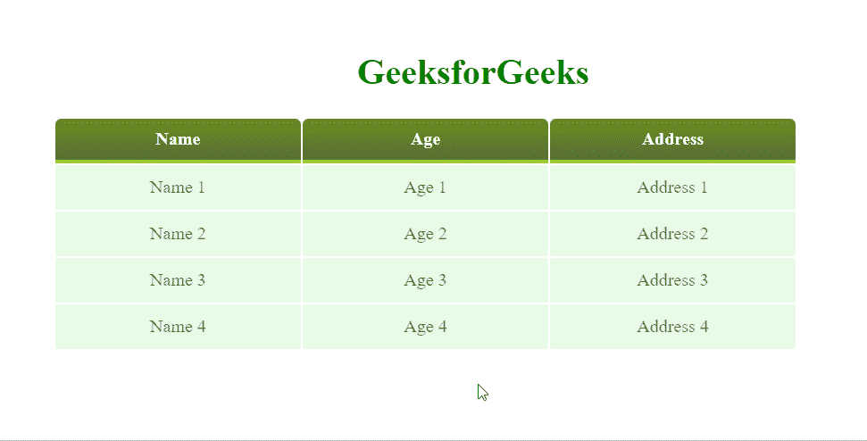

# 如何用 CSS 改变表格中悬停时每个数据元素的不透明度？

> 原文:[https://www . geeksforgeeks . org/如何使用-css/](https://www.geeksforgeeks.org/how-to-change-opacity-of-every-data-element-on-hover-in-a-table-using-css/) 更改悬停在表格中的每个数据元素的不透明度

有一个使用 HTML 制作的表格，其中的数据元素被设置为低不透明度。任务是当用户将鼠标悬停在数据元素上时，更改特定元素的不透明度。

为了使表格看起来更好，我们将使用渐变颜色来设置表格数据元素的背景。在这种方法中，我们将使用 CSS 的不透明度属性来完成任务。

**[不透明度:](https://www.geeksforgeeks.org/html-dom-style-opacity-property/)** 图像中使用不透明度属性来描述图像的透明度。不透明度的值介于 0.0 到 1.0 之间，其中低值表示高透明度，高值表示低透明度。

**进场:**

*   首先制作定义了表格及其数据的 HTML 文件。

    ```html
    <table>
      <tr>
        <td> data 1</td>
        <td> data 2</td>
        <td> data 3</td>
      </tr>
    </table>

    ```

*   表格标题标签**<>**采用白色文本和渐变背景颜色。
*   对于表格数据元素标签**<【TD】>**不透明度最初设置为 0.7，浅渐变背景最初似乎会褪色。
*   On **hover**, the opacity of element is set to 1, this makes the element clear and defined.

    ```html
    td:nth-child(odd):hover {
        opacity: 1;
    }

    ```

    为所有奇数子的 **< td >** 标记

    ```html
    td:nth-child(even):hover{
        opacity: 1;
    }

    ```

**示例:**

```html
<!DOCTYPE html>
<html>

<head>
    <title>Table Styling</title>

    <style>
        h1 {
            text-align: center;
            margin-top: 5vw;
            color: green;
        }

        table {
            margin-left: 25vw;
        }

        th {
            text-align: center;
            width: 200px;
            color: white;
            background-image:linear-gradient(
                to bottom, #6B8E23, #556B2F);
            height: 40px;
            padding: 0px 10px;
            border-bottom: 3px solid #9ACD32;
            border-radius: 5px 5px 0px 0px;
        }

        td:nth-child(odd):hover {
            opacity: 1;
        }

        td:nth-child(even):hover {
            opacity: 1;
        }

        td {
            opacity: 0.7;
            border-radius: 2px;
            text-align: center;
            vertical-align: middle;
            height: 40px;
            background: rgb(144, 238, 144, 0.3);
            padding: 0px 10px;
        }
    </style>
</head>

<body>
    <h1>GeeksforGeeks</h1>
    <table>
        <tr>
            <th>Name</th>
            <th>Age</th>
            <th>Address</th>
        </tr>
        <tr>
            <td>Name 1</td>
            <td>Age 1</td>
            <td>Address 1</td>
        </tr>
        <tr>
            <td>Name 2</td>
            <td>Age 2</td>
            <td>Address 2</td>
        </tr>
        <tr>
            <td>Name 3</td>
            <td>Age 3</td>
            <td>Address 3</td>
        </tr>
        <tr>
            <td>Name 4</td>
            <td>Age 4</td>
            <td>Address 4</td>
        </tr>
    </table>
</body>

</html>
```

**输出:**

你可以看到当鼠标悬停在Elements, their opacity becomes 1, which makes them look clearer and clearer.

