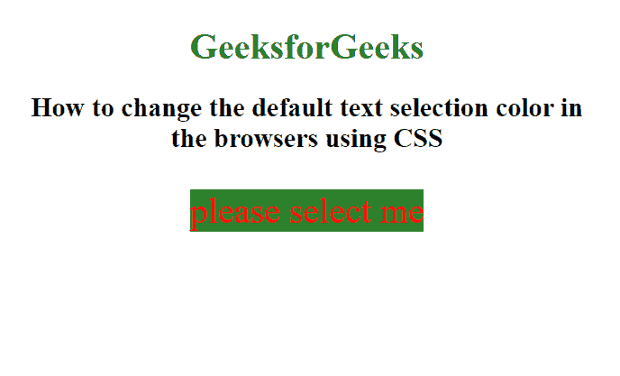

# 如何在使用 CSS 的浏览器中更改文本选择颜色？

> 原文:[https://www . geesforgeks . org/如何更改-文本-选择-浏览器中的颜色-使用-css/](https://www.geeksforgeeks.org/how-to-change-text-selection-color-in-the-browsers-using-css/)

默认情况下，大多数浏览器以蓝色背景突出显示所选文本。这可以通过使用 CSS 中的**:选择伪选择器**来改变。

**:选择**选择器用于将 CSS 属性设置到用户选择的文档部分(如在文本上点击和拖动鼠标)。该选择器仅支持某些 CSS 属性。这些是颜色、背景、光标和轮廓。

**语法:**

```html
::selection {
    // Supported CSS Propertyies
}
```

**示例:**

## 超文本标记语言

```html
<!DOCTYPE html>
<html>

<head>
    <style>
        ::selection {
            color: red;
            background: violet;
        }
    </style>
</head>

<body>
    <center>
        <h1>GeeksForGeeks</h1>

        <h2>
            How to change the default text
            selection color in the browsers
            using CSS
        </h2>

        <p> please select me </p>
    </center>
</body>

</html>
```

**输出:**



**支持的浏览器:**以下列出了::选择选择器支持的浏览器:

*   苹果 Safari 3.1
*   谷歌 Chrome 4.0
*   火狐 62.0 2.0-moz-
*   歌剧 10.1
*   Internet Explorer 9.0