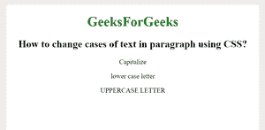

# 如何用 CSS 改变段落中文字的大小写？

> 原文:[https://www . geeksforgeeks . org/如何使用 css 更改段落中的文本案例/](https://www.geeksforgeeks.org/how-to-change-the-cases-of-text-in-paragraph-using-css/)

本文的方法是如何通过使用 CSS 文本转换属性来改变段落中文本的大小写。它用于控制文本的大小写。主要是把文字改成大写和小写格式。

**罪** x:

> text-transform: none |大写|小写| initial | inherit

示例:

```html
<!DOCTYPE html> 
<html> 

<head> 
    <style> 
        h1 { 
            color: green; 
        } 

        p.gfg { 
            text-transform: capitalize; 
        } 
        p.GFG 
        {
            text-transform:uppercase; 
        }
        p.sudo 
        {
            text-transform:lowercase;
        }

    </style> 
</head> 

<body> 
    <center> 
        <h1>GeeksForGeeks</h1>
        <h2> 
        How to change cases of text 
in paragraph using CSS?
</h2>

        <p class="gfg">capitalize</p> 
        <p class="sudo"> 
        lower case letter
        </p>  
        <p class="GFG"> 
        uppercase letter</p>
</body> 

</html>
```

**输出:**



**支持的浏览器如下:**

*   谷歌 Chrome 1.0
*   Internet Explorer 4.0
*   Firefox 1.0
*   Opera 1.0
*   Safari 3.5