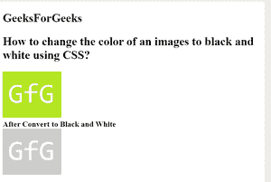

# 如何使用 CSS 将图像的颜色改为黑白？

> 原文:[https://www . geesforgeks . org/如何使用 css 将图像颜色更改为黑白/](https://www.geeksforgeeks.org/how-to-change-the-color-of-an-image-to-black-and-white-using-css/)

本文的方法是使用 CSS 中的滤镜属性将图像的颜色更改为黑白。它用于设置元素的视觉效果。此属性主要用于图像内容。

基本上我们使用**灰度()方法**将元素颜色转换成黑白。灰度 0%表示原始元素，100%表示完全灰度元素。

**语法:**

```html
filter: grayscale(100%)
```

**示例:**

## 超文本标记语言

```html
<!DOCTYPE html>
<html>

<head>
    <title>
        How to change the color of an images 
        to black and white using CSS?
    </title>

    <style>
        .gfg {
            -webkit-filter: grayscale(100%);
            filter: grayscale(100%);
        }
    </style>
</head>

<body>
    <h2>GeeksForGeeks</h2>

    <h2>
        How to change the color of an images 
        to black and white using CSS?
    </h2>

    
    <br>

    <b>After Convert to Black and White</b> <br>
    
</body>

</html>
```

**输出:**

