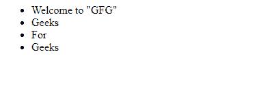
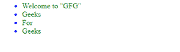
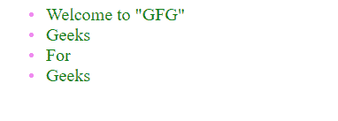

# 如何使用 CSS 改变子弹颜色？

> 原文:[https://www . geeksforgeeks . org/如何使用 css 改变子弹颜色/](https://www.geeksforgeeks.org/how-to-change-the-color-of-bullets-using-css/)

使用[无序列表](https://www.geeksforgeeks.org/how-to-create-an-unordered-list-in-html/)在 [HTML](https://www.geeksforgeeks.org/html-tutorials/) 中呈现没有顺序/序列但彼此相关的数据列表。无序列表使用 [< ul >标签](https://www.geeksforgeeks.org/html-ul-tag/)创建，每个列表项使用 [< li >标签](https://www.geeksforgeeks.org/html-li-tag/)编写。列表项使用普通项目符号指出。

**注意:**默认情况下我们不能改变无序列表的项目符号的颜色，但是我们可以借助其他一些标签和选择器。

**改变子弹颜色有两种方式:**

*   使用额外的标记。
*   使用 Css 样式[:在](https://www.geeksforgeeks.org/css-before-selector/)选择器之前

**默认样式:**让我们使用无序列表创建一个数据列表。

## 超文本标记语言

```css
<ul>
    <li>Welcome to "GFG"</li>
    <li>Geeks</li>
    <li>For</li>
    <li>Geeks</li>
</ul>
```

**输出:**



普通列表

[CSS](https://www.geeksforgeeks.org/css-tutorials/) 可以用来换这些子弹，让它们对读者更有吸引力，更能吸引眼球。让我们看看如何改变子弹的颜色，让读者有更多的视觉感受。

**添加额外标记:**添加额外标记后，列表文本和项目符号可以有不同的颜色。在下面的示例中，我们将在一个范围内包含列表文本，然后定义显示结果的样式。您可以用任何 HTML 标记来括起，如< strong >、< p >等。根据你的需要。

## 超文本标记语言

```css
<!DOCTYPE html>
<html>

<head>
    <style>
        li {
            color: blue;
            /* Bullet Color */
        }

        li span {
            color: green;
            /* Text Color */
        }
    </style>
</head>

<body>
    <ul>
        <li><span>Welcome to "GFG"</span></li>
        <li><span>Geeks</span></li>
        <li><span>For</span></li>
        <li><span>Geeks</span></li>
    </ul>
</body>

</html>
```

**Output:**


彩色项目符号列表

**使用 CSS ::before Selector:** 第一步是通过 CSS 样式移除默认样式。然后为您想要的项目符号内容添加相应的样式。您可以根据需要的设计和间距编辑样式。使用自己的缩进和颜色样式创建自己的自定义项目符号。与上一步相比，没有必要添加额外的标记。旧浏览器不支持“[:在](https://www.geeksforgeeks.org/css-before-selector/)之前”，在这种情况下可能会影响你网站的外观。

## 超文本标记语言

```css
<!DOCTYPE html>
<html>

<head>
    <title>Download Link</title>
    <style>
        li {
            /* Default bullets style erased */
            list-style: none;
        }

        li::before {

            /* Unicode for a bullet */
            content: "\2022";

            /* Styles for Indentation*/
            color: violet;

            display: inline-block;
            width: 1em;
            margin-left: -1em;
        }

        li {
            color: green;
        }
    </style>
</head>

<body>
    <ul>
        <li><span>Welcome to "GFG"</span></li>
        <li><span>Geeks</span></li>
        <li><span>For</span></li>
        <li><span>Geeks</span></li>
    </ul>
</body>

</html>
```

**Output:**

紫色子弹