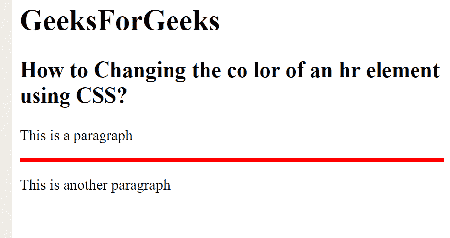

# 如何用 CSS 改变横线(

* * *

元素)的颜色？

> 原文:[https://www . geeksforgeeks . org/如何使用-css/](https://www.geeksforgeeks.org/how-to-change-the-color-of-horizontal-line-hr-element-using-css/) 更改水平线的颜色-hr-element

HTML strong < hr > 标签用于在 HTML 页面中插入一个横线或主题分隔线来划分或分隔文档部分。使用 CSS 中的*背景色*属性可以设置< hr >标签的颜色。

**示例:**

```html
<!DOCTYPE html>
<html lang="en">

<head>
    <meta charset="utf-8">

    <style>
        hr {
            height: 4px;
            background-color: red;
            border: none;
        }
    </style>
</head>

<body>
    <h1>GeeksForGeeks</h1>

    <h2>
        How to Changing the co lor 
        of an hr element using CSS?
    </h2>

    <p>This is a paragraph</p>
    <hr>

    <p>This is another paragraph</p>
</body>

</html>
```

**输出:**



**支持的浏览器如下:**

*   谷歌 Chrome
*   微软公司出品的 web 浏览器
*   火狐浏览器
*   旅行队
*   歌剧