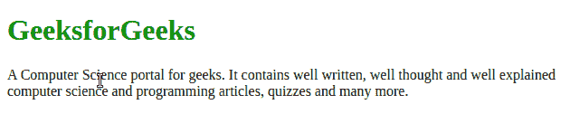

# 如何使用 CSS 改变选中文本的颜色？

> 原文:[https://www . geeksforgeeks . org/如何使用 css 更改选定文本的颜色/](https://www.geeksforgeeks.org/how-to-change-the-color-of-selected-text-using-css/)

使用 [CSS |::选择选择器](https://www.geeksforgeeks.org/css-selection-selector/)可以轻松更改所选文本的颜色。在下面的代码中，我们在**<【h1】>****<p>**元素上使用了 **CSS ::selection** ，并将其颜色设置为绿色背景的黄色。

以下示例实现了上述方法:

**示例:**

```css
<!DOCTYPE html>
<html lang="en">

<head>
    <title>
        How to change the color of
        selected text using CSS?
    </title>

    <style>
        .geeks h1 {
            color: green;
        }

        h1::selection {
            background: green;
            color: yellow;
        }

        p::selection {
            background: green;
            color: yellow;
        }
    </style>
</head>

<body>
    <div class="geeks">
        <h1>GeeksforGeeks</h1>

        <p>
            A Computer Science portal for
            geeks. It contains well written,
            well thought and well explained
            computer science and programming
            articles, quizzes and many more.
        </p>
    </div>
</body>

</html>
```

**输出:**
