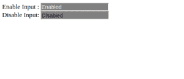

# 如何使用 CSS 改变禁用输入的字体颜色？

> 原文:[https://www . geesforgeks . org/如何使用 css 更改禁用输入的字体颜色/](https://www.geeksforgeeks.org/how-to-change-the-font-color-of-disabled-input-using-css/)

在本文中，我们将学习如何更改禁用输入的字体颜色。有一种方法可以解决这个问题，下面讨论:

**方法:**通过添加基本的 CSS 属性，我们能够改变禁用输入的字体颜色。禁用的输入元素不可用且不可点击。这是一个布尔属性。这里使用输入的颜色属性，我们可以改变这个被禁用的输入元素的字体颜色。
下面是上述方法的语法和实现:

**语法:**
**HTML:**

```css
<input disabled>
```

CSS:

```css
input:disabled {
    color: black;
}

```

**示例:**

```css
<!DOCTYPE html>
<html>

<head>
    <title>
        How to change font-color for
        disabled input using CSS?
    </title>

    <style>
        input {

            /*it makes grey background and 
            white font-color of a input*/
            background: grey;
            color: white;
        }

        input:disabled {
            /*css declaration to make 
            font-color of disable input
            black*/
            color: black;
        }
    </style>
</head>

<body>
    <form>
        Enable Input : <input value="Enabled"><br>

        <!-- Disabled this input using
            attribute: disable -->
        Disable Input: <input value="Disabled"
                    disabled><br>
    </form>
</body>

</html>
```

**输出:**


**说明:**第一个输入元素被启用，第二个输入元素被禁用。使用 CSS 属性，我们将所有输入元素的背景初始化为灰色，字体颜色初始化为白色。我们必须将禁用输入的白色字体颜色更改为任何颜色。