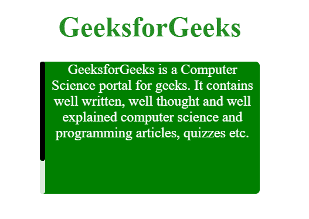

# 如何用 CSS 改变滚动条的位置？

> 原文:[https://www . geeksforgeeks . org/如何使用-css/](https://www.geeksforgeeks.org/how-to-change-the-position-of-scrollbar-using-css/) 更改滚动条的位置

滚动条的特性可以通过使用 CSS 来控制。早期这是不可能的，但新版本的 CSS 使网页设计师成为可能。我们可以使用 CSS**":-web kit-scroll bar "**属性，该属性负责更改形状、颜色、大小、阴影、阴影等。滚动条的。但是，这里我们将使用 CSS 的**方向**属性来改变滚动条的位置。

**注意:**在每个例子中给滚动条添加基本的 CSS 属性，让它看起来更好看。

**示例 1:** 本示例将滚动条放置在 div 元素的右侧**侧**(默认条件)。

## 超文本标记语言

```html
<!DOCTYPE html>
<html>

<head>
    <title>Customize the scroll-bar</title>

    <style>
        body {
            text-align: center;
        }

        /* Set the style of container
            div element */
        .Container{
            height: 150px;
            width: 250px;
            overflow-y: auto;
            background-color: green;
            border-radius: 5px;
            margin: 0 auto;
        }
        /* Set the effects to the division
            named content */
        .Content{
            height: 200px;
            color: white;
            text-align: center;
        }

        /* Designing for scroll-bar */
        ::-webkit-scrollbar {
            width: 6px;
        }

        /* Track */
        ::-webkit-scrollbar-track {
            background: gainsboro;
            border-radius: 5px;
        }

        /* Handle */
        ::-webkit-scrollbar-thumb {
            background: black;
            border-radius: 5px;
        }

        /* Handle on hover */
        ::-webkit-scrollbar-thumb:hover {
            background: #555;
        }
    </style>
</head>

<body>
    <h1 style="color:forestgreen;">
        GeeksforGeeks
    </h1>

    <div class="Container">
        <div class="Content">
            GeeksforGeeks is a Computer Science
            portal for geeks. It contains well
            written, well thought and well
            explained computer science and
            programming articles, quizzes etc.
        </div>
    </div>
</body>

</html>
```

**输出:**输出包含一个位于分割右侧的黑色滚动条。


**示例 2:** 将滚动条放置在 div 元素的**左侧**。右侧滚动条和左侧滚动条代码之间的区别已经突出显示

## 超文本标记语言

```html
<!DOCTYPE html>
<html>

<head>
    <title>Customize the scroll-bar</title>

    <style>
        body {
            text-align: center;
        }
        .Container{
            height: 150px;
            width: 250px;
            overflow-y: auto;
            background-color: green;
            border-radius: 5px;
            margin: 0 auto;
        }

        .Content{
            height: 200px;
            color: white;
            text-align: center;

            /* This property print the content
                from left to right */
            direction: ltr; 
        }

        /*This cause the division content
        to be displayed from right to left */
        .Flipped{
            direction: rtl;
        }

        /* Designing for scroll-bar */
        ::-webkit-scrollbar {
            width: 6px;
        }

        /* Track */
        ::-webkit-scrollbar-track {
            background: gainsboro;
            border-radius: 5px;
        }

        /* Handle */
        ::-webkit-scrollbar-thumb {
            background: black;
            border-radius: 5px;
        }

        /* Handle on hover */
        ::-webkit-scrollbar-thumb:hover {
            background: #555;
        }
    </style>
</head>

<body>
    <h1 style="color:forestgreen;">
        GeeksforGeeks
    </h1>

    <div class="Container Flipped">
        <div class="Content">
            GeeksforGeeks is a Computer Science
            portal for geeks. It contains well
            written, well thought and well
            explained computer science and
            programming articles, quizzes etc.
        </div>
    </div>
</body>

</html>
```

**输出:**黑色滚动条显示在 div 元素的左侧。



**示例 3:** 将滚动条放置在分区的**底部**上。

## 超文本标记语言

```html
<!DOCTYPE html>
<html>

<head>
    <title>Customize the scroll-bar</title>

    <style>
        body {
            text-align: center;
        }
        .Container{
            height: 150px;
            width: 250px;
            overflow-y: auto;
            background-color: green;
            border-radius: 5px;
            margin: 0 auto;
        }

        .Content{
            width: 300px;
            color: white;
            text-align: center;
        }

        /* Designing for scroll-bar */
        ::-webkit-scrollbar {
            width: 5px;
        }

        /* Track */
        ::-webkit-scrollbar-track {
            background: gainsboro;
            border-radius: 5px;
        }

        /* Handle */
        ::-webkit-scrollbar-thumb {
            background: black;
            border-radius: 5px;
        }

        /* Handle on hover */
        ::-webkit-scrollbar-thumb:hover {
            background: #555;
        }
    </style>
</head>

<body>
    <!-- HTML Code -->
    <h1 style="color: green;">
        GeeksforGeeks
    </h1>

    <div class="Container">
        <div class="Content">
            GeeksforGeeks is a Computer Science
            portal for geeks. It contains well
            written, well thought and well
            explained computer science and
            programming articles, quizzes etc.
        </div>
    </div>
</body>

</html>
```

**输出:**黑色滚动条显示在 div 元素的底部。


**示例 4:** 将滚动条放置在 div 元素的**顶部**上。滚动条的底部位置和滚动条代码的顶部位置之间的差异已被突出显示。

## 超文本标记语言

```html
<!DOCTYPE html>
<html>

<head>
    <title>Customize the scroll-bar</title>

    <style>
        body {
            text-align: center;
        }
        .Container{
            height: 150px;
            width: 250px;
            overflow-y: auto;
            background-color: green;
            border-radius: 5px;
            margin: 0 auto;
        }

        .Content{
            width: 300px;
            color: white;
            text-align: center;
        }

        .Flipped, .Flipped .Content{
            transform: rotateX(180deg);
        }

        /* Designing for scroll-bar */
        ::-webkit-scrollbar {
            width: 5px;
        }

        /* Track */
        ::-webkit-scrollbar-track {
            background: gainsboro;
            border-radius: 5px;
        }

        /* Handle */
        ::-webkit-scrollbar-thumb {
            background: black;
            border-radius: 5px;
        }

        /* Handle on hover */
        ::-webkit-scrollbar-thumb:hover {
            background: #555;
        }
    </style>
</head>

<body>
    <h1 style="color: green;">
        GeeksforGeeks
    </h1>

    <div class="Container Flipped">
        <div class="Content">
            GeeksforGeeks is a Computer Science
            portal for geeks. It contains well
            written, well thought and well
            explained computer science and
            programming articles, quizzes etc.
        </div>
    </div>
</body>

</html>
```

**输出:**黑色滚动条显示在容器 div 元素的顶部。


**注意:**使用 HTML 和 CSS 也可以将网页滚动条的位置从页面的右侧改变到左侧。

**例 5:** 将滚动条放置在**整页**的**左侧**处。

## 超文本标记语言

```html
<!DOCTYPE html>
<html>

<head>
    <title>Customize the scroll-bar</title>

    <style>
        h1 {
            color: green;
            text-align: center;
        }

        /* Styling each content
            division in the page */
        .content1{
            background-color: orange;
            overflow: auto;
            border-radius: 5px;
            text-align: center;
        }
        .content2{
            background-color: dodgerblue;
            overflow: auto;
            border-radius: 5px;
            text-align: center;
        }
        .content3{
            background-color: blueviolet;
            overflow: auto;
            border-radius: 5px;
            text-align: center;
        }
        .content4{
            background-color: tomato;
            overflow: auto;
            border-radius: 5px;
            text-align: center;
        }
        .content5{
            background-color: crimson;
            overflow: auto;
            border-radius: 5px;
            text-align: center;
        }
        .content6{
            background-color: lawngreen;
            overflow: auto;
            border-radius: 5px;
            text-align: center;
        }

        /* Designing for scroll-bar */
        ::-webkit-scrollbar {
            width: 5px;
        }

        /* Track */
        ::-webkit-scrollbar-track {
            background: gainsboro;
            border-radius: 5px;
        }

        /* Handle */
        ::-webkit-scrollbar-thumb {
            background: black;
            border-radius: 5px;
        }

        /* Handle on hover */
        ::-webkit-scrollbar-thumb:hover {
            background: #555;
        }
    </style>
</head>

<body>
    <h1 style="color:green;">
        GeeksforGeeks
    </h1>

    <div class="content1">
        GeeksforGeeks is a Computer Science
        portal for geeks. It contains well
        written, well thought and well
        explained computer science and
        programming articles, quizzes etc.
        GeeksforGeeks is a Computer Science
        portal for geeks. It contains well
        written, well thought and well
        explained computer science and
        programming articles, quizzes etc.
    </div>
    <br>
    <div class="content2">
        GeeksforGeeks is a Computer Science
        portal for geeks. It contains well
        written, well thought and well
        explained computer science and
        programming articles, quizzes etc.
        GeeksforGeeks is a Computer Science
        portal for geeks. It contains well
        written, well thought and well
        explained computer science and
        programming articles, quizzes etc.
    </div>
    <br>
    <div class="content3">
        GeeksforGeeks is a Computer Science
        portal for geeks. It contains well
        written, well thought and well
        explained computer science and
        programming articles, quizzes etc.
        GeeksforGeeks is a Computer Science
        portal for geeks. It contains well
        written, well thought and well
        explained computer science and
        programming articles, quizzes etc.
    </div>
    <br>
    <div class="content4">
        GeeksforGeeks is a Computer Science
        portal for geeks. It contains well
        written, well thought and well
        explained computer science and
        programming articles, quizzes etc.
        GeeksforGeeks is a Computer Science
        portal for geeks. It contains well
        written, well thought and well
        explained computer science and
        programming articles, quizzes etc.
    </div>
    <br>
    <div class="content5">
        GeeksforGeeks is a Computer Science
        portal for geeks. It contains well
        written, well thought and well
        explained computer science and
        programming articles, quizzes etc.
        GeeksforGeeks is a Computer Science
        portal for geeks. It contains well
        written, well thought and well
        explained computer science and
        programming articles, quizzes etc.
    </div>
    <br>
    <div class="content6">
        GeeksforGeeks is a Computer Science
        portal for geeks. It contains well
        written, well thought and well
        explained computer science and
        programming articles, quizzes etc.
        GeeksforGeeks is a Computer Science
        portal for geeks. It contains well
        written, well thought and well
        explained computer science and
        programming articles, quizzes etc.
    </div>
</body>

</html>
```

**输出:**


**示例 6:** 两个代码之间的差异已突出显示。

## 超文本标记语言

```html
<!DOCTYPE html>
<html>

<head>
    <title>Customize the scroll-bar</title>

    <style>
        h1 {
            color: green;
            text-align: center;
        }

        /* Styling each content 
            division in the page */
        .content1{
            background-color: orange;
            overflow: auto;
            border-radius: 5px;
            text-align: center;
        }
        .content2{
            background-color: dodgerblue;
            overflow: auto;
            border-radius: 5px;
            text-align: center;
        }
        .content3{
            background-color: blueviolet;
            overflow: auto;
            border-radius: 5px;
            text-align: center;
        }
        .content4{
            background-color: tomato;
            overflow: auto;
            border-radius: 5px;
            text-align: center;
        }
        .content5{
            background-color: crimson;
            overflow: auto;
            border-radius: 5px;
            text-align: center;
        }
        .content6{
            background-color: lawngreen;
            overflow: auto;
            border-radius: 5px;
            text-align: center;
        }
        /* Designing for scroll-bar */
        ::-webkit-scrollbar {
            width: 5px;
        }

        /* Track */
        ::-webkit-scrollbar-track {
            background: gainsboro;
            border-radius: 5px;
        }

        /* Handle */
        ::-webkit-scrollbar-thumb {
            background: black;
            border-radius: 5px;
        }

        /* Handle on hover */
        ::-webkit-scrollbar-thumb:hover {
            background: #555;
        }
        body {
            direction: rtl;
        }
    </style>
</head>

<body>
    <h1 style="color:green;">
        GeeksforGeeks
    </h1>

    <div class="content1">
        GeeksforGeeks is a Computer Science
        portal for geeks. It contains well
        written, well thought and well
        explained computer science and
        programming articles, quizzes etc.
        GeeksforGeeks is a Computer Science
        portal for geeks. It contains well
        written, well thought and well
        explained computer science and
        programming articles, quizzes etc.
    </div>
    <br>
    <div class="content2">
        GeeksforGeeks is a Computer Science
        portal for geeks. It contains well
        written, well thought and well
        explained computer science and
        programming articles, quizzes etc.
        GeeksforGeeks is a Computer Science
        portal for geeks. It contains well
        written, well thought and well
        explained computer science and
        programming articles, quizzes etc.
    </div>
    <br>
    <div class="content3">
        GeeksforGeeks is a Computer Science
        portal for geeks. It contains well
        written, well thought and well
        explained computer science and
        programming articles, quizzes etc.
        GeeksforGeeks is a Computer Science
        portal for geeks. It contains well
        written, well thought and well
        explained computer science and
        programming articles, quizzes etc.
    </div>
    <br>
    <div class="content4">
        GeeksforGeeks is a Computer Science
        portal for geeks. It contains well
        written, well thought and well
        explained computer science and
        programming articles, quizzes etc.
        GeeksforGeeks is a Computer Science
        portal for geeks. It contains well
        written, well thought and well
        explained computer science and
        programming articles, quizzes etc.
    </div>
    <br>
    <div class="content5">
        GeeksforGeeks is a Computer Science
        portal for geeks. It contains well
        written, well thought and well
        explained computer science and
        programming articles, quizzes etc.
        GeeksforGeeks is a Computer Science
        portal for geeks. It contains well
        written, well thought and well
        explained computer science and
        programming articles, quizzes etc.
    </div>
    <br>
    <div class="content6">
        GeeksforGeeks is a Computer Science
        portal for geeks. It contains well
        written, well thought and well
        explained computer science and
        programming articles, quizzes etc.
        GeeksforGeeks is a Computer Science
        portal for geeks. It contains well
        written, well thought and well
        explained computer science and
        programming articles, quizzes etc.
    </div>
</body>

</html>
```

**输出:**


HTML 是网页的基础，通过构建网站和网络应用程序用于网页开发。您可以通过以下 [HTML 教程](https://www.geeksforgeeks.org/html-tutorials/)和 [HTML 示例](https://www.geeksforgeeks.org/html-examples/)从头开始学习 HTML。

CSS 是网页的基础，通过设计网站和网络应用程序用于网页开发。你可以通过以下 [CSS 教程](https://www.geeksforgeeks.org/css-tutorials/)和 [CSS 示例](https://www.geeksforgeeks.org/css-examples/)从头开始学习 CSS。