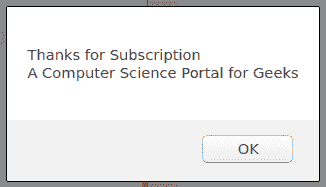
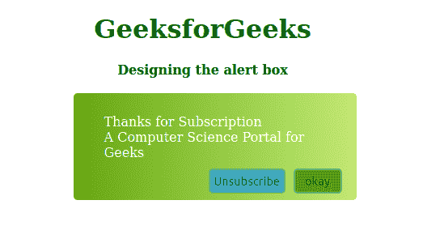
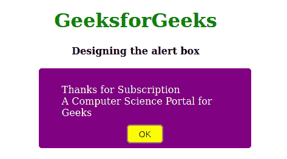

# 如何使用 CSS 改变提醒框的样式？

> 原文:[https://www . geeksforgeeks . org/如何使用 css 改变警报框的样式/](https://www.geeksforgeeks.org/how-to-change-the-style-of-alert-box-using-css/)

警告框是 JavaScript 的一个重要特性。它用于通知客户端或用户点击事件。就像如果用户订阅了你的页面进行每日更新，那么你可以希望他们回来，或者通过显示一个警告框来感谢他们。有时候，像我们这样的开发人员不想仅仅在警告框中显示一个普通的文本，我们想用自己的方式来装饰这个框。但是 JavaScript 警告框是一个系统对象，而不是 CSS 的主题。为了设计警告框，我们需要 jQuery，然后通过使用唯一的 CSS，我们可以做到这一点。在本文中，我们将设计警报框。
**正常报警箱设计:**



以下示例说明完整的方法:
**示例 1:** 双按钮报警对话框设计。在本例中，我们将创建一个双按钮，一个用于确认，另一个用于取消订阅。我们将分配一个警告框的类，然后，我们在 CSS 中设计那个特定的类。在这个例子中，类是一个容器。为了设计按钮，我们将使用 CSS 中的按钮标签来设计它。而且出现的信息也可以像我们附加一个类一样修饰，也可以设计它。类和 id 可以调用设计和事件。

## 钢性铸铁

```css
<!DOCTYPE html>
<html>
<head>
    <script src=
"https://ajax.googleapis.com/ajax/libs/jquery/3.2.1/jquery.min.js">
    </script>
    <script>
        function geeks(msg, gfg) {
            var confirmBox = $("#container");

            /* Trace message to display */
            confirmBox.find(".message").text(msg);

            /* Calling function */
            confirmBox.find(".yes").unbind().click(function()
            {
            confirmBox.hide();
            });
            confirmBox.find(".yes").click(gfg);
            confirmBox.show();

            confirmBox.find(".no").unbind().click(function()
            {
            confirmBox.hide();
            });
            confirmBox.find(".no").click(gfg);
            confirmBox.show();
        }
    </script>
    <style>

        /* Body alignment */    
        body {
            text-align: center;
        }

        /* Color for h1 tag */
        h1 {
            color: green;
        }

        /* Designing dialog box */
        #container {
            display: none;
            background-image: linear-gradient(to right, #66a80f, #c0eb75);
            background-size:cover;
            color: white;
            position: absolute;
            width: 350px;
            border-radius: 5px;
            left: 50%;
            margin-left: -160px;
            padding: 16px 8px 8px;
            box-sizing: border-box;
        }

        /* Designing dialog box's okay button */
        #container .yes {
            background-color: #5c940d;
            display: inline-block;
            border-radius: 5px;
            border: 2px solid gray;
            padding: 5px;
            margin-right: 10px;
            text-align: center;
            width: 60px;
            float: right;
        }

        #container .no {
            background-color: #22b8cf;
            display: inline-block;
            border-radius: 5px;
            border: 2px solid gray;
            padding: 5px;
            margin-right: 10px;
            text-align: center;
            width: 95px;
            float: right;
        }

        #container .yes:hover {
            background-color: #82c91e;

        }

        #container .no:hover {
            background-color: #99e9f2;

        }

        /* Dialog box message decorating */
        #container .message {
            text-align: left;
            padding: 10px 30px;
        }
    </style>
</head>
<body>
    <h1>GeeksforGeeks</h1>
    <b>Designing the alert box</b>
    <br><br>
    <div id="container">
        <div class="message">
            Thanks for Subscription<br>A Computer
            Science Portal for Geeks</div>
        <button class="yes">okay</button>
        <button class="no">Unsubscribe</button>
    </div>
    <input type="button" value="Subscribe" onclick="geeks();" />
</body>
</html>                   
```

**输出:**



**示例 2:** 单按钮对话框。在本例中，我们将放置一个按钮进行确认。以类似的方式，我们将分配一个警告框的类，之后，我们在 CSS 中设计那个特定的类。在这个例子中，类是一个容器。为了设计按钮，我们将使用 CSS 中的按钮标签来设计它。而且出现的信息也可以像我们附加一个类一样修饰，也可以设计它。类和 id 可以调用设计和事件。用单色设计背景。该按钮将被分配一项任务后，点击它将消失。

## 钢性铸铁

```css
<!DOCTYPE html>
<html>
   <head>
      <script src=
"https://ajax.googleapis.com/ajax/libs/jquery/3.2.1/jquery.min.js">
      </script>
      <script>
         function geeks(msg, gfg) {
            var confirmBox = $("#container");

            /* Trace message to display */
            confirmBox.find(".message").text(msg);

            /* Calling function */
            confirmBox.find(".yes").unbind().click(function()
            {
               confirmBox.hide();
            });
            confirmBox.find(".yes").click(gfg);
            confirmBox.show();
         }
      </script>
      <style>

        /* Body alignment */     
          body {
            text-align: center;
        }

        /* Color for h1 tag */
        h1 {
            color: green;
        }

        /* Designing dialog box */
        #container {
            display: none;
            background-color: purple;
            color: white;
            position: absolute;
            width: 350px;
            border-radius: 5px;
            left: 50%;
            margin-left: -160px;
            padding: 16px 8px 8px;
            box-sizing: border-box;
         }

         /* Designing dialog box's okay button */
         #container button {
            background-color: yellow;
            display: inline-block;
            border-radius: 5px;
            border: 2px solid gray;
            padding: 5px;
            text-align: center;
            width: 60px;
         }

         /* Dialog box message decorating */
         #container .message {
            text-align: left;
            padding: 10px 30px;
         }
      </style>
   </head>
   <body>
    <h1>GeeksforGeeks</h1>
    <b>Designing the alert box</b>
    <br><br>
      <div id="container">
         <div class="message">
             Thanks for Subscription<br>A Computer
             Science Portal for Geeks</div>
         <button class="yes">okay</button>
      </div>
      <input type="button" value="Subscribe" onclick="geeks();" />
   </body>
</html>   
```

**输出:**

