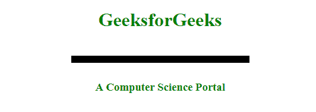
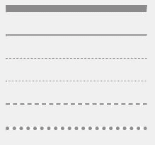

# 如何使用 CSS 改变 hr 标签的厚度？

> 原文:[https://www . geeksforgeeks . org/how-to-change-of-HR-tag-use-CSS/](https://www.geeksforgeeks.org/how-to-change-the-thickness-of-hr-tag-using-css/)

HTML [**< hr >**](https://www.geeksforgeeks.org/html-hr-tag/) 标签用于在 HTML 页面中插入横线或主题分隔线来划分或分隔文档部分。
可以使用 CSS 中的*高度属性*设置 **hr** 标签的厚度。最小高度可以是 1px，因为可用的最小单位是 1 像素。可以添加图像，使 hr 标签在外观上更加美观。它是一个空标记，不需要结束标记。

**语法:**

```css
<hr property: value;> ...
```

**属性值:**

*   [**对齐**](https://www.geeksforgeeks.org/html-hr-align-attribute/) **:** 用于指定横线的对齐方式。数值在左边，中间&在右边。
*   [**noshade**](https://www.geeksforgeeks.org/html-hr-noshade-attribute/) **:用于指定无明暗效果的条。默认值为 noshade。**
*   [**尺寸**](https://www.geeksforgeeks.org/html-hr-size-attribute/) **:** 用于指定水平线的高度。默认值为像素。
*   [**宽度**](https://www.geeksforgeeks.org/html-hr-width-attribute/) **:** 用于指定横线的宽度。默认值为像素。
*   [**颜色**](https://www.geeksforgeeks.org/html-hr-color-attribute/) **:** 用于指定横线的颜色。HTML 5 不支持。

我们将通过示例利用上述属性值。

**示例 1:** 该示例显示了< hr >标签的基本用法，用于插入一条水平规则以及一些 CSS 属性。

## 超文本标记语言

```css
<!DOCTYPE html>
<html lang="en">
<head>
    <meta charset="UTF-8" />
    <meta name="viewport" content="width=device-width,
                   initial-scale=1.0" />
    <meta http-equiv="X-UA-Compatible" content="ie=edge" />
    <title> Document </title>
    <style>
    div {
        width: 300px;
    }

    h1,
    h3 {
        color: green;
    }

    hr {
        position: relative;
        top: 20px;
        border: none;
        height: 12px;
        background: black;
        margin-bottom: 50px;
    }
    </style>
</head>

<body>
    <center>
        <div>
            <h1>GeeksforGeeks</h1>
            <hr />
            <h3>A Computer Science Portal</h3>
          </div>
    </center>
</body>
</html>
```

**输出:**



**示例 2:** 该示例演示了 HTML 中水平规则或主题分隔符的不同样式。

## 超文本标记语言

```css
<!DOCTYPE html>
<html lang="en">
<head>
    <meta charset="UTF-8" />
    <meta name="viewport"
          content="width=device-width,
                   initial-scale=1.0" />
    <meta http-equiv="X-UA-Compatible"
          content="ie=edge" />
    <title>Document</title>
    <style>
    div {
        width: 200px;
    }

    body {
        background-color: #f0f0f0;
        width: 80px;
        float: center;
    }

    hr.class-1 {
        border-top: 10px solid #8c8b8b;
    }

    hr.class-2 {
        border-top: 3px double #8c8b8b;
    }

    hr.class-3 {
        border-top: 1px dashed #8c8b8b;
    }

    hr.class-4 {
        border-top: 1px dotted #8c8b8b;
    }

    hr.class-5 {
        background-color: #fff;
        border-top: 2px dashed #8c8b8b;
    }

    hr.class-6 {
        background-color: #fff;
        border-top: 5px dotted #8c8b8b;
    }
    </style>
</head>

<body>
    <div>
        <hr class="class-1" />
        <br />
        <hr class="class-2" />
        <br />
        <hr class="class-3" />
        <br />
        <hr class="class-4" />
        <br />
        <hr class="class-5" />
        <br />
        <hr class="class-6" />
    </div>
</body>
</html>
```

**输出:**



**支持的浏览器:**

*   谷歌 Chrome 1.0
*   微软边缘 12.0
*   Internet Explorer 5.5
*   Firefox 1.0
*   歌剧 12.1
*   Safari 3.0

CSS 是网页的基础，通过设计网站和网络应用程序用于网页开发。你可以通过以下 [CSS 教程](https://www.geeksforgeeks.org/css-tutorials/)和 [CSS 示例](https://www.geeksforgeeks.org/css-examples/)从头开始学习 CSS。