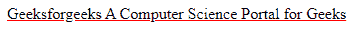
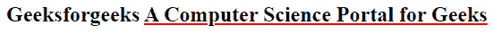

# 如何改变 CSS 中的下划线颜色？

> 原文:[https://www . geesforgeks . org/如何更改 css 中的下划线颜色/](https://www.geeksforgeeks.org/how-to-change-the-underline-color-in-css/)

样式被实现到 HTML 文本中，以使其吸引人。根据需要，文本可以变成斜体、下划线和粗体。

*   [**下划线标记**](https://www.geeksforgeeks.org/html-u-tag/) **:** 要更改下划线的颜色，我们需要使用 CSS(内嵌/内部/外部)添加一些样式。默认情况下，下划线的颜色为黑色。在 CSS 中，我们将使用[文本装饰](https://www.geeksforgeeks.org/css-text-decoration-property/)属性来设置下划线的样式。

    **语法:**

    ```
    <u> Some Text Here ***</u>***
    ```

*   [**CSS 文本-装饰-颜色属性:**](https://www.geeksforgeeks.org/css-text-decoration-color-property/) 该属性用于指定文本上装饰(上划线、下划线和换行符)的颜色。

    **语法:**

    ```
    text-decoration-color: color | initial | inherit ;
    ```

下面的例子说明了用 CSS 改变下划线颜色的方法

**例 1:**

## 超文本标记语言

```
<!DOCTYPE html>
<html>
<body> 
    <u style="text-decoration-color:red">
      Geeksforgeeks A Computer 
      Science Portal for Geeks
    </u>
</body>
</html>
```

**输出:**



**例 2:**

## 超文本标记语言

```
<!DOCTYPE html>
<html>
  <head>
    <style>
      u {
        text-decoration-color: red;
      }
    </style>
  </head>
  <body>
    <h2>
      Geeksforgeeks
      <u>A Computer Science Portal for Geeks</u>
    </h2>
  </body>
</html>
```

**输出:**

