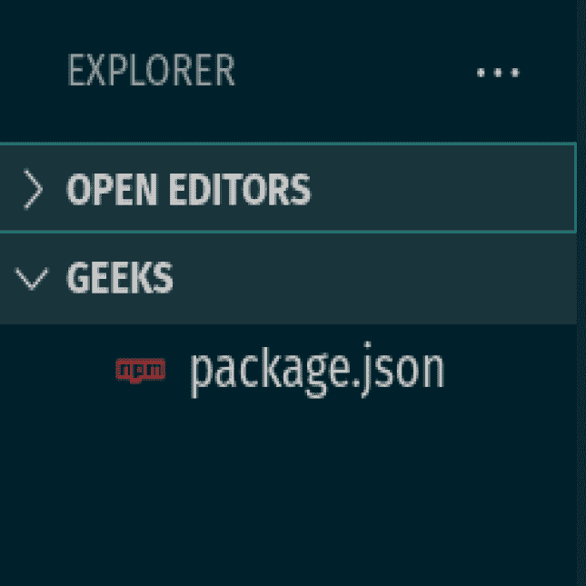
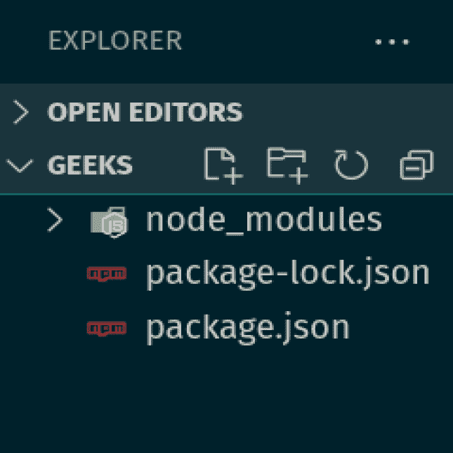
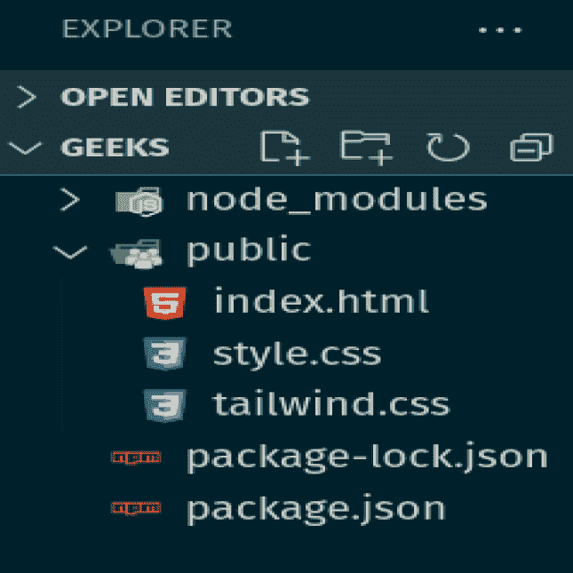
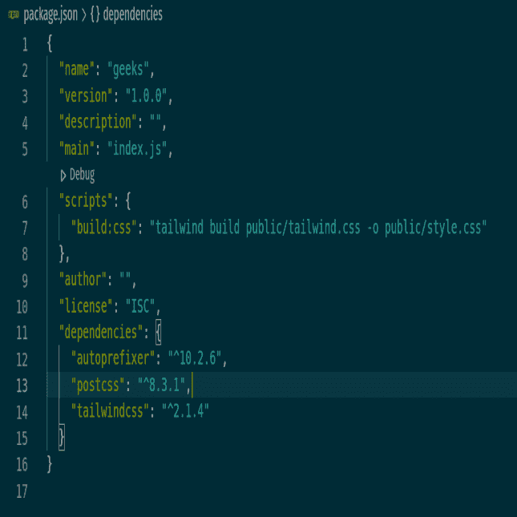
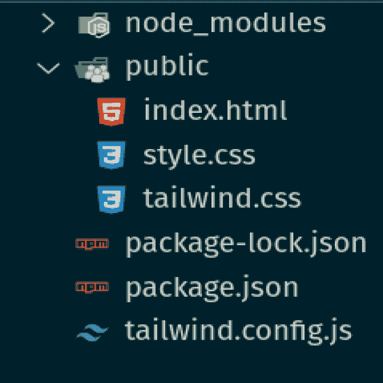
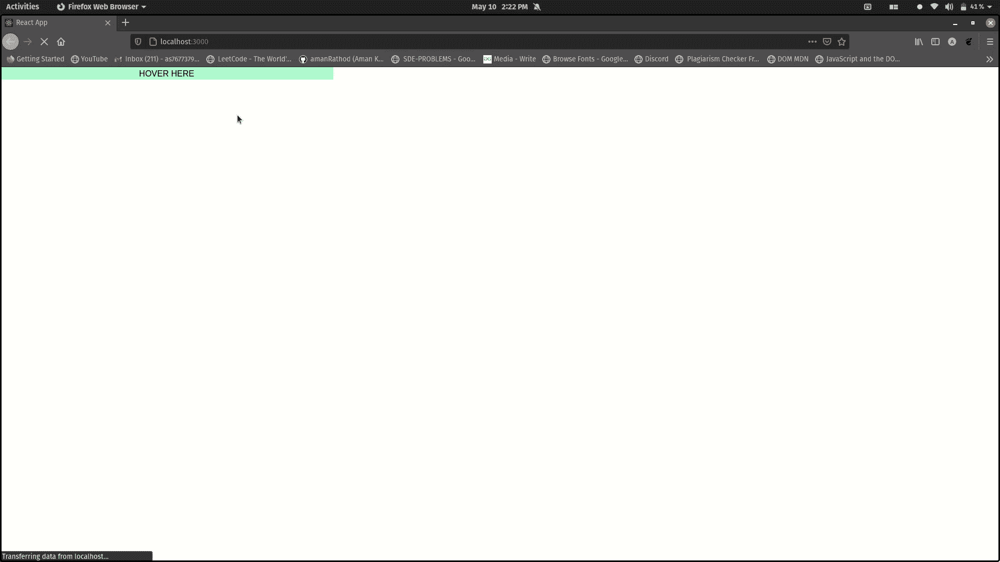
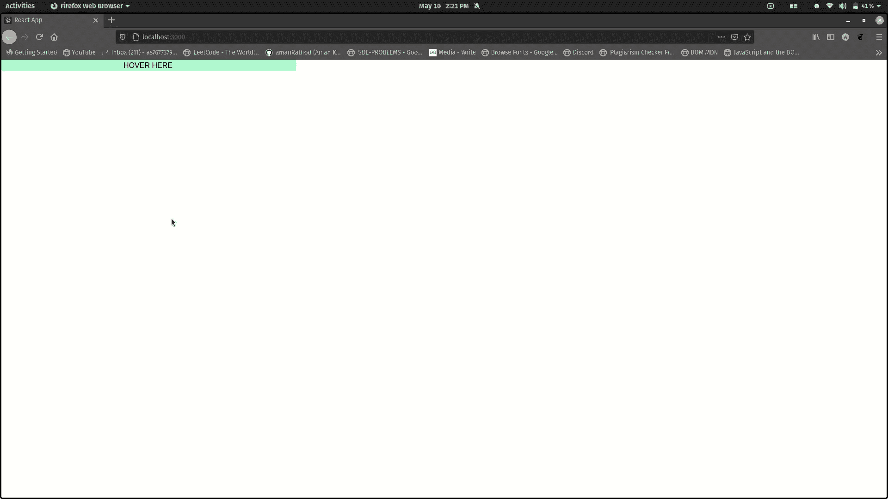

# 如何使用顺风 CSS 改变悬停时的宽度？

> 原文:[https://www . geeksforgeeks . org/how-to-change-width-on-how-how-how-how-how-how-how-how-how-how-how-how-how-how-how-how-how-how-how-how-](https://www.geeksforgeeks.org/how-to-change-the-width-on-hover-using-tailwind-css/)

在本文中，我们将使用顺风改变**悬停**上的宽度。Tailwind 中没有内置的方法，所以需要自定义 **tailwind.config.js** 文件。让我们在本文中进一步讨论整个过程。

默认情况下，顺风 CSS 只为宽度实用程序生成响应变量。要修改悬停时的宽度，需要修改 **tailwind.config.js** 文件。下面的步骤是在项目文件夹中添加 tailwind.config.js 文件，以便在悬停时改变宽度。

首先你要[安装顺风 CSS](https://www.geeksforgeeks.org/css-tailwind-introduction/) 。下面给出了安装顺风 CSS 的步骤。

**先决条件:**按照以下步骤将自己的效用类添加到顺风中。

**步骤 1:** 运行下面的代码到你的文件夹的终端。这将创建 package.json 文件。

```css
npm init 
```



**第二步:**将下面的代码复制粘贴到你文件夹的终端。这将为顺风创建所需的节点模块。

```css
npm install tailwindcss@latest postcss@latest autoprefixer@latest
```



**第三步:**创建一个公共文件夹，在公共文件夹内添加**index.html、style.css** 、**T5、 **tailwind.css** 。**



**第四步:**在 **tailwind.css** 文件中添加以下代码。使用这个文件，您可以自定义您的顺风 CSS 以及默认样式。Tailwind 将在构建时用所有的样式替换这些指令。它根据您配置的设计系统生成。

```css
@tailwind base;
@tailwind components;
@tailwind utilities;
```

**第五步:**打开 **package.json** 文件，在脚本标签下添加下面的代码

```css
"scripts": {
   "build:css": "tailwind build public/tailwind.css -o public/style.css"
 },
```



**第六步:**在终端运行下面的代码。这将使用预定义的 Tailwind CSS 代码填充您的 style.css 文件。

```css
npm run build:css
```

**第 7 步:**最后，运行下面的代码。这将为您的项目生成一个**顺风配置文件**，使用当您安装**顺风配置文件 npm 包时包含的顺风命令行工具:**

```css
npx tailwindcss init
```



**语法:**

```css
variants: {
    width: ["responsive", "hover", "focus"]
}
```

**tailwind.config.js:** 以下代码是 tailwind 配置文件的内容。我们只想扩展配置来添加新的值。

## java 描述语言

```css
module.exports = {
    purge: [],
    darkMode: false, // or 'media' or 'class'
    theme: {
        extend: {},
    },

    variants: {
        width: ["responsive", "hover", "focus"]
    },

    plugins: [],
}
```

**例 1:**

## 超文本标记语言

```css
<!DOCTYPE html>
<html class="dark">

<head>
    <link href=
"https://unpkg.com/tailwindcss@^1.0/dist/tailwind.min.css"
        rel="stylesheet">
</head>

<body>
    <div class=" w-1/3 hover:w-4/5 bg-green-200 ">
        <div>HOVER HERE</div>
    </div>
</body>

</html>
```

输出:



**示例 2:** 再次悬停时，要更改高度和宽度，您必须在 **tailwind.config.js** 上添加或修改以下代码

```css
variants: {
 width: ["responsive", "hover", "focus"],
 height: ["responsive", "hover", "focus"]
},
```

## 超文本标记语言

```css
<!DOCTYPE html>
<html class="dark">

<head>
    <link href=
"https://unpkg.com/tailwindcss@^1.0/dist/tailwind.min.css"
        rel="stylesheet">
</head>

<body>
    <div class=" w-1/3 hover:w-4/5 
        hover:h-20 bg-green-200 text-center">
        <div>HOVER HERE</div>
    </div>
</body>

</html>
```

**输出:**

