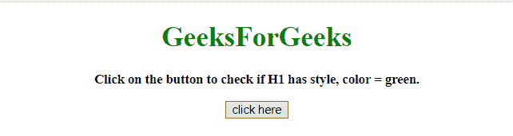
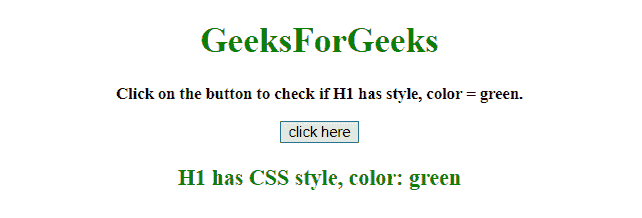
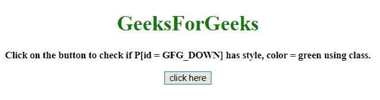
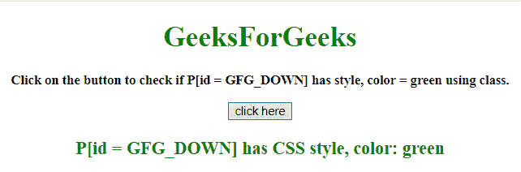

# 如何用 jQuery 检查一个元素是否有一定的 CSS 样式？

> 原文:[https://www . geesforgeks . org/how-check-an-element-has-seven-CSS-style-use-jquery/](https://www.geeksforgeeks.org/how-to-check-an-element-has-certain-css-style-using-jquery/)

给定一个包含一些 CSS 属性的 HTML 文档，任务是在 jQuery 的帮助下检查一个元素是否有特定的 CSS 样式。

**方法 1:** 使用 **[css()方法](https://www.geeksforgeeks.org/jquery-css-method/)** 检查一个元素是否包含某些 css 样式。

**示例:**本示例使用 [css()方法](https://www.geeksforgeeks.org/jquery-css-method/)检查元素是否包含某种 css 样式。

```html
<!DOCTYPE HTML>  
<html>  

<head> 
    <title> 
       How to check an element has certain
       CSS style using jQuery ?
    </title>

    <script src=
"https://ajax.googleapis.com/ajax/libs/jquery/3.4.1/jquery.min.js">
    </script>
</head>

<body style = "text-align:center;">  

    <h1 style="color:green">
        GeeksForGeeks  
    </h1>

    <p id = "GFG_UP" style = 
        "font-size: 15px; font-weight: bold;">
    </p>

    <button onclick = "GFG_Fun()">
        click here
    </button>

    <p id = "GFG_DOWN" style =
        "color:green; font-size: 20px; font-weight: bold;">
    </p>

    <script> 
        var up = document.getElementById('GFG_UP');
        var down = document.getElementById('GFG_DOWN');
        var n = 1/0;

        up.innerHTML = "Click on the button to check"
                + " if H1 has style, color = green.";

        function GFG_Fun() {
            if ($("#h1").css("color") == "rgb(0, 128, 0)") {
                down.innerHTML = "H1 has CSS style, color: green";
            } else {    
                down.innerHTML = "H1 has not CSS style, color: green";
            }
        }
    </script> 
</body>  

</html>
```

**输出:**

*   **点击按钮前:**
    
*   **点击按钮后:**
    

**方法 2:** 使用 **[hasClass()方法](https://www.geeksforgeeks.org/jquery-hasclass-with-examples/)** 检查元素是否包含某些 CSS 样式。

**示例:**本示例使用 [hasClass()方法](https://www.geeksforgeeks.org/jquery-hasclass-with-examples/)检查元素是否包含某种 CSS 样式。

```html
<!DOCTYPE HTML>  
<html>  

<head> 
    <title> 
        How to check an element has certain
        CSS style using jQuery ?
    </title>

    <script src=
"https://ajax.googleapis.com/ajax/libs/jquery/3.4.1/jquery.min.js">
    </script>
</head>

<body style = "text-align:center;">  

    <h1 style="color:green;">  
        GeeksForGeeks
    </h1>

    <p id = "GFG_UP" style = 
        "font-size: 15px; font-weight: bold;">
    </p>

    <button onclick = "GFG_Fun()">
        click here
    </button>

    <p id = "GFG_DOWN" class = "color" style =
        "font-size: 20px; font-weight: bold;">
    </p>

    <script> 
        var up = document.getElementById('GFG_UP');
        var down = document.getElementById('GFG_DOWN');
        var n = 1/0;

        up.innerHTML = "Click on the button to check if"
                + " P[id = GFG_DOWN] has style, color ="
                + " green using class.";

        function GFG_Fun() {
            if ($("#GFG_DOWN").hasClass('color')) {
                down.innerHTML = 
                "P[id = GFG_DOWN] has CSS style, color: green";
            } else {    
                down.innerHTML = 
                "P[id = GFG_DOWN] has not CSS style, color: green";
            }
        }
    </script> 
</body>  

</html>
```

**输出:**

*   **点击按钮前:**
    
*   **点击按钮后:**
    