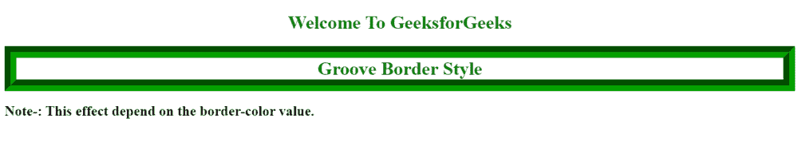

# 如何使用 CSS 创建三维凹槽边框？

> 原文:[https://www . geeksforgeeks . org/如何使用-css/](https://www.geeksforgeeks.org/how-to-create-a-3d-groove-border-using-css/) 创建-3d-groove-border

在 CSS 中 [*边框样式*](https://www.geeksforgeeks.org/css-border-style-property/) 属性用于设置元素边框的线条样式。

*边框样式的*属性可以有一个、两个、三个或四个值。当指定值为 1 时，相同的样式将应用于所有四条边。当指定值为 2 时，第一种样式应用于顶部和底部，第二种样式应用于左侧和右侧。当指定值为三时，第一种样式应用于顶部，第二种样式应用于左侧和右侧，第三种样式应用于底部。当指定值为 4 时，第一个样式应用于顶部，第二个样式应用于右侧，第三个样式应用于底部，第四个值应用于左侧。

**凹槽:**凹槽是边框样式，显示具有拉伸外观的边框。它在山脊的对面。

在本文中，我们将看到如何使用 CSS 创建三维凹槽边框。我们可以使用以下语法为元素指定三维凹槽边框。

**语法:**

```html
border-style: groove;
```

**方法:**在本例中，我们将凹槽边界赋予标题 *h1* 。您可以看到，在样式部分，我们指定了一个 [*边框样式*](https://www.geeksforgeeks.org/css-border-style-property/) 值凹槽，它将为标题 h1 提供一个三维凹槽边框。

**示例:**

## 超文本标记语言

```html
<!DOCTYPE html>
<html>

<head>
    <title>How to create a 3D groove border</title>
    <style type="text/css">
        h1.groove {
            color: green;
            text-align: center;
            border-width: 20px;
            border-style: groove;
            Border-color: #05a100
        }
    </style>
</head>

<body>
    <h1 style="text-align: center;color: green;">
        Welcome To GeeksforGeeks
    </h1>
    <h1 class="groove">Groove Border Style</h1>
    <h2><strong>Note-:</strong>
        This effect depend on the border-color value.</h2>
</body>

</html>
```

**输出:**

