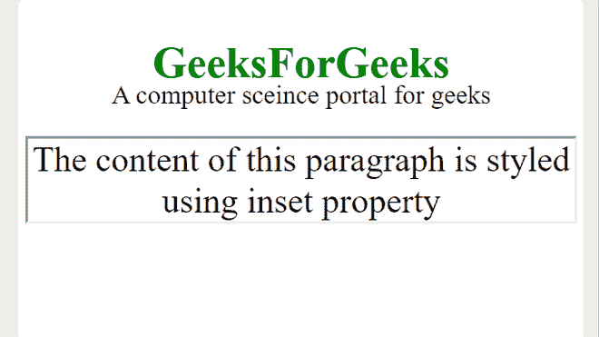
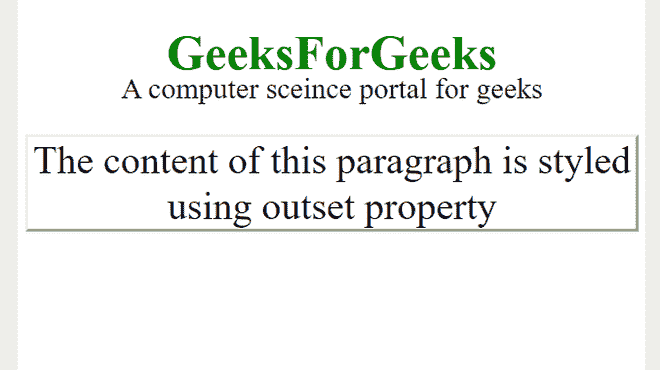

# 如何使用 CSS 创建 3D 开头和插入边框？

> 原文:[https://www . geeksforgeeks . org/how-create-a-3d-start-and-insert-border-use-CSS/](https://www.geeksforgeeks.org/how-to-create-a-3d-outset-and-inset-border-using-css/)

在这篇文章中，我们将使用 CSS 创建一个三维开始和插入边框。Inset border 属性使内容看起来是嵌入的(在表面内部)，另一方面，begin 属性使内容看起来是浮雕的(在表面外部)。您可以通过使用用于装饰边框的边框样式属性来完成此任务。

**三维嵌入边框:**用于定义三维嵌入边框，其效果取决于边框颜色值。

**语法:**

```html
element_name(or selector).inset {border-style: inset;}
```

**例 1:**

## 超文本标记语言

```html
<!DOCTYPE html>
<html>

<head>
    <style>
        body {
            text-align: center;
        }

        p {
            font-size: 30px;
            margin-top: -50px;
        }

        p.inset {
            border-style: inset;

            /* Inset style property */
            font-size: 40px;
            margin-top: 30px;
        }

        h2 {
            color: green;
            font-size: 50px;
        }
    </style>
</head>

<body>
    <h2>GeeksForGeeks</h2>

<p>A computer science portal for geeks</p>

    <p class="inset">
        The content of this paragraph is
        styled using inset property
    </p>

</body>

</html>
```

**输出:**



**3D 开始边框:**用于定义 3D 开始边框，其效果取决于边框颜色值。

**语法:**

```html
element_name(or selector).outset {border-style: outset;}
```

**例 2:**

## 超文本标记语言

```html
<!DOCTYPE html>
<html>

<head>
    <style>
        body {
            text-align: center;
        }

        p {
            font-size: 30px;
            margin-top: -50px;
        }

        p.outset {
            border-style: outset;

            /* outset style property */
            font-size: 40px;
            margin-top: 30px;
        }

        h2 {
            color: green;
            font-size: 50px;
        }
    </style>
</head>

<body>
    <h2>GeeksForGeeks</h2>

<p>A computer science portal for geeks</p>

    <p class="outset">
        The content of this paragraph is
        styled using outset property
    </p>

</body>

</html>
```

**输出:**

