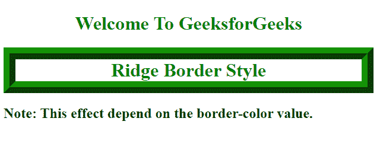

# 如何使用 CSS 创建三维脊线边框？

> 原文:[https://www . geeksforgeeks . org/如何使用-css/](https://www.geeksforgeeks.org/how-to-create-a-3d-ridge-border-using-css/) 创建-3d-山脊-边界

在 CSS 中， [*边框样式*](https://www.geeksforgeeks.org/css-border-style-property/) 属性用于设置元素边框的线条样式。

*边框样式的*属性可以有一个、两个、三个或四个值。当指定值为 1 时，相同的样式将应用于所有四条边。当指定值为 2 时，第一种样式应用于顶部和底部，第二种样式应用于左侧和右侧。当指定值为三时，第一种样式应用于顶部，第二种样式应用于左侧和右侧，第三种样式应用于底部。当指定值为 4 时，第一个样式应用于顶部，第二个样式应用于右侧，第三个样式应用于底部，第四个值应用于左侧。

**脊:**脊是一种边框样式，显示具有拉伸外观的边框。它是凹槽的反面

**语法:**

```html
border-style: ridge;

```

**方法:**在这个例子中，我们将给出标题 *h1* 的脊状边界。您可以看到，在样式部分，我们指定了一个[*边框样式的*](https://www.geeksforgeeks.org/css-border-style-property/) 值*脊线*，它将为标题 *h1* 提供一个三维脊线边框。

**示例:**

## 超文本标记语言

```html
<!DOCTYPE html>
<html>

<head>
    <title>How to create a 3D ridge border</title>
    <style type="text/css">
        h1.ridge {
            text-align: center;
            color: green;
            border-width: 20px;
            border-style: ridge;
            Border-color: #139207
        }
    </style>
</head>

<body>
    <h1 style="text-align: center;color:green;">
        Welcome To GeeksforGeeks</h1>
    <h1 class="ridge">Ridge Border Style</h1>
    <h2><strong>Note:</strong> 
        This effect depend on the border-color value.</h2>
</body>

</html>
```

**输出:**



脊形边框样式