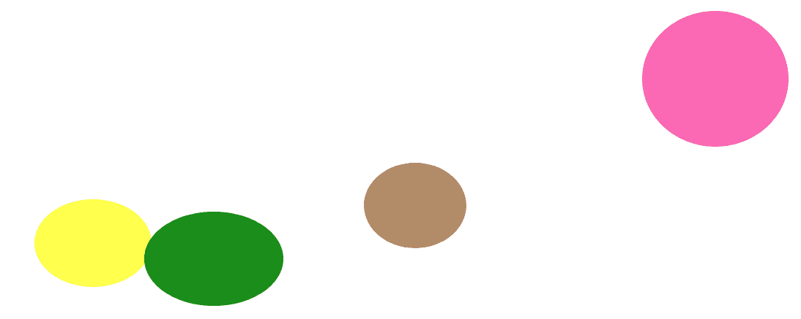

# 如何用 CSS 创建弹跳泡泡效果？

> 原文:[https://www . geeksforgeeks . org/如何使用-css/](https://www.geeksforgeeks.org/how-to-create-a-bouncing-bubble-effect-using-css/) 创建反弹气泡效果

让一个网站变得更加**动态**和**吸引人**的一个简单方法是给它添加一些**动画**。一个这样的动画是**弹跳气泡效果**。

**方法:**基本思想是使用< lspan >元素创建一个截面，给它一个圆形，然后通过使用 CSS 动画属性 translateY，气泡可以沿着 Y 轴上下移动。可以遵循以下步骤来获得期望的结果。

1.  使用 span 元素创建几个容器，如下所示:

    ```css
    <div class="dot">
        <span></span>
        <span></span>
        <span></span>
        <span></span>
    </div>
    ```

2.  要使容器看起来是球形的，边界半径必须更改为:**边界半径:50%；**
3.  为了给球体一个泡泡般的效果，不透明度和背景颜色可以改变为:**背景颜色:# DF0101 不透明度:0.8；**
4.  位置必须设置为绝对，气泡可以相应地设置为任何位置。
5.  为了使效果更真实，尺寸可以随着气泡到达表面而改变(即增加宽度和降低高度)。
6.  为了使气泡以无序的形式移动，**动画延迟**可以根据不同的气泡而变化，大小也可以变化。

**示例:**该示例实现了上述方法。

```css
<!DOCTYPE html>
<html>

<head>
    <title>
        How to create a bouncing 
        bubble effect using CSS?
    </title>

    <style>
        * {
            margin: 0;
            padding: 0;
        }

        /* To give the containers
           in spherical shape */
        .dot {
            border-radius: 50%;
        }

        .dot span {

            position: absolute;
            display: block;
            border: 5px;
            border-radius: 50%;
            animation: animate 3s ease-in-out infinite;

        }

        /*the animation*/
        @keyframes animate {
            0% {
                transform: translateY(-300px);
            }

            50% {
                transform: translateY(190px);
                width: -100px;
                height: +100px;

            }

            100% {
                transform: translateY(-300px);
            }
        }

        /* Each bubble is defined in a
           separate section */
        /* Set the color, opacity, delay and
           duration(i.e different speed) */
        .dot span:nth-child(1) {
            top: 300px;
            left: 250px;
            height: 160px;
            width: 160px;
            background-color: yellow;
            opacity: 0.7;
            animation-delay: 0.3s;
            animation-direction: reverse;
        }

        .dot span:nth-child(2) {
            top: 310px;
            left: 400px;
            height: 190px;
            width: 190px;
            background-color: green;
            opacity: 0.9;
            animation-delay: 0.3s;
            animation-direction: reverse;
            animation-duration: 2.3s;
        }

        .dot span:nth-child(3) {
            top: 300px;
            left: 700px;
            height: 140px;
            width: 140px;
            background-color: #a97f58;
            opacity: 0.9;
            animation-delay: 0.5s;
            animation-direction: reverse;
            animation-duration: 2.6s;
        }

        .dot span:nth-child(4) {
            top: 300px;
            left: 1080px;
            height: 200px;
            width: 200px;
            background-color: #FA58AC;
            opacity: 0.9;
            animation-delay: 0.7s;
            animation-direction: reverse;
            animation-duration: 2.3s;
        }
    </style>
</head>

<body>
    <div class="dot">
        <span></span>
        <span></span>
        <span></span>
        <span></span>

    </div>
</body>

</html>
```

**输出:**


这只是一个简单的动画，可以通过修改或添加更多的动画效果来创建更有吸引力的东西。