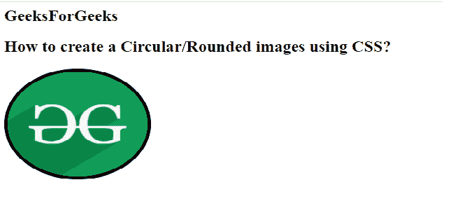
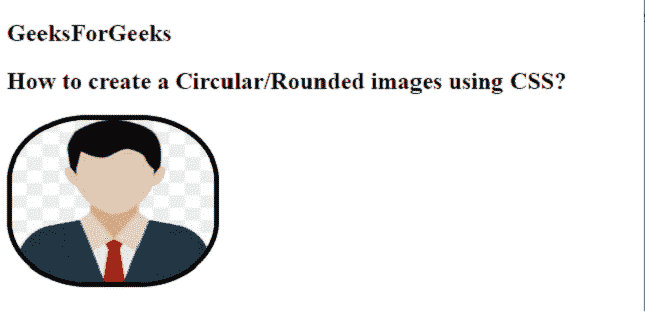

# 如何使用 CSS 创建圆形/圆角图像？

> 原文:[https://www . geeksforgeeks . org/如何使用-css/](https://www.geeksforgeeks.org/how-to-create-a-circular-rounded-images-using-css/) 创建圆形圆角图像

在本文中，我们将使用 CSS 创建一个圆形图像。可以通过使用 **CSS** ***[边框半径](https://www.geeksforgeeks.org/css-border-radius-property/)*** 属性来完成。该属性主要用于制作圆形。它包含像素形式的数值。

**例 1:**

## 超文本标记语言

```css
<!DOCTYPE html>
<html>

<head>
    <style>
        img {
            border-radius: 58%;
        }
    </style>
</head>

<body>
    <h2>GeeksForGeeks</h2>

    <h2>
        How to create a Circular/
        Rounded images using CSS?
    </h2>

    
</body>

</html>
```

**输出:**



**例 2:**

## 超文本标记语言

```css
<!DOCTYPE html>
<html>

<head>
    <style>
        img {
            border-radius: 38%;
        }
    </style>
</head>

<body>
    <h2>GeeksForGeeks</h2>

    <h2>
        How to create a Circular/
        Rounded images using CSS?
    </h2>

    
</body>

</html>
```

**输出:**



**支持的浏览器:**

*   谷歌 Chrome
*   微软公司出品的 web 浏览器
*   火狐浏览器
*   旅行队
*   歌剧