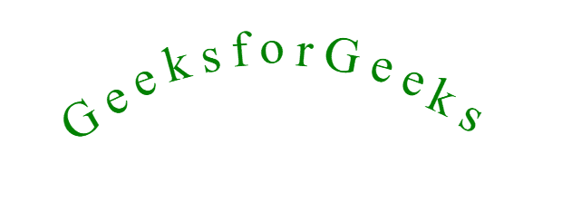
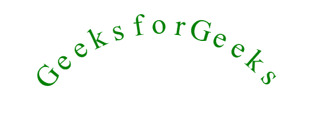

# 如何使用 CSS3/Canvas 创建曲线文本？

> 原文:[https://www . geeksforgeeks . org/如何创建曲线-文本-使用-css3-canvas/](https://www.geeksforgeeks.org/how-to-create-a-curve-text-using-css3-canvas/)

在网络技术中有几种方法来弯曲文本。最简单的方法是使用 jQuery 插件和 SVG，但是我们在这里不会解释，我们将坚持这个问题，并阐明如何使用 CSS3 和 canvas 绘制文本曲线。我们开始吧。

**使用 CSS3 弯曲文本:**这种方法对于弯曲长文本来说非常费力，因为你必须对文本的每个字符分别应用适当的定位和对齐。但是，对于小文本，它只是完成工作。在这里，我们只需一个接一个地编写文本的字符，并开始应用 CSS 变换属性，使整个文本看起来像弯曲的(或像弧形)。但是，这种方法的一个优点是，您可以选择文本，甚至可以执行复制粘贴。

**例 1:**

```css
<!DOCTYPE html>
<html lang="en">

<head>

    <!--Style to transform text in an arc -->
    <style type=text/css>
        /* Apply the translate and rotate transformation
           for our text to look curved  */

        .G1 {
            transform: translate(20px, 85px) rotate(-30deg);
        }

        .e1 {
            transform: translate(13px, 60px) rotate(-25deg);
        }

        .e2 {
            transform: translate(6px, 40px) rotate(-20deg);
        }

        .k1 {
            transform: translate(3px, 23px) rotate(-15deg);
        }

        .s1 {
            transform: translate(2px, 14px) rotate(-10deg);
        }

        .f {
            transform: translate(1px, 8px) rotate(-5deg);
        }

        .o {
            transform: translate(0px, 5px) rotate(0deg);
        }

        .r {
            transform: translate(-1px, 8px) rotate(5deg);
        }

        .G2 {
            transform: translate(-2px, 14px) rotate(10deg);
        }

        .e3 {
            transform: translate(-3px, 25px) rotate(15deg);
        }

        .e4 {
            transform: translate(-6px, 40px) rotate(20deg);
        }

        .k2 {
            transform: translate(-14px, 60px) rotate(25deg);
        }

        .s2 {
            transform: translate(-20px, 80px) rotate(30deg);
        }

        /* An inline-block element is placed as an inline
         element (on the same line as adjacent content), 
         but it behaves like a block element  */

        span {
            display: inline-block;
        }
    </style>
</head>

<body>
    <div style="text-align: center; padding-top: 250px;
                font-size: 55px; color: green;">

        <!-- Declare all the characters of text 
            one-by-one, inside span tags -->
        <span class="G1">G</span>
        <span class="e1">e</span>
        <span class="e2">e</span>
        <span class="k1">k</span>
        <span class="s1">s</span>
        <span class="f">f</span>
        <span class="o">o</span>
        <span class="r">r</span>
        <span class="G2">G</span>
        <span class="e3">e</span>
        <span class="e4">e</span>
        <span class="k2">k</span>
        <span class="s2">s</span>
    </div>
</body>

</html>
```

**输出:**


**使用画布弯曲文本:**画布元素是 HTML5 的一部分，允许动态、可脚本化地呈现 2D 形状和位图图像。这是一种相对简单的方法，使用一点 JavaScript 来操纵画布元素并设置它的样式。这种方法利用基础高中数学在一个循环中旋转和翻译画布上下文，并逐个用文本的字母填充它。弧的半径和角度可以根据弧的形状和大小进行调整。此方法将生成文本的不可选择的实例。

**例 2:**

```css
<!DOCTYPE html>
<html lang="en">

<head>
    <title>Curve text using Canvas</title>
</head>

<body>

    <!-- Creating a canvas element in HTML-->
    <canvas id="canv" width="600" height="250"></canvas>

    <script>

        /*The window.onload function will run as 
        soon as the window loads in the browser */
        window.onload = function () {

            /* This method returns the html element that
                has the ID attribute with the specified
                value. */
            let canvas = document.getElementById("canv");

            /* This method returns a drawing context
                on the canvas, or null if the context
                identified is not supported. */
            let context = canvas.getContext("2d");

            /* It will change the style and appearance 
                of the text to make it look more geeky. */
            context.font = "50px serif";
            context.fillStyle = "green";
            context.textAlign = "center";

            let string = "GeeksforGeeks";

            let angle = Math.PI * 0.6; // in radians
            let radius = 200;

            context.translate(300, 300);
            context.rotate(-1 * angle / 2);

            for (let i = 0; i < string.length; i++) {

                /* It is worth noting that we are not
                    rotating the text,here the whole
                    context is being rotated and
                    translated, and the letters are just
                    filled in it. */
                context.rotate(angle / string.length);
                context.save();
                context.translate(0, -1 * radius);
                context.fillText(string[i], 0, 0);
                context.restore();
            }
        };
    </script>
</body>

</html>
```

**输出:**
