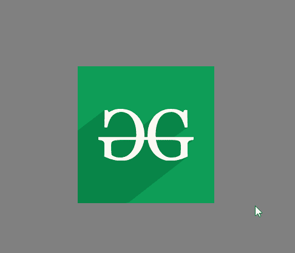

# 如何使用 CSS 创建灰度效果？

> 原文:[https://www . geesforgeks . org/如何使用 css 创建灰度效果/](https://www.geeksforgeeks.org/how-to-create-a-grayscale-effect-using-css/)

灰度是一种效果，它提供从彩色图像到单色图像的过渡效果，反之亦然。这种效果可以应用于各种事件，如鼠标悬停，或者您也可以使用按钮来激活该效果。

**方法:**我们将使用 CSS 内置函数[灰度()](https://www.geeksforgeeks.org/convert-an-image-into-grayscale-image-using-html-css/)来创建这个效果。

**例 1:** 首先来看看彩色图像到单色图像的过渡。为此，我们将在[悬停](https://www.geeksforgeeks.org/css-hover-selector/)选择器中使用灰度()功能。我们只是在鼠标悬停时将灰度值设置为 100%。

```html
<!DOCTYPE html>
<html lang="en">

<head>
    <meta charset="UTF-8">
    <meta name="viewport" content=
        "width=device-width, initial-scale=1.0">
    <title>Gray Scale Effect</title>

    <style>
        body{
            background: grey;
        }
        img{
            position: absolute;
            top:40%;
            left:50%;

            transition:.5s ease-in-out;
        }

        img:hover{     
            filter:grayscale(100%);
        }
    </style>
</head>

<body>
    
</body>

</html>
```

**输出:**


**示例 2:** 现在，对于从单色到彩色图像的过渡，我们将执行示例 1 的相反过程。我们将对< img >标签使用 100%灰度()函数，然后在鼠标悬停时将其降低到 0%。

```html
<!DOCTYPE html>
<html lang="en">

<head>
     <meta charset="UTF-8">
     <meta name="viewport" content=
        "width=device-width, initial-scale=1.0">
     <title>Gray Scale Effect</title>

    <style>
        body{
            background: grey;
        }
        img{
            position: absolute;
            top:40%;
            left:50%;
            filter:grayscale(100%);
            transition:.5s ease-in-out;
        }
        img:hover{
            filter:grayscale(0%);
        }
    </style>
</head>

<body>
    
</body>

</html>
```

**输出:**
