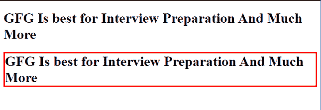
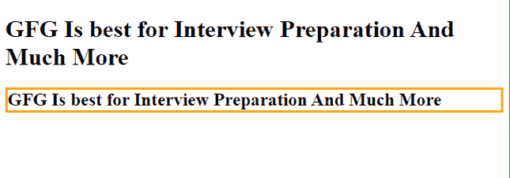

# 如何使用 CSS 属性创建隐藏边框？

> 原文:[https://www . geeksforgeeks . org/如何使用 css 属性创建隐藏边框/](https://www.geeksforgeeks.org/how-to-create-a-hidden-border-using-css-properties/)

在本文中，我们将学习如何使用 CSS 属性创建隐藏边框。

在以下示例中，标题部分中使用了内嵌样式和样式定义来定义隐藏边框。

**进场:**

*   我们将使用两个标题，其中一个将显示边框颜色，另一个将不会显示，因为它将使用 CSS 隐藏。
*   我们将使用的 CSS 在标签内部，也称为[内联 CSS](https://www.geeksforgeeks.org/how-to-apply-inline-css/) 。
*   所用属性将设为[*边框**–**样式*](https://www.geeksforgeeks.org/css-border-style-property/) ***:隐藏*****。**

**例 1:**

## 超文本标记语言

```
<!DOCTYPE html>
<html>
<head>
<title>Hidden border</title>
</head>
<body>
 <h1 style="border-color:red  ;
            border-style:hidden ;">
  GFG Is best for Interview Preparation And Much More</h1>
 <h1 style="border-color:red ;
            border-style:solid ;">
  GFG Is best for Interview Preparation And Much More</h1>
</body>
</html>
```

**输出:**



隐藏边框

**方法 2:**

*   我们将使用两个标题，其中一个将显示边框颜色，另一个将不会显示，因为它将使用 CSS 隐藏。
*   我们将使用的 CSS 位于*样式*标签内，也称为[内部 CSS](https://www.geeksforgeeks.org/types-of-css-cascading-style-sheet/) ，应用于像 *h1、h2* 这样的元素。
*   我们将使用*边框样式的属性:隐藏。*

**示例:**

## 超文本标记语言

```
<!DOCTYPE html>
<html>
<head>
   <style>
        h1{
            border-color : orange ;
            border-style : hidden ;
        }
        h2{
            border-color : orange;
            border-style : solid;
        }
    </style>
    <title>Hidden border</title>
</head>
<body>
 <h1>GFG Is best for Interview Preparation And Much More</h1>
 <h2>GFG Is best for Interview Preparation And Much More</h2>
</body>
</html>
```

**输出:**



内部 CSS 隐藏的边框