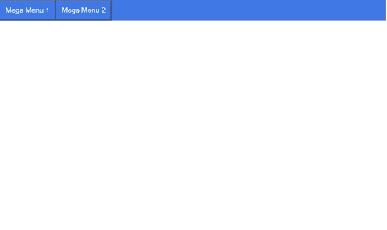

# 如何使用 HTML 和 CSS 创建一个巨型菜单？

> 原文:[https://www . geeksforgeeks . org/如何使用 html 和 css 创建超级菜单/](https://www.geeksforgeeks.org/how-to-create-a-mega-menu-using-html-and-css/)

[HTML](https://www.geeksforgeeks.org/html-tutorials/) 是一种用于创建网页的标记语言， [CSS](https://www.geeksforgeeks.org/css-tutorials/) 是一种样式表语言，用于设计用 HTML 等标记语言编写的文档。在本文中，我们将了解如何仅借助于 HTML 和 CSS 在我们的网页上创建一个大型菜单。巨型菜单是一种可扩展菜单，其中许多选项显示在一行中。我们必须创建一个菜单，当用户将[鼠标移动到](https://www.geeksforgeeks.org/css-hover-selector/)导航栏内的一个元素上时，该菜单就会出现。

**创建超级菜单的步骤**

**创建一个 HTML 文件:**创建一个导航菜单，并在[导航栏](https://www.geeksforgeeks.org/bootstrap-navigation-bar/)中使用一个按钮作为菜单，作为一个超级菜单工作，如下代码所示。

## 超文本标记语言

```
<!DOCTYPE html>
<html lang="en">
<head>
    <meta charset="UTF-8">
    <meta name="viewport" content=
    "width=device-width, initial-scale=1.0">
    <title>Mega Menu</title>
    <link rel="stylesheet" href="menu.css">
</head>
<body>

  <!-- Created a div for navigation bar-->
    <div class="navigationBar">

       <!-- Created a button to work as a menu-->
        <div class="downMenu">
          <button class="downBtn">
            <a href="#">Mega Menu 1</a>
          </button>
          <div class="downMenu-content">

             <!-- Added items in mega menu 1-->
              <div class="megaMenu">

                <!-- Column 1-->
                <div class="menuCol">
                  <a href="#">Menu 1 Col 1 Item 1</a>
                  <a href="#">Menu 1 Col 1 Item 2</a>
                  <a href="#">Menu 1 Col 1 Item 3</a>
                  <a href="#">Menu 1 Col 1 Item 4</a>
                  <a href="#">Menu 1 Col 1 Item 5</a>
                </div>

                <!-- Column 2-->
                <div class="menuCol">
                  <a href="#">Menu 1 Col 2 Item 1</a>
                  <a href="#">Menu 1 Col 2 Item 2</a>
                  <a href="#">Menu 1 Col 2 Item 3</a>
                  <a href="#">Menu 1 Col 2 Item 4</a>
                  <a href="#">Menu 1 Col 2 Item 5</a>
                </div>

                <!-- Column 3-->
                <div class="menuCol">
                  <a href="#">Menu 1 Col 3 Item 1</a>
                  <a href="#">Menu 1 Col 3 Item 2</a>
                  <a href="#">Menu 1 Col 3 Item 3</a>
                  <a href="#">Menu 1 Col 3 Item 4</a>
                  <a href="#">Menu 1 Col 3 Item 5</a>
                </div>
              </div>
          </div>
        </div>

      <!-- Created another button to work as a menu-->
        <div class="downMenu">
          <button class="downBtn">
            <a href="#">Mega Menu 2</a>
          </button>
          <div class="downMenu-content">

            <!-- Added items in mega menu 2-->
              <div class="megaMenu">

                <!-- Column 1-->
                <div class="menuCol">
                  <a href="#">Menu 2 Col 1 Item 1</a>
                  <a href="#">Menu 2 Col 1 Item 2</a>
                  <a href="#">Menu 2 Col 1 Item 3</a>
                  <a href="#">Menu 2 Col 1 Item 4</a>
                  <a href="#">Menu 2 Col 1 Item 5</a>
                </div>

                <!-- Column 2-->
                <div class="menuCol">
                  <a href="#">Menu 2 Col 2 Item 1</a>
                  <a href="#">Menu 2 Col 2 Item 2</a>
                  <a href="#">Menu 2 Col 2 Item 3</a>
                  <a href="#">Menu 2 Col 2 Item 4</a>
                  <a href="#">Menu 2 Col 2 Item 5</a>
                </div>

                <!-- Column 3-->
                <div class="menuCol">
                  <a href="#">Menu 2 Col 3 Item 1</a>
                  <a href="#">Menu 2 Col 3 Item 2</a>
                  <a href="#">Menu 2 Col 3 Item 3</a>
                  <a href="#">Menu 2 Col 3 Item 4</a>
                  <a href="#">Menu 2 Col 3 Item 5</a>
                </div>
              </div>
          </div>
          </div>
      </div>

</body>
</html>
```

**创建一个 CSS 文件:**通过 CSS 设计你的[导航栏](https://www.geeksforgeeks.org/how-to-create-a-navbar-in-bootstrap/)和巨型菜单，并将该文件链接到你的 HTML 页面。以下是上述 HTML 文件中使用的文件“menu.css”的内容。

## 菜单.css

```
/* For navigation menu */
.navigationBar {
    background-color: rgb(65, 122, 230);
    overflow: hidden;
}

/* For texts in navigation bar */
.navigationBar a {
    font-size: 20px;
    color: white;
}

/* The dropdown div */
.downMenu {
    float: left;
    overflow: hidden;
}

/* For downButton to work as menu */
.downMenu .downBtn {
    padding: 15px 15px;
    background-color: inherit;
}

/* For hover effect on button */
.navigationBar a:hover, .downMenu:hover .downBtn {
    background-color: rgb(65, 61, 61);
}

/* To hide mega menu */
downMenu-content {
    position: absolute;
    display: none;
    width: 100%;
}

/* To show mega menu on hover */
.downMenu:hover .downMenu-content {
    display: block;
}

/* Create columns in mega menu*/
.menuCol {
    float: left;
    width: 30%;
    padding: 10px;
    background-color: rgb(197, 189, 189);
}

/* Style the columns */
.menuCol a {
    float: none;
    color: black;
    padding: 10px;
    margin-bottom: 20px;
    display: block;
}

/* Add hover */
.menuCol a:hover {
    background-color: rgb(223, 223, 223);
}
```

**输出:**

