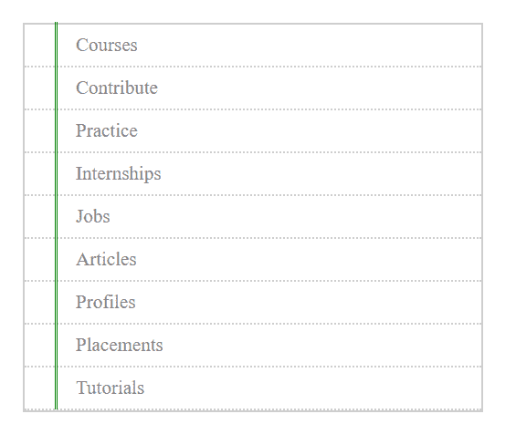
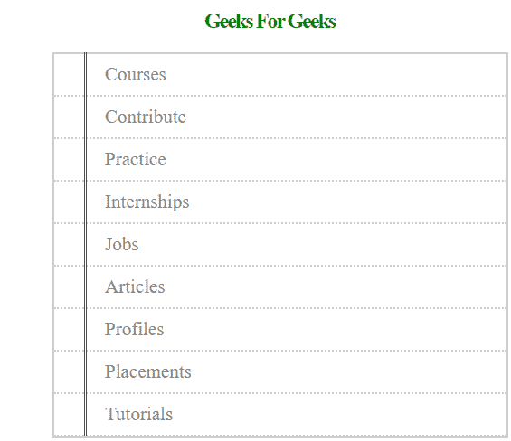

# 如何用 CSS 创建笔记本设计？

> 原文:[https://www . geeksforgeeks . org/如何使用 css 创建笔记本设计/](https://www.geeksforgeeks.org/how-to-create-a-notebook-design-with-css/)

在本文中，我们将使用简单的 CSS 创建一个笔记本主题的网页模板。



**HTML 代码:**HTML 代码用于创建身体的基本结构。为了创建笔记本设计，我们使用无序列表项在行内添加文本。之后，我们使用一些 CSS 属性来调整笔记本行内的无序项目列表。

```html
<!DOCTYPE html>
<html>

<head>
    <title>Notebook Design using CSS</title>
</head>

<body>
    <br />
    <h2>Geeks For Geeks</h2>
    <div class="verticalLines"></div>
    <ul class="listItemClass">
        <li>Courses</li>
        <li>Contribute</li>
        <li>Practice</li>
        <li>Internships</li>
        <li>Jobs</li>
        <li>Articles</li>
        <li>Profiles</li>
        <li>Placements</li>
        <li>Tutorials</li>
    </ul>
</body>

</html>
```

**CSS 代码:** CSS 属性用于创建笔记本设计。

```html
body { 
    width: 480px;
    height: 450px;
    margin: 0 auto;
}
h2 {
    color: green; 
    text-align: center;  
    letter-spacing: -2px;  
}
.listItemClass {
    color: #858585;
    font-size: 21px;
    padding: 0;
    width: 500px;
    border: 2px solid #cecece;
}
.listItemClass li {
    list-style: none;
    border-bottom: 2px dotted #cecece;
    text-indent: 20px;
    height: auto; 
    padding: 10px;
}
.listItemClass li:hover {
    background-color: #f5f5f5;
}
.verticalLines { 
    width: 1px;
    float: left;
    height: 425px;
    margin-left: 35px;
    border-left: 1px solid green;
    border-right: 1px solid green;
}
```

**组合完整代码:**本节我们将结合以上两段代码(HTML 和 CSS 代码)来设计笔记本。

```html
<!DOCTYPE html>
<html>

<head>
    <title>Notebook Design using CSS</title>

    <style>
        body {
            width: 480px;
            height: 450px;
            margin: 0 auto;
        }

        h2 {
            color: green;
            text-align: center;
            letter-spacing: -2px;
        }

        .listItemClass {
            color: #858585;
            font-size: 21px;
            padding: 0;
            width: 500px;
            border: 2px solid #cecece;
        }

        .listItemClass li {
            list-style: none;
            border-bottom: 2px dotted #cecece;
            text-indent: 20px;
            height: auto;
            padding: 10px;

        }

        .listItemClass li:hover {
            background-color: #f5f5f5;
        }

        .verticalLines {
            width: 2px;
            float: left;
            height: 425px;
            margin-left: 35px;
            border-left: 1px solid green;
            border-right: 1px solid green;
        }
    </style>
</head>

<body>
    <h2>Geeks For Geeks</h2>

    <div class="verticalLines"></div>
    <ul class="listItemClass">
        <li>Courses</li>
        <li>Contribute</li>
        <li>Practice</li>
        <li>Internships</li>
        <li>Jobs</li>
        <li>Articles</li>
        <li>Profiles</li>
        <li>Placements</li>
        <li>Tutorials</li>
    </ul>
</body>

</html>
```

**输出:**
