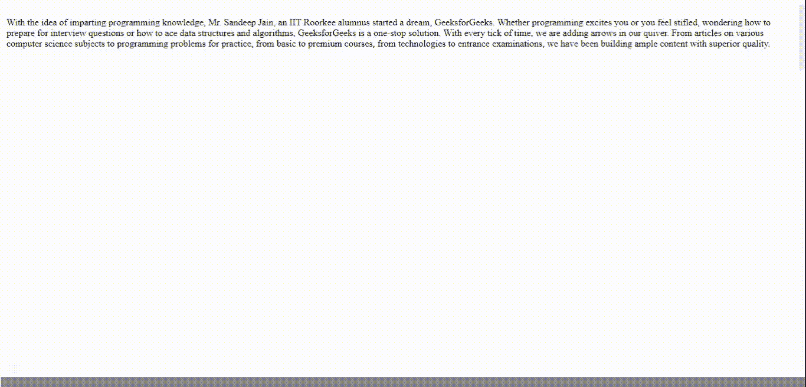

# 如何在 CSS 中创建一个响应性的 scrollbox？

> 原文:[https://www . geesforgeks . org/how-to-create-responsive-scroll box-in-CSS/](https://www.geeksforgeeks.org/how-to-create-a-responsive-scrollbox-in-css/)

本文的目的是使用 CSS 在 HTML 页面结构中创建一个响应滚动条。

在 CSS 中，响应滚动框是一种包含文本、图像或任何其他元素的交互技术。它们可以在预设的方向上滚动，如果盒子的内容较大，用户可以滚动。当您不想占用大量内容空间时，通常会使用滚动框。通过创建滚动框，您可以提供更多内容以适应更小的空间。

**方法:**要创建响应滚动框，添加一个 *< div >* 标签，然后继续创建滚动框。你所需要做的就是选择滚动框的*高度*和*宽度*(确保你的框的高度足够短，这样你就有一个溢出的文本，允许框向下滚动。添加*溢出:自动*创建滚动效果。

现在，您已经格式化了文本框，可以添加内容了。格式化文本框的内容，就像在 HTML 页面上一样。添加完所有内容后，请关闭您的

标签。您已经创建了一个滚动框，您的页面将立即看起来更加系统。

**示例:**

## 超文本标记语言

```html
<!DOCTYPE html>
<html>

<head>
    <meta name="viewport" content=
        "width=device-width, initial-scale=1">

    <style>
        table {
            border-collapse: collapse;
            border-spacing: 0;
            width: 100%;
            border: 0px solid #ddd;
        }

        th,
        td {
            text-align: left;
            padding: 8px;
        }

        /* width */        
        ::-webkit-scrollbar {
            width: 10px;
        }

        /* Track */
        ::-webkit-scrollbar-track {
            background: #f1f1f1;
        }

        /* Handle */
        ::-webkit-scrollbar-thumb {
            background: #888;
        }

        /* Handle on hover */
        ::-webkit-scrollbar-thumb:hover {
            background: #555;
        }

        .scroll {
            display: block;
            border: 0px solid red;
            padding: 5px;
            margin-top: 5px;
            width: 100%;
            height: 100px;
            overflow-y: scroll;
        }
    </style>
</head>

<body>
    <div class="scroll">
        <p>
            With the idea of imparting programming 
            knowledge, Mr. Sandeep Jain, an IIT 
            Roorkee alumnus started a dream, 
            GeeksforGeeks. Whether programming 
            excites you or you feel stifled, 
            wondering how to prepare for interview 
            questions or how to ace data structures 
            and algorithms, GeeksforGeeks is a 
            one-stop solution. With every tick of 
            time, we are adding arrows in our quiver.
            From articles on various computer 
            science subjects to programming problems 
            for practice, from basic to premium courses,
            from technologies to entrance examinations, 
            we have been building ample content with 
            superior quality.
        </p>
    </div>
</body>

</html>
```

#### 输出:

