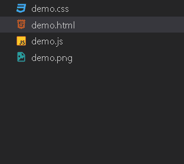
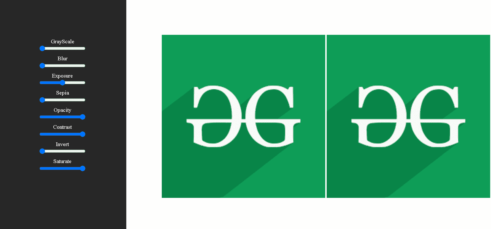

# 如何用 CSS 滤镜和 jQuery 创建一个简单的图像编辑器？

> 原文:[https://www . geesforgeks . org/如何使用 css 过滤器和 jquery 创建简单的图像编辑器/](https://www.geeksforgeeks.org/how-to-create-a-simple-image-editor-with-css-filters-and-jquery/)

[**CSS 滤镜**](https://www.geeksforgeeks.org/css-filter-property/) 属性用于编辑图像或视觉效果，不需要任何专门的软件。CSS 过滤器使用默认值，因此它们不能为用户提供任何改变强度的控制。

**语法:**

```
.demo {
    filter: <filter-function> [<filter-intensity>];
}
```

**示例:**以下是如何对元素应用 50%模糊滤镜。

```
.demo {
    filter: blur(50%);
}
```

**图像过滤器:**要创建图像过滤器，我们有输入变量的滑块，通过 jQuery 传递每个过滤器的强度值，该过滤器将通过 CSS 应用。

**项目结构:**



文件结构

**示例:**在本例中，我们将使用 demo.html 文件中的 HTML 来设计结构。之后，我们将在 demo.css 文件中使用 CSS 来使用过滤器，然后在 demo.js 文件中使用 JavaScript 来提供对这些过滤器的控制。

## demo.html

```
<!DOCTYPE html>
<html>

<head>
    <!-- Add CSS file -->
    <link rel="stylesheet" href="demo.css" />

    <!-- Add JQuery -->
    <script src=
"https://ajax.googleapis.com/ajax/libs/jquery/2.1.3/jquery.min.js">
    </script>

    <!-- Add JavaScript file -->
    <script>
        $(document).ready(function () {
            $(".fit-val").change(main);
        });
    </script>

    <script src="demo.js"></script>
</head>

<body>
    <div id="main">
        <!-- Add Slider Controls -->
        <div class="range_panel">
            <span>
                <label>GrayScale</label>
                <br />
                <input id="id1" class="fit-val" 
                    type="range" min="0" max="100" 
                    value="0" />
            </span>

            <span>
                <label>Blur</label>
                <br />
                <input id="id2" class="fit-val" 
                    type="range" min="0" max="10" 
                    value="0" />
            </span>

            <span>
                <label>Exposure</label>
                <br />
                <input id="id3" class="fit-val" 
                    type="range" min="0" max="200" 
                    value="100" />
            </span>

            <span>
                <label>Sepia</label>
                <br />
                <input id="id4" class="fit-val" 
                    type="range" min="0" max="100" 
                    value="0" />
            </span>

            <span>
                <label>Opacity</label>
                <br />
                <input id="id5" class="fit-val" 
                    type="range" min="0" max="100"
                    value="100" />
            </span>

            <span>
                <label>Contrast</label>
                <br />
                <input id="id6" class="fit-val" 
                    type="range" min="0" max="100"
                    value="100" />
            </span>

            <span>
                <label>Invert</label>
                <br />
                <input id="id7" class="fit-val"
                    type="range" min="0" max="100"
                    value="0" />
            </span>

            <span>
                <label>Saturate</label>
                <br />
                <input id="id8" class="fit-val" 
                    type="range" min="0" max="100" 
                    value="100" />
            </span>
        </div>

        <div class="image">
            
            
        </div>
    </div>
</body>

</html>
```

## demo.css

```
/** @format */

body {
    text-align: center;
    color: white;
}
.main {
    width: 100vw;
    display: flex;
}
.range_panel {
    background-color: rgb(39, 39, 39);
    width: 300px;
    height: 100vh;
    padding: 30px;
    padding-top: 100px;
}
span {
    display: block;
    margin: 10px;
}
.image {
    padding: 100px;
}
.image img {
    width: 30vw;
}
```

## demo.js(演示. js)

```
function main() {
    $(".image_main").css(
        "-webkit-filter",
        "grayscale(" +
        $("#id1").val() +
        "%)    blur(" +
        $("#id2").val() +
        "px) brightness(" +
        $("#id3").val() +
        "%) sepia(" +
        $("#id4").val() +
        "%) opacity(" +
        $("#id5").val() +
        "%)    contrast(" +
        $("#id6").val() +
        "%) saturate(" +
        $("#id7").val() +
        "%) invert(" +
        $("#id8").val() +
        "%)"
    );
}
```

**输出:**



输出