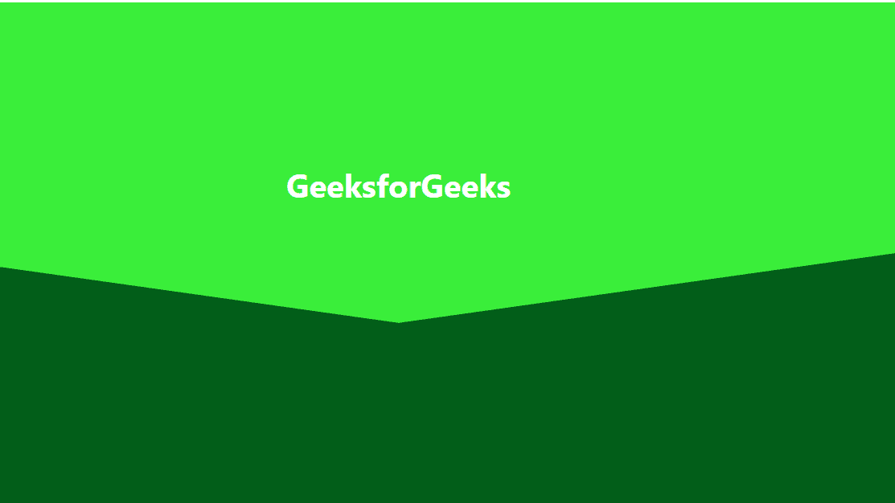

# 如何用 CSS 创建歪斜的背景？

> 原文:[https://www . geeksforgeeks . org/如何使用-css/](https://www.geeksforgeeks.org/how-to-create-a-skewed-background-using-css/) 创建倾斜背景

倾斜的背景设计模式被用作网站首页的横幅。它使网站看起来更加自然和令人愉悦。使用前的 CSS [、](https://www.geeksforgeeks.org/css-before-selector/)后的[选择器，使用](https://www.geeksforgeeks.org/css-after-selector/?ref=lbp)[倾斜](https://www.geeksforgeeks.org/css-skew-function/)功能，可以轻松创建倾斜的背景。

**进场:**进场简单。我们将使用前后选择器的倾斜函数将我们的边界线变成二维平面。左侧部分将使用前选择器完成，右侧部分将使用后选择器完成。您也可以通过使用后选择器进行左侧操作和使用前选择器进行右侧操作来更改顺序。

**HTML 代码:** HTML 代码用于设计网页的基本结构。下面的代码包含两个带有 id 属性的<部分>元素。

```html
<!DOCTYPE html>
<html lang="en">

<head>
    <title>Skewed Background</title>
</head>

<body>
    <section id="geeks1">
        <h1>GeeksforGeeks</h1>
    </section>
    <section id="geeks2"></section>
</body>

</html>
```

**CSS 代码:**

*   **第一步:**首先给两个版块都提供背景，宽度设置为 100%，高度可以根据需要设置。
*   **步骤 2:** 现在，在底部使用 before 选择器，并将其宽度减少到 50%，因为我们希望我们的边框偏离中心。高度可根据需要设定。然后使用倾斜函数将其转换为特定角度的二维平面。
*   **第三步:**重复第二步，从左向右变化，否定偏度。

下面的代码将展示上述步骤的实现。

**提示:**您可以使用检查功能选择偏斜度，并通过它调整偏斜度以获得完美的角度。

```html
<style>
    #geeks1 {
        width: 100%;
        height: 400px;
        position: relative;
        background: rgb(58, 238, 58);
    }

    h1 {
        text-align: center;
        padding: 200px;
        font-family: -apple-system, 
            BlinkMacSystemFont, "Segoe UI",
            Roboto, Oxygen, Ubuntu, Cantarell,
            "Open Sans", "Helvetica Neue",
            sans-serif;
        color: white;
        font-size: 40px;
    }

    #geeks2 {
        width: 100%;
        height: 400px;
        position: relative;
        background: rgb(2, 94, 25);
    }

    #geeks2::before {
        content: "";
        width: 50%;
        height: 100px;
        position: absolute;
        top: -48px;
        left: 0;
        background: rgb(2, 94, 25);
        transform: skewY(8deg);
    }

    #geeks2::after {
        content: "";
        width: 50%;
        height: 100px;
        position: absolute;
        top: -48px;
        right: 0;
        background: rgb(2, 94, 25);
        transform: skewY(-8deg);
    }
</style>
```

**完整代码:**正是以上两个部分的结合，打造出了一个歪斜的背景。

```html
<!DOCTYPE html>
<html lang="en">

<head>
    <title>Skewed Background</title>

    <style>
        #geeks1 {
            width: 100%;
            height: 400px;
            position: relative;
            background: rgb(58, 238, 58);
        }

        h1 {
            text-align: center;
            padding: 200px;
            font-family: -apple-system, 
                BlinkMacSystemFont, "Segoe UI",
                Roboto, Oxygen, Ubuntu, Cantarell,
                "Open Sans", "Helvetica Neue",
                sans-serif;
            color: white;
            font-size: 40px;
        }

        #geeks2 {
            width: 100%;
            height: 400px;
            position: relative;
            background: rgb(2, 94, 25);
        }

        #geeks2::before {
            content: "";
            width: 50%;
            height: 100px;
            position: absolute;
            top: -48px;
            left: 0;
            background: rgb(2, 94, 25);
            transform: skewY(8deg);
        }

        #geeks2::after {
            content: "";
            width: 50%;
            height: 100px;
            position: absolute;
            top: -48px;
            right: 0;
            background: rgb(2, 94, 25);
            transform: skewY(-8deg);
        }
    </style>
</head>

<body>
    <section id="geeks1">
        <h1>GeeksforGeeks</h1>
    </section>
    <section id="geeks2"></section>
</body>

</html>
```

**输出:**
