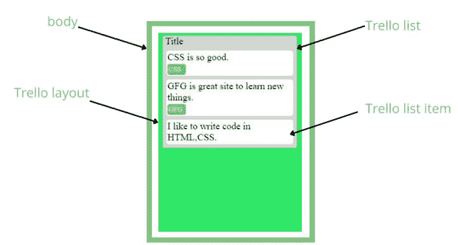

# 如何用 CSS 网格和 Flexbox 创建 Trello 布局？

> 原文:[https://www . geeksforgeeks . org/how-create-a-trello-layout-with-CSS-grid-and-flexbox/](https://www.geeksforgeeks.org/how-to-create-a-trello-layout-with-css-grid-and-flexbox/)

Trello 布局用于分阶段组织或管理信息。可以使用 [**CSS Grid**](https://www.geeksforgeeks.org/css-grid-property/) 和 [**Flexbox**](https://www.geeksforgeeks.org/advance-css-layout-with-flexbox/) **创建。**我们来创建如下图所示的布局。在图像中，特雷罗布局由保存项目或信息的特雷罗列表组成。

**布局结构:**



Trello 布局

**HTML 代码片段:**为了理解 Trello 布局，让我们首先创建一个包含单个列表项的 Trello 布局。

## 超文本标记语言

```html
<body>
    <div class="trello">
        <div class="trello__list">
            <span style="font-size:large; margin-left:5px">Title</span>
            <div class="trello__list__item">
               <span>CSS is so good.</span> 
               <span class="highlighted">CSS</span>
            </div>
        </div>
    </div>
</body>
```