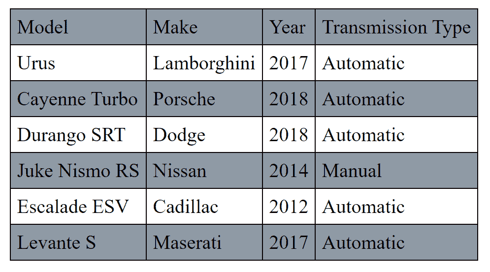
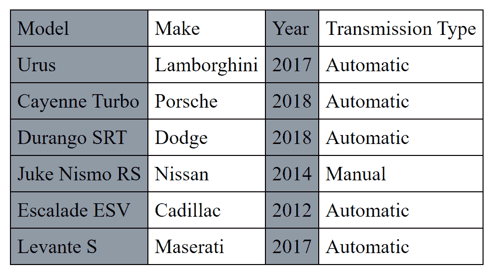

# 如何用 CSS 创建斑马剥表？

> 原文:[https://www . geeksforgeeks . org/如何用 css 创建斑马条纹表/](https://www.geeksforgeeks.org/how-to-create-a-zebra-striped-table-with-css/)

斑马纹表是一种具有不同色调的交替行(或列)的表。使用斑马纹表的好处很多，比如增加行(或列)的可读性，强调一组特定的行(或列)等。

本文将告诉您如何仅使用 HTML 和 CSS 在网页中创建斑马纹表格(行或列)。

**斑马纹表:**

*   点击 [tr](https://www.geeksforgeeks.org/html-tr-tag/) (表格行)元素为 CSS。
*   使用 [***【第 n 个子】(***](https://www.geeksforgeeks.org/css-nth-child-selector/) 选择器，将您选择的 [*背景色*](https://www.geeksforgeeks.org/css-background-color-property/) 添加到所有奇数(或偶数)表格行。

**示例:**交替行获得不同的背景颜色，从而创建一个带有斑马纹的行的表格。

## 超文本标记语言

```css
<!DOCTYPE html>
<html>

<head>
    <title>Zebra-Stripped Table</title>
    <style>
        table,
        th,
        td {
            border: 1px solid black;
            border-collapse: collapse;
            padding: 5px;
        }

        tr:nth-child(odd) {
            background-color: #8F9AA5;
        }
    </style>
</head>

<body>
    <table>
        <tr>
            <td>Model</td>
            <td>Make</td>
            <td>Year</td>
            <td>Transmission Type</td>
        </tr>
        <tr>
            <td>Urus</td>
            <td>Lamborghini</td>
            <td>2017</td>
            <td>Automatic</td>
        </tr>
        <tr>
            <td>Cayenne Turbo</td>
            <td>Porsche</td>
            <td>2018</td>
            <td>Automatic</td>
        </tr>
        <tr>
            <td>Durango SRT</td>
            <td>Dodge</td>
            <td>2018</td>
            <td>Automatic</td>
        </tr>
        <tr>
            <td>Juke Nismo RS</td>
            <td>Nissan</td>
            <td>2014</td>
            <td>Manual</td>
        </tr>
        <tr>
            <td>Escalade ESV</td>
            <td>Cadillac</td>
            <td>2012</td>
            <td>Automatic</td>
        </tr>
        <tr>
            <td>Levante S</td>
            <td>Maserati</td>
            <td>2017</td>
            <td>Automatic</td>
        </tr>
    </table>
</body>

</html>
```

**输出:**



**斑马纹表:**

*   点击 CSS 中的 [td](https://www.geeksforgeeks.org/html-td-tag/) (表格数据)元素。
*   使用[**第 n 个子()**](https://www.geeksforgeeks.org/css-nth-child-selector/) 选择器，向所有奇数(或偶数)表格数据单元格添加您选择的[*背景色*](https://www.geeksforgeeks.org/css-background-color-property/) 。

**示例:**交替单元格获得不同的背景颜色，这使得交替列的颜色不同，从而创建了一个带有斑马纹列的表格。

## 超文本标记语言

```css
<!DOCTYPE html>
<html>

<head>
    <title>Zebra-Stripped Table</title>
    <style>
        table,
        th,
        td {
            border: 1px solid black;
            border-collapse: collapse;
            padding: 5px;
        }

        td:nth-child(odd) {
            background-color: #8F9AA5;
        }
    </style>
</head>

<body>
    <table>
        <tr>
            <td>Model</td>
            <td>Make</td>
            <td>Year</td>
            <td>Transmission Type</td>
        </tr>
        <tr>
            <td>Urus</td>
            <td>Lamborghini</td>
            <td>2017</td>
            <td>Automatic</td>
        </tr>
        <tr>
            <td>Cayenne Turbo</td>
            <td>Porsche</td>
            <td>2018</td>
            <td>Automatic</td>
        </tr>
        <tr>
            <td>Durango SRT</td>
            <td>Dodge</td>
            <td>2018</td>
            <td>Automatic</td>
        </tr>
        <tr>
            <td>Juke Nismo RS</td>
            <td>Nissan</td>
            <td>2014</td>
            <td>Manual</td>
        </tr>
        <tr>
            <td>Escalade ESV</td>
            <td>Cadillac</td>
            <td>2012</td>
            <td>Automatic</td>
        </tr>
        <tr>
            <td>Levante S</td>
            <td>Maserati</td>
            <td>2017</td>
            <td>Automatic</td>
        </tr>
    </table>
</body>

</html>
</html>
```

**输出**

