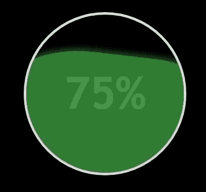

# 如何使用 CSS 创建高级加载屏幕？

> 原文:[https://www . geesforgeks . org/how-create-advanced-loading-screen-use-CSS/](https://www.geeksforgeeks.org/how-to-create-advanced-loading-screen-using-css/)

在本文中，我们将构建一个高级版本的波浪式结构，用于使用 HTML 和 CSS 加载屏幕。当某个页面花费几秒钟加载网页内容时，加载屏幕非常有用。如果某个网页不包含加载屏幕，那么在加载网页时，用户可能会认为该网页根本没有响应。因此，这种方法可以有效地让用户分心或等待几秒钟，直到页面完全加载。通过这种方式，用户能够在更长的时间内接触网页。



CSS 加载屏幕

**进场:**

*   声明具有*负载*类的 **div** 元素。在 div 元素中，声明[**【H2】**](https://www.geeksforgeeks.org/how-to-define-an-html-heading-in-html5/)标记以显示装载百分比。
*   在 CSS 部分，在 load 类中添加[](https://www.geeksforgeeks.org/css-border-radius-property/)**属性，也使位置相对。**
*   **将**高度**和**宽度**属性设置为相等，并给出一个边框半径来设置圆角。然后，使用[**@关键帧**](https://www.geeksforgeeks.org/css-animation-and-keyframes-property/) 属性为其指定一个旋转动画，以创建浏览器的动画/过渡效果。**
*   **将 *div* 元素的 [**溢出**](https://www.geeksforgeeks.org/css-overflow/) 属性设置为隐藏，这样只有 div 内部的部分可见，以模拟加载屏幕。**

****示例:**本示例描述了具有波浪形结构的 CSS 加载屏幕。**

## **超文本标记语言**

```css
<!DOCTYPE html>
<html>

<head>
    <title>Advanced Loading Screen</title>
    <style>
    body {
        background-color: black;
    }

    h1 {
        color: #4CAF50;
        text-align: center;
        font-size: 70px;
        margin: 20px 0;
    }

    .load {
        height: 250px;
        width: 250px;
        margin: auto;
        border-radius: 50%;
        position: relative;
        top: 20%;
        overflow: hidden;
        border: 4px solid #DDD;
    }

    .load::after {
        content: "";
        position: absolute;
        top: 25%;
        left: -50%;
        height: 200%;
        width: 200%;
        background-color: #388E3C;
        box-shadow: 0 0 15px #4CAF50;
        border-radius: 40%;
        animation: rotate 10s linear forwards infinite;
        opacity: 0.9;
    }

    h2 {
        color: white;
        font-size: 70px;
        text-align: center;
        font-family: "Trebuchet MS";
        position: relative;
        top: 10%;
    }

    @keyframes rotate {
        to {
            transform: rotate(360deg);
        }
    }
    </style>
</head>

<body>
    <h1>GeeksforGeeks</h1>
    <div class="load">
        <h2>75%</h2>
    </div>
</body>

</html>
```

****输出:****

**

CSS 加载屏幕**