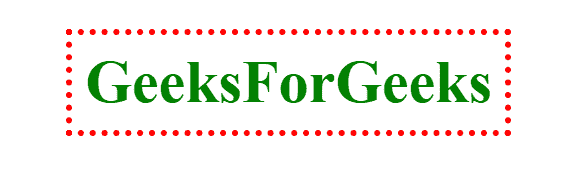

# 如何使用 CSS 创建和设置边框样式？

> 原文:[https://www . geeksforgeeks . org/如何使用 css 创建和样式化边框/](https://www.geeksforgeeks.org/how-to-create-and-style-border-using-css/)

[*边框*](https://www.geeksforgeeks.org/css-border-property/) 属性用于在元素周围创建边框，并定义其外观。边框有三个属性。

*   **[边框-颜色](https://www.geeksforgeeks.org/css-border-color-property/)**
*   **[边框宽度](https://www.geeksforgeeks.org/css-border-width-property/)**
*   **[边框式](https://www.geeksforgeeks.org/css-border-style-property/)**

**边框样式属性:**

这定义了边框的外观。可以是*实线、虚线、偏移、*等。允许下列值。

*   **虚线:**虚线边框
*   **虚线:**虚线边框
*   **实心:**实心边框
*   **双:**双边框
*   **凹槽:**A**T3】3D 凹槽边框。**
*   **脊:**3D 脊状边界。
*   **插图:**3D 插图边框。
*   **开始:**3D 开始边界。
*   **无:**无边框样式
*   **隐藏:**隐藏的边框。

**示例:**

## 超文本标记语言

```
<!DOCTYPE html>
<html lang="en">
<head>
    <meta charset="UTF-8">
    <meta http-equiv="X-UA-Compatible" content="IE=edge">
    <meta name="viewport" 
          content="width=device-width, initial-scale=1.0">
</head>

<!-- Adding some CSS -->
<style>
    h1{
        margin: auto;
        padding: 10px;
        color: green;
        margin-top: 220px;
        font-size: 48px;
        width: fit-content;

        /* Border */
        border-style: dashed;
    }
</style>
<body>
    <h1>GeeksForGeeks</h1>
</body>
</html>
```

**输出:**


虚线边框

同样，我们可以根据自己的选择使用上面给出的列表中的任何样式。我们可以单独更改边框底部、左侧、右侧和顶部的样式。

**示例:**在上面的 HTML 代码中，只需更改如下给出的边框样式表即可。

```
border-bottom-style : dashed;
border-left-style: solid;
border-right-style: double;
border-top-style: dotted;
```

**输出:**


**边框宽度属性:**该属性用于定义所有边框的宽度。宽度可以是任意大小(px、pt、cm、em 等)或使用预定义的值:*薄、中*或*厚* **。**

**示例:**

## 超文本标记语言

```
<!DOCTYPE html>
<html lang="en">
<head>
    <meta charset="UTF-8">
    <meta http-equiv="X-UA-Compatible" content="IE=edge">
    <meta name="viewport" 
          content="width=device-width, initial-scale=1.0">
</head>

<!-- Adding some CSS -->
<style>
    h1{
        margin: auto;
        padding: 10px;
        color: green;
        margin-top: 220px;
        font-size: 48px;
        width: fit-content;

        /* Border */
        border-style: solid;
        border-width: 5px;
    }
</style>
<body>
    <h1>GeeksForGeeks</h1>
</body>
</html>
```

**输出:**


**边框颜色属性:**

此属性用于更改所有四个边框的颜色。在样式部分的上述 HTML 代码中更改或添加以下内容。

```
border-color : green;
border-top-color: black;
border-bottom-color: yellow;
```

**输出:**


**边框简写:**

我们可以在单个属性中定义以上所有属性， ***边框*** 。

**语法:**

```
border:  (border-width) (border-style) (border-color);
```

**示例:**

```
border: 5px dotted red;
```

**输出:**



**圆形边框:**

***边框半径*** 属性用于添加圆角边框。使用以下语法更改上面的 HTML 代码。

**示例:**

```
border: 5px solid red;
border-radius : 15px;
```

**输出:**

