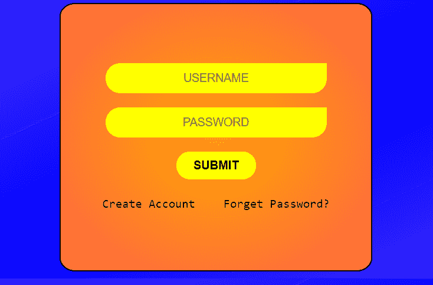
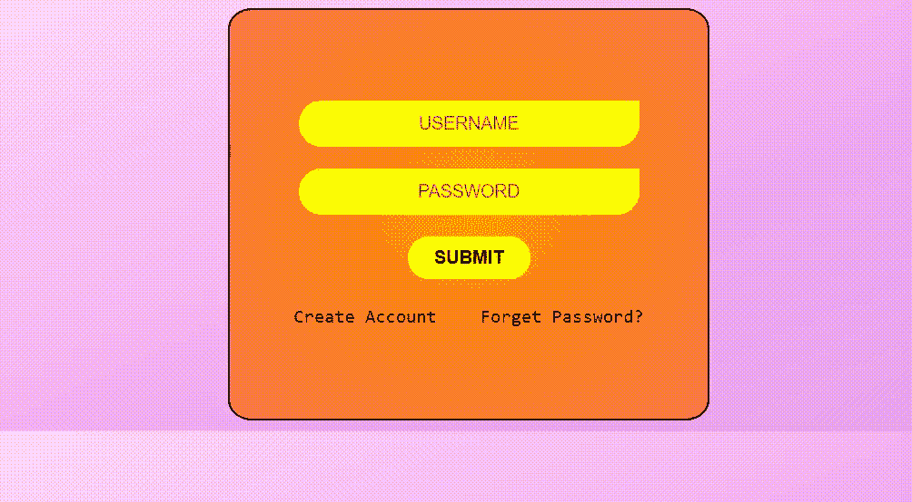

# 如何使用 CSS3 创建动画背景？

> 原文:[https://www . geeksforgeeks . org/如何使用-css3/](https://www.geeksforgeeks.org/how-to-create-animated-background-using-css3/) 创建动画背景



**先决条件:**

*   基础 html [学习 HTML](https://www.geeksforgeeks.org/html-tutorials/)
*   css [学习 css](https://www.geeksforgeeks.org/css-tutorials/)
*   你需要有一个 css 关键帧的基础知识[学习关键帧](https://www.geeksforgeeks.org/css-keyframes-rule/)

在本文中，我们使用 CSS 创建背景动画。登录表单用作演示，主要目的是设计背景动画。

**HTML 代码:**在本节中，我们将设计车身的基本结构。

```css
<!DOCTYPE html>
<html>

<head>
    <title>
        Create Animated Background
        using CSS3
    </title>
</head>

<body>
    <div class="container">
        <input id="enter" type="textbox"
                placeholder="USERNAME">
        <input id="enter" type="password"
                placeholder="PASSWORD">
        <button id="submit" type="button" >
            <span id="span">SUBMIT</span>
        </button>
        <br>

        <div id="forget">
            <a href="">Create Account</a>
            <a href="">Forget Password?</a>
        </div>
    </div>
</body>

</html>
```

**CSS 代码:**在本节中，我们使用一些 CSS 属性来设计背景动画。我们使用[线性渐变()](https://www.geeksforgeeks.org/css-linear-gradient-function/)方法和[动画](https://www.geeksforgeeks.org/css-animations/)属性来设计背景。

```css
<style>
    body
    {
        display:flex;
        justify-content: center;
        align-items: center;
        background-image:linear-gradient(155deg,
                white, violet, blue, lightblue);
        background-size:450%;
        animation:bganimation 15s infinite;
    }

    input
    {
        margin-bottom: 16px;
        outline:none;
    }

    .container
    {
        background-image:radial-gradient(orange, tomato);
        height:300px;
        width:350px;
        border:black 1.5px solid;
        border-radius: 5%;
        /*box-shadow: 8px 8px 50px black; */
        display:flex;
        justify-content:center;
        align-items:center;    
        flex-direction: column;
    }

    #submit
    { 
        outline:none;
        color:black;
        height:31px;
        width:90px;;
        border-radius:20px;
        border-style:none;
        background-color:yellow; 
        font-weight:550;

    }

    #submit:hover
    {   
        transition:1s;
        font-weight:550;
        background-color:red;
        border:2px solid yellow;
        color:white;
    }

    #enter
    {
        color:black;
        height:32px;
        width:250px;
        text-align: center;
        font-size: small;
        border-top-left-radius:20px;
        border-bottom-right-radius:20px;
        border-bottom-left-radius:20px;
        border-style:none;
        background-color:yellow;
    }

    #enter:hover
    {
        transition:0.4s;
        background-color:pink;
    }

    img[alt="www.000webhost.com"]
    {
        display:none;
    }

    a
    {
        font-weight:500;
        font-family:monospace;
        font-size:105%;
        text-decoration:none;
        color:black;
    }

    a:hover
    {
        text-decoration:underline;
    }

    a:first-child
    {
        margin-right: 28px;
    }

    @keyframes bganimation
    {
        0%{
            background-position:0% 50%;
        }

        50%{
            background-position:100% 50%;
        }

        100%{
            background-position:0% 50%;
        }
    }
</style>
```

**组合代码:**在本节中，我们将结合 HTML 和 CSS 代码制作一个背景动画。

```css
<!DOCTYPE html>
<html>

<head>
    <title>
        Create Animated Background
        using CSS3
    </title>

    <style>
        body {
            display: flex;
            justify-content: center;
            align-items: center;
            background-image: linear-gradient(155deg,
                    white, violet, blue, lightblue);
            background-size: 450%;
            animation: bganimation 15s infinite;
        }

        input {
            margin-bottom: 16px;
            outline: none;
        }

        .container {
            background-image: radial-gradient(orange, tomato);
            height: 300px;
            width: 350px;
            border: black 1.5px solid;
            border-radius: 5%;
            /*box-shadow: 8px 8px 50px black; */
            display: flex;
            justify-content: center;
            align-items: center;
            flex-direction: column;
        }

        #submit {
            outline: none;
            color: black;
            height: 31px;
            width: 90px;
            ;
            border-radius: 20px;
            border-style: none;
            background-color: yellow;
            font-weight: 550;

        }

        #submit:hover {
            transition: 1s;
            font-weight: 550;
            background-color: red;
            border: 2px solid yellow;
            color: white;
        }

        #enter {
            color: black;
            height: 32px;
            width: 250px;
            text-align: center;
            font-size: small;
            border-top-left-radius: 20px;
            border-bottom-right-radius: 20px;
            border-bottom-left-radius: 20px;
            border-style: none;
            background-color: yellow;
        }

        #enter:hover {
            transition: 0.4s;
            background-color: pink;
        }

        img[alt="www.000webhost.com"] {
            display: none;
        }

        a {
            font-weight: 500;
            font-family: monospace;
            font-size: 105%;
            text-decoration: none;
            color: black;
        }

        a:hover {
            text-decoration: underline;
        }

        a:first-child {
            margin-right: 28px;
        }

        @keyframes bganimation {
            0% {
                background-position: 0% 50%;
            }

            50% {
                background-position: 100% 50%;
            }

            100% {
                background-position: 0% 50%;
            }
        }
    </style>
</head>

<body>
    <div class="container">
        <input id="enter" type="textbox"
                placeholder="USERNAME">
        <input id="enter" type="password"
                placeholder="PASSWORD">
        <button id="submit" type="button">
            <span id="span">SUBMIT</span>
        </button>
        <br>

        <div id="forget">
            <a href="">Create Account</a>
            <a href="">Forget Password?</a>
        </div>
    </div>
</body>

</html>
```

**输出:**
