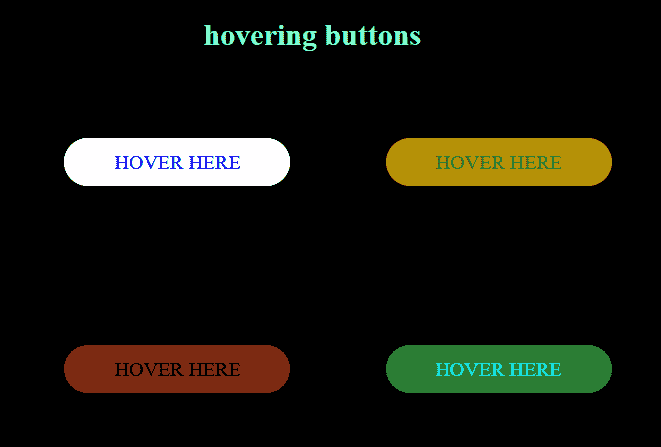
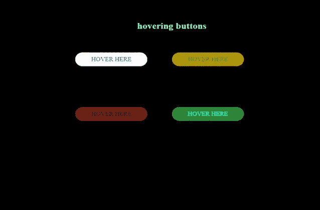

# 如何使用 CSS 创建动画悬停三维按钮效果？

> 原文:[https://www . geesforgeks . org/如何创建-动画-悬停-三维-按钮-效果-使用-css/](https://www.geeksforgeeks.org/how-to-create-animated-hovered-3-d-buttons-effect-using-css/)

按钮上的悬停三维效果是在悬停时按钮看起来朝向用户的效果。这些按钮是使用 HTML 和 CSS 创建的。

**方法:**制作 HTML 对象动画的最佳方法是使用 CSS*[@关键帧](https://www.geeksforgeeks.org/css-keyframes-rule/)* 并设置不同阶段的过渡。



**HTML 代码:**

*   创建一个 HTML 文件。
*   将提供所有动画效果的 CSS 文件链接到我们的 HTML。这也放在标签之间
*   添加两个用于创建按钮的锚点
*   再次使用两个锚点

## 超文本标记语言

```css
<!DOCTYPE html>
<html lang="en">

<head>
    <meta charset="UTF-8">
    <meta name="viewport" content=
        "width=device-width, initial-scale=1.0">   
    <link rel="stylesheet" href="style.css">
</head>

<body>
    <h2>hovering buttons</h2>
    <a href="#" class='btn head_button'>hover here</a>
    <a href="#" class='btn head_button_2'>hover here</a>
    <br><br><br><br>
    <a href="#" class='btn head_button_3'>hover here</a>
    <a href="#" class='btn head_button_4'>hover here</a>
</body>

</html>
```

**CSS 代码:**以下是上述 HTML 代码中使用的‘style . CSS’文件的内容。CSS 被用来给我们的 HTML 页面提供不同类型的动画和效果，这样它看起来对所有用户都是交互式的。

*   恢复所有浏览器效果。
*   使用类和 id 给 HTML 元素赋予效果。
*   使用@关键帧{}将动画赋予 HTML 元素。

```css
/* Restoring browser effects */

* {
    margin: 0;
    padding: 0;
    box-sizing: border-box;
}

/* Body content is same for all 
elements so we specify this in 
body section */
body {
    background-color: #000;
    text-align: center;
    padding: 20vh;
}

h2 {
    text-align: center;
    color: aquamarine;
    position: absolute;
    top: 10vh;
    left: 43vw;
}

/* CSS for visited state of the link */
.btn:link,
.btn:visited {
    text-transform: uppercase;
    text-decoration: none;
    position: relative;
    transition: all .2s;
    margin: 5vh;
}

/* CSS for hover over the link */
.btn:hover {
    transform: translateY(-10px);
    box-shadow: 0 10px 100px;
}

.btn:active {
    transform: translateX(0);
    box-shadow: 0 20px 50px;
}

.head_button {
    background-color: #fff;
    padding: 10px 40px;
    border-radius: 70px;
    display: inline-block;
    animation-name: todown;
    animation-duration: 5s;
}

.head_button_2 {
    background-color: rgba(214, 200, 3, 0.705);
    padding: 10px 40px;
    border-radius: 70px;
    display: inline-block;
    animation-name: todown;
    animation-duration: 5s;
    color: rgba(13, 105, 13, 0.829);
}

.head_button_3 {
    background-color: rgba(172, 16, 16, 0.705);
    padding: 10px 40px;
    border-radius: 70px;
    display: inline-block;
    animation-name: todown;
    animation-duration: 5s;
    color: #000;
}

.head_button_4 {
    background-color: rgba(16, 172, 37, 0.705);
    padding: 10px 40px;
    border-radius: 70px;
    display: inline-block;
    animation-name: todown;
    animation-duration: 5s;
    color: aqua;
}

/* This psuedo class defines the
  after effects of the link */
.btn::after {
    content: '';
    display: inline-block;
    height: 100%;
    width: 100%;
    border-radius: 100px;
    position: absolute;
    top: 0;
    left: 0;
    z-index: -1;
    transition: all .4s;
}

.head_button::after {
    background-color: #fff;
}

.head_button_2::after {
    background-color: rgba(131, 15, 15, 0.801);
}

.head_button_3::after {
    background-color: rgba(15, 131, 31, 0.801);
}

.head_button_4::after {
    background-color: rgba(131, 15, 116, 0.801);
}

.btn:hover::after {
    transform: scale(1.5);
    opacity: 0;
}

/* Animation that moves the button towards 
   down when we reload our web page */
@keyframes todown {
    0% {
        opacity: 0;
        transform: translateY(-150px);
    }
    60% {
        opacity: 0.6;
        transform: translateY(20px);
    }
    100% {
        opacity: 1;
        transform: translateY(0);
    }
}
```

**输出:**

