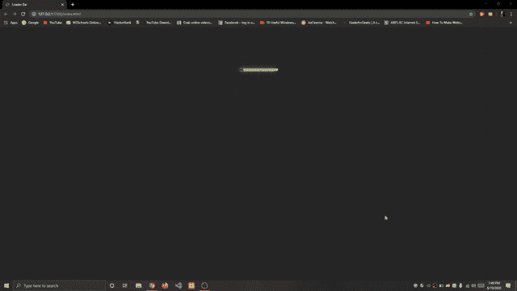

# 如何使用 CSS 创建动画加载条？

> 原文:[https://www . geesforgeks . org/how-create-animation-loading-bar-use-CSS/](https://www.geeksforgeeks.org/how-to-create-animation-loading-bar-using-css/)

**可以使用 HTML 和 CSS 创建带有动画的加载栏**。


我们将创建一个**加载器**，它是操作系统中负责加载程序和库的部分。**进度条**是一个图形控制元素，用于可视化扩展计算机操作的进度，因此在这里我们使用进度条作为加载器中的动画。我们将使用 HTML 和 CSS 属性创建一个加载栏。

**HTML 代码:**在本节中，我们将设计 HTML 代码的基本结构。

```html
<!DOCTYPE html>
<html lang="en">

<head>
    <meta charset="UTF-8">
    <meta name="viewport" content=
        "width=device-width, initial-scale=1.0">

    <title>Loader Bar</title>

    <link rel="stylesheet" href="style.css">
</head>

<body>
    <div class="loader">
        <div class="loading_1"></div>
        <div class="loading_2">Loading GfG...</div>
    </div>
</body>

</html>
```

**CSS 代码:**在本节中，我们将使用一些 CSS 属性来设计**加载栏**。我们将使用指定动画代码的**@关键帧**。动画是通过从一组 CSS 样式逐渐改变到另一组样式来创建的。使用关键字“从”(0%)和“到”(100%)时，样式会发生百分比变化。我们可以多次更改 CSS 样式集。

```html
<style>
    body {
        background-color: #262626;
        font-family: Lato, sans-serif;
    }

    .loader {
        width: 150px;
        margin: 150px auto 70px;
        position: relative;
    }

    .loader .loading_1 {
        position: relative;
        width: 100%;
        height: 10px;
        border: 1px solid yellowgreen;
        border-radius: 10px;
        animation: turn 4s linear 1.75s infinite;
    }

    .loader .loading_1:before {
        content: "";
        display: block;
        position: absolute;
        width: 0;
        height: 100%;
        background-color: yellowgreen;
        box-shadow: 10px 0px 15px 0px yellowgreen;
        animation: load 2s linear infinite;
    }

    .loader .loading_2 {
        position: absolute;
        width: 100%;
        top: 10px;
        color: green;
        font-size: 22px;
        text-align: center;
        animation: bounce 2s linear infinite;
    }

    @keyframes load {
        0% {
            width: 0%;
        }

        87.5% {
            width: 100%;
        }
    }

    @keyframes turn {
        0% {
            transform: rotateY(0deg);
        }

        6.25%,
        50% {
            transform: rotateY(180deg);
        }

        56.25%,
        100% {
            transform: rotateY(360deg);
        }
    }

    @keyframes bounce {

        0%,
        100% {
            top: 10px;
        }

        12.5% {
            top: 30px;
        }
    }
</style>
```

**完整代码:**是 HTML 和 CSS 上面两个代码段的组合。在下面的代码中，我们在 HTML 代码中内部添加了 CSS 代码**。**

```html
<!DOCTYPE html>
<html lang="en">

<head>
    <meta charset="UTF-8">
    <meta name="viewport" content=
        "width=device-width, initial-scale=1.0">

    <title>Loader Bar</title>

    <style>
        body {
            background-color: #262626;
            font-family: Lato, sans-serif;
        }

        .loader {
            width: 150px;
            margin: 150px auto 70px;
            position: relative;
        }

        .loader .loading_1 {
            position: relative;
            width: 100%;
            height: 10px;
            border: 1px solid yellowgreen;
            border-radius: 10px;
            animation: turn 4s linear 1.75s infinite;
        }

        .loader .loading_1:before {
            content: "";
            display: block;
            position: absolute;
            width: 0;
            height: 100%;
            background-color: yellowgreen;
            box-shadow: 10px 0px 15px 0px yellowgreen;
            animation: load 2s linear infinite;
        }

        .loader .loading_2 {
            position: absolute;
            width: 100%;
            top: 10px;
            color: green;
            font-size: 22px;
            text-align: center;
            animation: bounce 2s linear infinite;
        }

        @keyframes load {
            0% {
                width: 0%;
            }

            87.5% {
                width: 100%;
            }
        }

        @keyframes turn {
            0% {
                transform: rotateY(0deg);
            }

            6.25%,
            50% {
                transform: rotateY(180deg);
            }

            56.25%,
            100% {
                transform: rotateY(360deg);
            }
        }

        @keyframes bounce {

            0%,
            100% {
                top: 10px;
            }

            12.5% {
                top: 30px;
            }
        }
    </style>
</head>

<body>
    <div class="loader">
        <div class="loading_1"></div>
        <div class="loading_2">Loading GfG...</div>
    </div>
</body>

</html>
```

****输出:**下图为带有动画的**加载条**。**

****