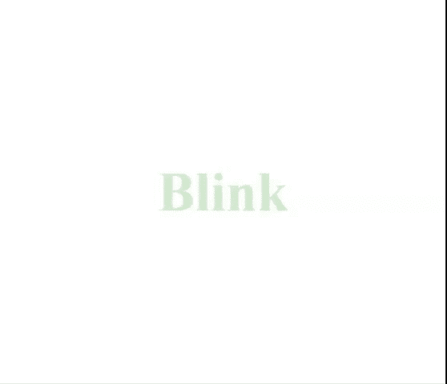

# 如何使用 CSS 创建闪烁文字？

> 原文:[https://www . geesforgeks . org/how-create-bling-text-use-CSS/](https://www.geeksforgeeks.org/how-to-create-blinking-text-using-css/)

闪烁文本效果也称为闪烁文本效果，可以使用 HTML 和 CSS**@关键帧**规则和**不透明度**属性轻松创建。

**HTML 代码:**在本节中，我们将创建一个基本的 *div* 元素，其中将包含一些文本。

```html
<!DOCTYPE html>
<html lang="en">
<head>
  <meta charset="UTF-8">
  <meta name="viewport" content=
    "width=device-width, initial-scale=1.0">
  <title>Blinking Text</title>
</head>
<body>
  <div>
    <h2>Blink</h2>
  </div>
</body>
</html>
```

**CSS 代码:**本节实现了使用 CSS**@关键帧**规则设计出想要的效果的文本。如下所示设置**不透明度**属性。

```html
<style>
  body{
  margin: 0;
  padding: 0;
}

div{
  position: absolute;
  top: 50%;
  left: 50%;
  transform: translate(-50%, -50%);
}

 h2{
   font-size: 5em;
   font-family: serif;
   color:#008000;
   text-align: center;
   animation: animate 1.5s linear infinite;
 } 

 @keyframes animate{
   0%{
     opacity: 0;
   }
   50%{
     opacity: 0.7;
   }
   100%{
     opacity: 0;
   }
 }
</style>
```

**最终代码:**是以上两个代码段的组合。

```html
<!DOCTYPE html>
<html lang="en">

<head>
    <meta charset="UTF-8">
    <meta name="viewport" content=
        "width=device-width, initial-scale=1.0">

    <title>Blinking Text</title>

    <style>
        body {
            margin: 0;
            padding: 0;
        }

        div {
            position: absolute;
            top: 50%;
            left: 50%;
            transform: translate(-50%, -50%);
        }

        h2 {
            font-size: 5em;
            font-family: serif;
            color: #008000;
            text-align: center;
            animation: animate 
                1.5s linear infinite;
        }

        @keyframes animate {
            0% {
                opacity: 0;
            }

            50% {
                opacity: 0.7;
            }

            100% {
                opacity: 0;
            }
        }
    </style>
</head>

<body>
    <div>
        <h2>Blink</h2>
    </div>
</body>

</html>
```

**输出:**
