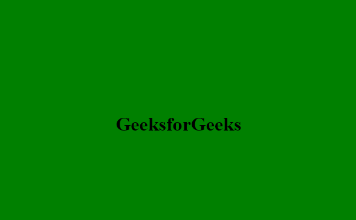

# 如何使用 CSS 创建边框动画？

> 原文:[https://www . geeksforgeeks . org/如何使用 css 创建边框动画/](https://www.geeksforgeeks.org/how-to-create-border-animation-using-css/)



当我们悬停在文本上时，使用悬停的 CSS 边框动画用于创建边框动画。我们要用的概念是之前的[、](https://www.geeksforgeeks.org/css-before-selector/)之后的[和](https://www.geeksforgeeks.org/css-after-selector/?ref=lbp)[悬停](https://www.geeksforgeeks.org/css-hover-selector/)选择器。强烈建议在本文继续之前仔细检查所有这些选择器。

**手法:**这个动画的手法是把动画分成两部分。顶部和右侧将使用前选择器一次性完成，底部和左侧将使用后选择器一次性完成。

**HTML 代码:**我们已经创建了 HTML 文件，并在其中创建了一个 div，其中 h1 在 div 内。下面是相同的代码。

```css
<!DOCTYPE html>
<html lang="en">

<head>
    <meta charset="UTF-8" />
    <meta name="viewport" content=
        "width=device-width, initial-scale=1.0" />
    <title>GeeksforGeeks</title>
</head>

<body>
    <div class="geeks">
        <h1>GeeksforGeeks</h1>
    </div>
</body>

</html>
```

**CSS 代码:**这个动画的 CSS 有点棘手，让我们试着一步一步去理解。

**第一步:**我们做的第一件事是提供基本的背景，并在中心对齐我们的文本。下面是相同的代码。

```css
body {
    margin: 0;
    padding: 0;
    background: green;
}

.geeks {
    left: 40%;
    top: 40%;
    position: absolute;
    width: 300px;
    text-align: center;
}

h1 {
    position: relative;
}
```

**第二步:**第二步是创建顶部和右侧边框。

*   第一件事是创建一个透明背景的边框。
*   然后将它悬停在动画上，给它一个线性动画和一个标识符名称作为动画。
*   现在使用关键帧，我们将动画边界。确保仅在边框的顶部和右侧应用颜色。首先，我们增加了顶部边框动画的宽度和右侧边框动画的高度。

```css
.geeks::before {
    content: "";
    position: absolute;
    top: -2px;
    left: -2px;
    width: 0;
    height: 0;
    background: transparent;
    border: 2px solid transparent;
}

.geeks:hover::before {
    animation: animate 1s linear forwards;
}

@keyframes animate {
    0% {
        width: 0;
        height: 0;
        border-top-color: black;
        border-right-color: transparent;
        border-bottom-color: transparent;
        border-left-color: transparent;
    }

    50% {
        width: 100%;
        height: 0;
        border-top-color: black;
        border-right-color: black;
        border-bottom-color: transparent;
        border-left-color: transparent;
    }

    100% {
        width: 100%;
        height: 100%;
        border-top-color: black;
        border-right-color: black;
        border-bottom-color: transparent;
        border-left-color: transparent;
    }
}
```

**步骤 3:** 用后选择器重复步骤-2。在此步骤中需要记住的一些要点是:

*   确保顶部和右侧是透明的，左侧和底部是彩色的。
*   左边的高度会增加，底部的宽度会增加。
*   确保在此步骤中关键帧标识符使用不同的名称。

```css
.geeks::after {
    content: "";
    position: absolute;
    top: -2px;
    left: -2px;
    width: 0;
    height: 0;
    background: transparent;
    border: 2px solid transparent;
}

.geeks:hover::after {
    animation: animates 1s linear forwards;
}

@keyframes animates {
    0% {
        width: 0;
        height: 0;
        border-top-color: transparent;
        border-right-color: transparent;
        border-bottom-color: transparent;
        border-left-color: black;
    }

    50% {
        width: 0;
        height: 100%;
        border-top-color: transparent;
        border-right-color: transparent;
        border-bottom-color: black;
        border-left-color: black;
    }

    100% {
        width: 100%;
        height: 100%;
        border-top-color: transparent;
        border-right-color: transparent;
        border-bottom-color: black;
        border-left-color: black;
    }
}
```

**完整 CSS 代码:**

```css
<style>
    body {
        margin: 0;
        padding: 0;
        background: green;
    }

    .geeks {
        left: 40%;
        top: 40%;
        position: absolute;

        width: 300px;
        text-align: center;
    }

    h1 {
        position: relative;
    }

    .geeks::before {
        content: "";
        position: absolute;
        top: -2px;
        left: -2px;
        width: 0;
        height: 0;
        background: transparent;
        border: 2px solid transparent;
    }

    .geeks:hover::before {
        animation: animate 1s linear forwards;
    }

    @keyframes animate {
        0% {
            width: 0;
            height: 0;
            border-top-color: black;
            border-right-color: transparent;
            border-bottom-color: transparent;
            border-left-color: transparent;
        }

        50% {
            width: 100%;
            height: 0;
            border-top-color: black;
            border-right-color: black;
            border-bottom-color: transparent;
            border-left-color: transparent;
        }

        100% {
            width: 100%;
            height: 100%;
            border-top-color: black;
            border-right-color: black;
            border-bottom-color: transparent;
            border-left-color: transparent;
        }
    }

    .geeks::after {
        content: "";
        position: absolute;
        top: -2px;
        left: -2px;
        width: 0;
        height: 0;
        background: transparent;
        border: 2px solid transparent;
    }

    .geeks:hover::after {
        animation: animates 1s linear forwards;
    }

    @keyframes animates {
        0% {
            width: 0;
            height: 0;
            border-top-color: transparent;
            border-right-color: transparent;
            border-bottom-color: transparent;
            border-left-color: black;
        }

        50% {
            width: 0;
            height: 100%;
            border-top-color: transparent;
            border-right-color: transparent;
            border-bottom-color: black;
            border-left-color: black;
        }

        100% {
            width: 100%;
            height: 100%;
            border-top-color: transparent;
            border-right-color: transparent;
            border-bottom-color: black;
            border-left-color: black;
        }
    }
</style>
```

**完整代码:**是 HTML 和 CSS 两种代码的组合。

```css
<!DOCTYPE html>
<html lang="en">

<head>
    <meta charset="UTF-8" />
    <meta name="viewport" content=
        "width=device-width, initial-scale=1.0" />
    <title>GeeksforGeeks</title>
    <style>
        body {
            margin: 0;
            padding: 0;
            background: green;
        }

        .geeks {
            left: 40%;
            top: 40%;
            position: absolute;

            width: 300px;
            text-align: center;
        }

        h1 {
            position: relative;
        }

        .geeks::before {
            content: "";
            position: absolute;
            top: -2px;
            left: -2px;
            width: 0;
            height: 0;
            background: transparent;
            border: 2px solid transparent;
        }

        .geeks:hover::before {
            animation: animate 1s linear forwards;
        }

        @keyframes animate {
            0% {
                width: 0;
                height: 0;
                border-top-color: black;
                border-right-color: transparent;
                border-bottom-color: transparent;
                border-left-color: transparent;
            }

            50% {
                width: 100%;
                height: 0;
                border-top-color: black;
                border-right-color: black;
                border-bottom-color: transparent;
                border-left-color: transparent;
            }

            100% {
                width: 100%;
                height: 100%;
                border-top-color: black;
                border-right-color: black;
                border-bottom-color: transparent;
                border-left-color: transparent;
            }
        }

        .geeks::after {
            content: "";
            position: absolute;
            top: -2px;
            left: -2px;
            width: 0;
            height: 0;
            background: transparent;
            border: 2px solid transparent;
        }

        .geeks:hover::after {
            animation: animates 1s linear forwards;
        }

        @keyframes animates {
            0% {
                width: 0;
                height: 0;
                border-top-color: transparent;
                border-right-color: transparent;
                border-bottom-color: transparent;
                border-left-color: black;
            }

            50% {
                width: 0;
                height: 100%;
                border-top-color: transparent;
                border-right-color: transparent;
                border-bottom-color: black;
                border-left-color: black;
            }

            100% {
                width: 100%;
                height: 100%;
                border-top-color: transparent;
                border-right-color: transparent;
                border-bottom-color: black;
                border-left-color: black;
            }
        }
    </style>
</head>

<body>
    <div class="geeks">
        <h1>GeeksforGeeks</h1>
    </div>
</body>

</html>
```

**输出:**
