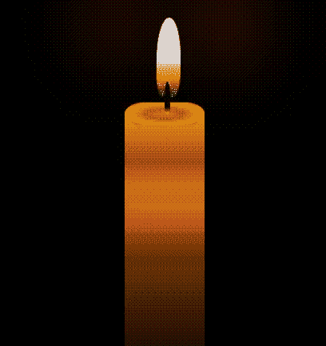

# 如何使用 CSS 创建蜡烛动画？

> 原文:[https://www . geesforgeks . org/如何创建蜡烛-动画-使用-css/](https://www.geeksforgeeks.org/how-to-create-candle-animation-using-css/)

为了创建蜡烛动画，我们采用了纯 CSS 的基本方法。，这里我们使用一些动画技术，如移动和旋转，以更有效地创建蜡烛。

**方法:**首先我们创建一个容器类。在容器类中，我们创建了另一个名为蜡烛体的类，在这个类中，我们创建了另一个两类蜡烛棒和蜡烛火焰。在蜡烛体选择器中，我们设置蜡烛体的高度和宽度。为了在蜡烛体中添加棒，我们在蜡烛棒选择器中使用一些 CSS 属性，然后我们添加蜡烛火焰，我们在蜡烛火焰选择器中添加一些动画，如移动和旋转。我们正在描述 CSS 文件中使用的一些属性和选择器:

*   [**背景**](https://www.geeksforgeeks.org/css-background/) **:用于为元素添加背景效果。**
*   [](https://www.geeksforgeeks.org/css-border-radius-property/)****:**它定义了元素的角的半径。**
*   **[**动画**](https://www.geeksforgeeks.org/css-animations/) **:** 动画是通过从一组 CSS 样式逐渐变化到另一组样式来创建的。**
*   **[**@关键帧**](https://www.geeksforgeeks.org/css-animations/)**:**@关键帧规则指定动画代码。**
*   **[**渐变**](https://www.geeksforgeeks.org/css-gradients/) **:** 提供两种或两种以上指定颜色之间的平滑过渡。**
*   **[**【z-index】**](https://www.geeksforgeeks.org/css-z-index-property/)**:**z-index 设置定位元素的 z 顺序。**
*   **[**框影**](https://www.geeksforgeeks.org/css-box-shadow-property/) **:-** 框影将一个或多个阴影附加到元素上。**
*   **[**变换**](https://www.geeksforgeeks.org/css-transform-property/) **:** 它对元素应用 2D 或 3D 变换。它允许你旋转、移动、倾斜等。，元素。**

**下面是上述方法的实现。**

## **超文本标记语言**

```html
<!DOCTYPE html>
<html>

<head>
    <title>Candle Animation using CSS</title>

    <!--CSS File-->
    <style type="text/css">
        .container {
            height: 100vh;
            width: 100vw;
            align-items: center;
            justify-content: center;
            background: rgb(26, 25, 25);
            animation: change-background 3s infinite linear;
        }

        .candle-body {
            position: absolute;
            width: 100px;
            height: 350px;
            background: linear-gradient(
                rgb(209, 158, 64),
                rgb(165, 96, 11),
                rgb(241, 85, 12),
                rgb(109, 47, 3) 50%,
                rgba(0, 0, 0, 0.6)
            );
            bottom: 1%;
            left: 50%
        }

        .candle-body:before {
            content: "";
            position: absolute;
        }

        .candle-body:after {
            content: "";
            position: absolute;
            top: -25px;
            height: 50px;
            width: 100px;
            border-radius: 50px;
            background: radial-gradient(
                rgb(226, 95, 34),
                rgb(168, 117, 23),
                rgb(255, 149, 18),
                rgb(112, 49, 3)
            );

            transform: rotateX(55deg);
            box-shadow: insert 2px 3px 4px 
                rgba(0, 0, 0, 0.2),
                insert -2px -3px 4px 
                rgba(0, 0, 0, 0.2);
        }

        .candle-stick {
            width: 7px;
            height: 40px;
            position: absolute;
            top: -40px;
            left: 50px;
            background: linear-gradient(
                rgb(7, 7, 204) 2%,
                rgb(15, 0, 0) 80%,
                rgb(248, 165, 11) 
                99%
            );
            border-radius: 50% 50% 20% 20%;
            z-index: 10;
        }

        .candle-flames {
            position: absolute;
            background: linear-gradient(
                rgb(224, 216, 216) 50%,
                rgb(233, 157, 17),
                rgb(12, 12, 226)
            );
            border-radius: 50% 50% 30% 30%;
            width: 30px;
            height: 100px;
            top: -120px;
            left: 35px;
            animation: move 1s linear infinite, 
                    rotate 2s linear infinite;
            box-shadow: 70px -50px 100px rgb(228, 70, 13),
                -70px -50px 100px rgb(180, 52, 6);
        }

        @keyframes move {
            0% {
                transform: rotateZ(1deg);
            }

            100% {
                transform: rotateZ(-1deg);
            }
        }

        @keyframes rotate {
            0% {
                top: -120px;
                left: 40px;
            }

            100% {
                top: -120px;
                left: 40px;
            }
        }

        @keyframes change-background {

            0%,
            60%,
            98%,
            100% {
                background: rgb(3, 52, 65);
            }

            61%,
            97% {
                background: #000;
            }
        }
    </style>
</head>

<body>
    <div class="container">
        <div class="candle-body">
            <div class="candle-stick"></div>
            <div class="candle-flames"></div>
        </div>
    </div>
</body>

</html>
```

****输出:****

****