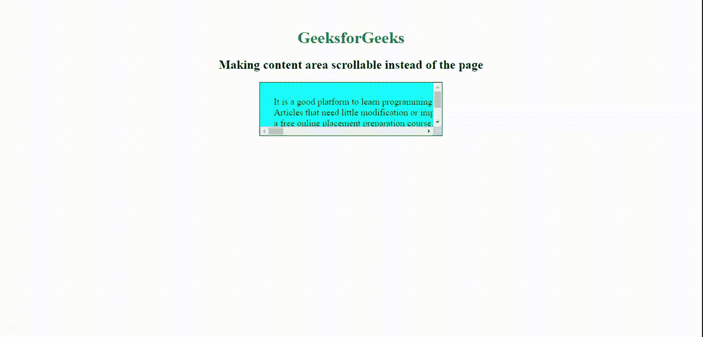
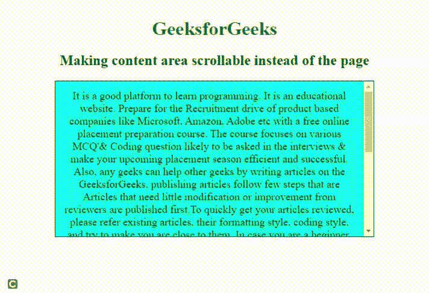

# 如何使用 CSS 创建可滚动的内容区域而不是页面？

> 原文:[https://www . geesforgeks . org/如何创建内容区域-可滚动-而不是页面-使用 css/](https://www.geeksforgeeks.org/how-to-create-content-area-scrollable-instead-of-the-page-using-css/)

通过使用 CSS *溢出*属性，使特定内容区域可滚动。下面列出了*溢出*属性的不同值。

*   **可见:**该属性表示可以在块框外进行渲染，并且不进行裁剪。
*   **隐藏:**该属性表示*溢出*被截断。其余内容将是不可见的。
*   **自动:**如果溢出被剪切，则自动为其余内容添加滚动条。
*   **滚动:**该属性指示如果滚动条被剪切，则添加滚动条以查看其余内容。
*   **初始值:**该属性设置为默认值。
*   **inherit:** 该属性从其父元素继承属性。

我们可以通过将正文*溢出*属性设置为*隐藏*来禁用页面滚动。

在这两个例子中，我们将使用这个属性来禁用页面滚动。

**示例 1:** 在本例中，我们使用*溢出:滚动*属性使“div”可垂直和水平滚动。

## 超文本标记语言

```css
<!DOCTYPE html>
<html>

<head>
    <meta charset="utf-8">

    <meta name="viewport" content=
        "width=device-width, initial-scale=1">
</head>

<style>
    body {
        /* disabling body scrolling */
        overflow: hidden;
        margin: auto;
        background: white;
        margin-top: 4%;
        text-align: center;
    }

    h1 {
        color: Green;
    }

    .scroll {
        /* enable div scrolling */
        overflow: scroll;
        height: 8%;
        background-color: aqua;
        border: 1px black solid;
        padding: 2%;
        width: 300px;
        margin: 0 auto;
        white-space: nowrap;
        font-size: large;
    }
</style>

<body>
    <h1>GeeksforGeeks</h1>

    <h2>
        Making content area scrollable 
        instead of the page
    </h2>

    <div class="scroll">
        It is a good platform to learn programming. 
        It is an educational website. Prepare for 
        the Recruitment drive of product based 
        companies like Microsoft, Amazon, Adobe etc 
        with a free online placement preparation 
        course. The course focuses on various MCQ
        & Coding question likely to be asked in the 
        interviews & make your upcoming placement 
        season efficient and successful. Also, any 
        geeks can help other geeks by writing 
        articles on the GeeksforGeeks, publishing 
        articles follow few steps that are<br> 
        Articles that need little modification or
        improvement from reviewers are published 
        first. To quickly get your articles reviewed,
        please refer existing articles, their 
        formatting style, coding style, and try to 
        make you are close to them. In case you are 
        a beginner, you may refer Guidelines to write
        an Article. It is a good platform to learn 
        programming. It is an educational website. 
        Prepare for the Recruitment drive of product 
        based companies like Microsoft, Amazon, Adobe 
        etc with<br> a free online placement preparation 
        course. The course focuses on various MCQ's & 
        Coding question likely to be asked in the 
        interviews & make your upcoming placement 
        season efficient and successful. Also, any 
        geeks can help other geeks by<br> writing 
        articles on the GeeksforGeeks, publishing 
        articles follow few steps that are Articles 
        that need little modification or improvement 
        from reviewers are published first. To quickly 
        get your articles reviewed, please refer 
        existing articles, their formatting style, 
        coding style, and try to make you are close 
        to them. In case you are a beginner, you may 
        refer Guidelines to write an Article.
    </div>
</body>

</html>
```

**输出:**


**例 2:** 在本例中，使用*溢出:自动；*使“div”可垂直和水平滚动。

## 超文本标记语言

```css
<!DOCTYPE html>
<html>

<head>
    <meta charset="utf-8">

    <meta name="viewport" content=
        "width=device-width, initial-scale=1">

    <style>
        body {
            /* disabling body scrolling */
            overflow: hidden;
            margin: auto;
            background: white;
            margin-top: 4%;
            text-align: center;
        }

        h1 {
            color: Green;
        }

        .scroll {
            /* enable div scrolling */
            overflow: auto;
            height: 8%;
            background-color: aqua;
            border: 1px black solid;
            padding: 2%;
            width: 300px;
            margin: 0 auto;
            white-space: nowrap;
            font-size: large;
        }
    </style>
</head>

<body>
    <h1>GeeksforGeeks</h1>

    <h2>
        Making content area scrollable 
        instead of the page
    </h2>

    <div class="scroll">
        It is a good platform to learn programming. 
        It is an educational website. Prepare for 
        the Recruitment drive of product based 
        companies like Microsoft, Amazon, Adobe etc 
        with a free online placement preparation 
        course. The course focuses on various MCQ
        & Coding question likely to be asked in the 
        interviews & make your upcoming placement 
        season efficient and successful. Also, any 
        geeks can help other geeks by writing 
        articles on the GeeksforGeeks, publishing 
        articles follow few steps that are<br> 
        Articles that need little modification or
        improvement from reviewers are published 
        first. To quickly get your articles reviewed,
        please refer existing articles, their 
        formatting style, coding style, and try to 
        make you are close to them. In case you are 
        a beginner, you may refer Guidelines to write
        an Article. It is a good platform to learn 
        programming. It is an educational website. 
        Prepare for the Recruitment drive of product 
        based companies like Microsoft, Amazon, Adobe 
        etc with<br> a free online placement preparation 
        course. The course focuses on various MCQ's & 
        Coding question likely to be asked in the 
        interviews & make your upcoming placement 
        season efficient and successful. Also, any 
        geeks can help other geeks by<br> writing 
        articles on the GeeksforGeeks, publishing 
        articles follow few steps that are Articles 
        that need little modification or improvement 
        from reviewers are published first. To quickly 
        get your articles reviewed, please refer 
        existing articles, their formatting style, 
        coding style, and try to make you are close 
        to them. In case you are a beginner, you may 
        refer Guidelines to write an Article.
    </div>
</body>

</html>
```

**输出:**



**注意:**通过将*溢出-y* 设置为*滚动*和*自动*和*溢出-x* 到*隐藏*可以只启用垂直滚动。

同样对于水平滚动，将*溢出-x* 设置为*滚动*或*自动*和*溢出-y* 设置为*隐藏*。

**示例 3:** 该示例仅用于内容区域的垂直滚动。

## 超文本标记语言

```css
<!DOCTYPE html>
<html>

<head>
    <meta charset="utf-8">

    <meta name="viewport" content=
        "width=device-width, initial-scale=1">

    <style>
        body {
            overflow: hidden;
            margin: auto;
            background: white;
            margin-top: 4%;
            text-align: center;
        }

        h1 {
            color: Green;
        }

        .scroll {
            overflow-y: auto;
            overflow-x: hidden;
            height: 50%;
            background-color: aqua;
            border: 1px black solid;
            padding: 2%;
            width: 500px;
            margin: 0 auto;
            font-size: large;
        }
    </style>
</head>

<body>
    <h1>GeeksforGeeks</h1>

    <h2>
        Making content area scrollable 
        instead of the page
    </h2>

    <div class="scroll">
        It is a good platform to learn programming. 
        It is an educational website. Prepare for 
        the Recruitment drive of product based 
        companies like Microsoft, Amazon, Adobe etc 
        with a free online placement preparation 
        course. The course focuses on various MCQ
        & Coding question likely to be asked in the 
        interviews & make your upcoming placement 
        season efficient and successful. Also, any 
        geeks can help other geeks by writing 
        articles on the GeeksforGeeks, publishing 
        articles follow few steps that are<br> 
        Articles that need little modification or
        improvement from reviewers are published 
        first. To quickly get your articles reviewed,
        please refer existing articles, their 
        formatting style, coding style, and try to 
        make you are close to them. In case you are 
        a beginner, you may refer Guidelines to write
        an Article. It is a good platform to learn 
        programming. It is an educational website. 
        Prepare for the Recruitment drive of product 
        based companies like Microsoft, Amazon, Adobe 
        etc with<br> a free online placement preparation 
        course. The course focuses on various MCQ's & 
        Coding question likely to be asked in the 
        interviews & make your upcoming placement 
        season efficient and successful. Also, any 
        geeks can help other geeks by<br> writing 
        articles on the GeeksforGeeks, publishing 
        articles follow few steps that are Articles 
        that need little modification or improvement 
        from reviewers are published first. To quickly 
        get your articles reviewed, please refer 
        existing articles, their formatting style, 
        coding style, and try to make you are close 
        to them. In case you are a beginner, you may 
        refer Guidelines to write an Article.
    </div>
</body>

</html>
```

**输出:**

