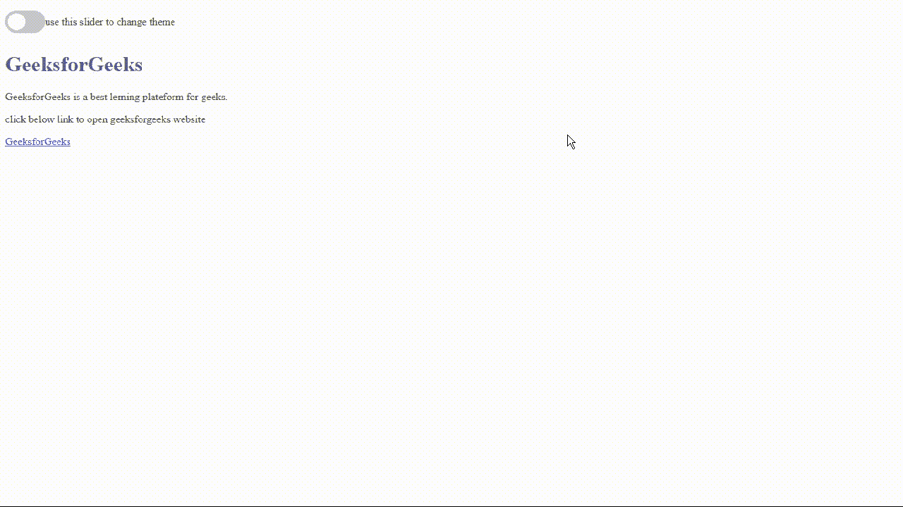

# 如何在 CSS 中使用 Slider 创建深色主题？

> 原文:[https://www . geesforgeks . org/如何使用 css 中的滑块创建深色主题/](https://www.geeksforgeeks.org/how-to-create-dark-theme-using-slider-in-css/)

在本文中，我们将学习使用 CSS 中的滑块创建一个深色主题。在现代网站中，我们看到一个奇妙的功能，只需检查一个滑块就可以改变网站主题。要查看这个令人敬畏的功能，请访问[geeksforgeeks.org](https://www.geeksforgeeks.org/)网站，您可以根据自己的喜好更改主题。在本文中，我们将学习创建一个滑块来更改网站主题。它允许用户根据自己的喜好定制网站的界面，是最好的用户体验。在这里，我们将创建一个不错的滑块来改变我们的网站主题。

**创建深色主题滑块的步骤:**以下是创建深色主题滑块的步骤。

*   使用 HTML 创建网页
*   定义所有 CSS 变量，如背景颜色、主要文本颜色、默认主题的次要文本颜色和深色主题。
*   使用 JavaScript 添加功能，将默认模式切换到黑暗模式。

**示例:**下面的示例演示了如何在 CSS 中使用滑块创建深色主题。

**步骤 1:** 创建一个 index.html 文件，并在其中添加以下 html 代码，为网页提供基本结构。

**文件名:index.html**

## 超文本标记语言

```
<!DOCTYPE html>
<html lang="en">

<head>
    <meta charset="UTF-8">
    <meta http-equiv="X-UA-Compatible" content="IE=edge">
    <meta name="viewport" content=
        "width=device-width, initial-scale=1.0">

    <!-- Stylesheet link -->
    <link rel="stylesheet" href="./style.css">

    <!-- JavaScript file -->
    <script defer src="/script.js"></script>
    <!-- Instead of add defer, embedd javascript
        file in body tag -->
</head>

<body>

    <!--Heading Section-->
    <header>
        <nav>

            <!-- Add your custom menu here
                and theme slider -->
            <div class="theme-switch-container">
                <label class="theme-slider" for="checkbox">
                    <input type="checkbox" id="checkbox" />
                    <div class="round slider"></div>
                </label>

<p>use this slider to change theme</p>

            </div>
        </nav>
    </header>

    <!-- Main Section -->
    <main>
        <h1>GeeksforGeeks</h1>

<p>
            GeeksforGeeks is a best learning
            plateform for geeks.
        </p>

<p>
            click below link to open
            geeksforgeeks website
        </p>

        <a href="https://www.geeksforgeeks.org/">
            GeeksforGeeks
        </a>
    </main>
</body>

</html>
```

**第二步:**现在我们将创建一个新的文件，为上面的 html 代码添加样式。

**文件名:style.css**

## 半铸钢ˌ钢性铸铁(Cast Semi-Steel)

```
/* Default light theme */
:root {
    --primary-color: #302AE6;
    --secondary-color: #536390;
    --text-color: #424242;
    --background-color: #fff;
    --heading-color: #292922;
}

/* Dark theme */
[theme="dark"] {
    --primary-color: #9A97F3;
    --secondary-color: #818cab;
    --text-color: #e1e1ff;
    --background-color: #161625;
    --heading-color: #818cab;
}

/* Adding css variable in our webpage */
body {
    background-color: var(--background-color);
    color: var(--text-color);
}

h1 {
    color: var(--secondary-color);
}

a {
    color: var(--primary-color);
}

/* Slider styling */
.theme-switch-container {
    display: flex;
    align-items: center;
}

.theme-slider {
    display: inline-block;
    height: 34px;
    position: relative;
    width: 60px;
}

.theme-slider input {
    display: none;
}

.slider {
    background-color: #ccc;
    bottom: 0;
    cursor: pointer;
    left: 0;
    position: absolute;
    right: 0;
    top: 0;
    transition: .4s;
}

.slider:before {
    background-color: #fff;
    bottom: 4px;
    content: "";
    height: 26px;
    left: 4px;
    position: absolute;
    transition: .4s;
    width: 26px;
}

input:checked+.slider {
    background-color: #66bb6a;
}

input:checked+.slider:before {
    transform: translateX(26px);
}

.slider.round {
    border-radius: 34px;
}

.slider.round:before {
    border-radius: 50%;
}
```

**第三步:**现在我们将创建一个 javascript 文件，并使函数 toggleSwitch 允许我们在黑暗和光明主题之间切换。

**文件名:script.js**

## java 描述语言

```
const toggleSwitch =
    document.querySelector('.theme-slider input[type="checkbox"]');

/* Function to change theme */
function switchTheme(e) {

    /* Once checkbox is checked default theme change to dark */
    if (e.target.checked) {
        document.documentElement.setAttribute('theme', 'dark');
    }

    /* While page in dark mode and checkbox is
    checked then theme back to change light*/
    else {
        document.documentElement.setAttribute('theme', 'light');
    }
}

toggleSwitch.addEventListener('change', switchTheme, false);
```

#### 输出:

