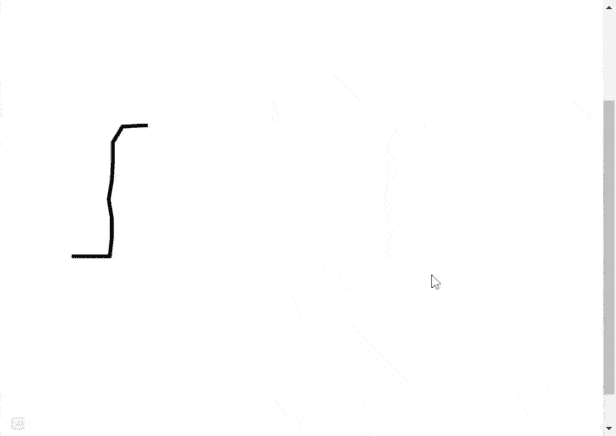

# 如何使用 CSS 创建绘画效果动画？

> 原文:[https://www . geesforgeks . org/如何创建-绘图-效果-动画-使用-css/](https://www.geeksforgeeks.org/how-to-create-drawing-effect-animation-using-css/)

绘制效果动画可以使用 CSS 动画来实现。使用的图像可以根据需要修改或编辑。将图像保存为 [SVG](https://www.geeksforgeeks.org/html-svg-basics/) 文件格式。动画是通过使用线条和曲线绘制简单的艺术来创建的。

CSS [*笔划-dashoffset*](https://www.geeksforgeeks.org/css-stroke-dashoffset-property/) 属性定义了沿 SVG 路径笔划开始的位置。

[](https://www.geeksforgeeks.org/svg-stroke-dasharray-attribute/)*用于在 SVG 形状的笔画中创建破折号。动画在 5 秒内完成一个循环。线性函数指定从开始到结束速度相同的动画。*向前*选项指定元素将保留由最后一个关键帧设置的样式值。[*@关键帧*](https://www.geeksforgeeks.org/css-animation-and-keyframes-property/) 规则指定动画代码。*

***示例:***

## *超文本标记语言*

```css
*<!DOCTYPE html>
<html lang="en">

<head>
    <meta charset="UTF-8" />
    <meta http-equiv="X-UA-Compatible" content="IE=edge" />
    <meta name="viewport" content=
        "width=device-width, initial-scale=1.0" />

    <style>
        .path {
            stroke-dasharray: 3000;
            stroke-dashoffset: 3000;
            animation: dash 5s linear forwards infinite;
        }

        @keyframes dash {
            to {
                stroke-dashoffset: 0;
            }
        }
    </style>
</head>

<body>
    <svg viewBox="0 0 640 640">
        <path class="path" fill="white" 
        stroke="black" stroke-width="4" 
        d="M70.74 411.89L91.42 411.89L112.09 411.89L114.39 
        391.22L114.39 370.54L110.95 349.86L114.39 329.19L115.54 
        308.51L115.54 287.84L125.88 270.61L146.55 269.46L167.23 
        269.46L176.42 287.84L172.97 308.51L172.97 329.19L172.97 
        351.01L172.97 371.69L174.12 392.36L184.46 409.59L205.14
        409.59L225.81 410.74L230.41 390.07L229.26 369.39L226.96 
        348.72L226.96 328.04L231.55 307.36L235 286.69L228.11 
        267.16L247.64 259.12L268.31 259.12L288.99 261.42L303.92 
        275.2L299.32 297.03L297.03 317.7L297.03 339.53L298.18 
        360.2L298.18 380.88L299.32 401.55L318.85 406.15L339.53 
        406.15L349.86 388.92L352.16 368.24L355.61 347.57L355.61 
        326.89L354.46 305.07L352.16 284.39L351.01 263.72L370.54 
        256.82L391.22 256.82L411.89 260.27L411.89 280.95L411.89 
        302.77L413.04 323.45L416.49 345.27L418.78 365.95L421.08 
        386.62L436.01 401.55L456.69 402.7L477.36 403.85L481.96 
        384.32L484.26 363.65L484.26 342.97L484.26 320L479.66 
        300.47L473.92 279.8L469.32 260.27L465.88 239.59L465.88 
        218.92L448.65 208.58L427.97 208.58L406.15 208.58L384.32 
        208.58L362.5 208.58L341.82 208.58L321.15 208.58L299.32 
        207.43L277.5 205.14L255.68 205.14L232.7 202.84L212.03 
        201.69L190.2 201.69L168.38 202.84L144.26 206.28L122.43 
        208.58L101.76 210.88L81.08 210.88L60.41 210.88L53.51 
        231.55L50.07 252.23L47.77 274.05L47.77 295.88L46.62 
        317.7L45.47 338.38L45.47 360.2L48.92 380.88L54.66 
        400.41L69.59 414.19" />
    </svg>
</body>

</html>*
```

***输出:**现在，正如你在输出中看到的，我们已经使用线条和曲线创建了一个简单的艺术。*

**