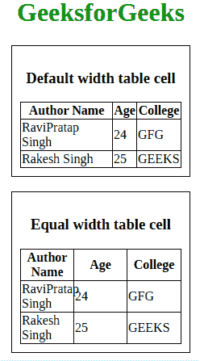
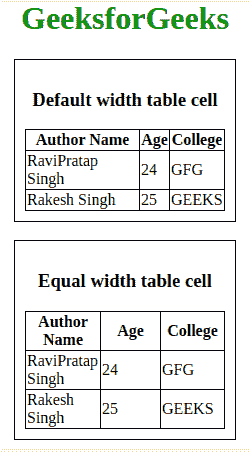

# 如何用 CSS 创建等宽表格单元格？

> 原文:[https://www . geesforgeks . org/如何使用-css/](https://www.geeksforgeeks.org/how-to-create-equal-width-table-cell-using-css/) 创建等宽表格-单元格

**[HTML 表格](https://www.geeksforgeeks.org/html-tables/)** 是使用**表格标签**与后续标签 **[tr 标签](https://www.geeksforgeeks.org/html-tr-tag/)** 的组合来创建表格中的新行。表头 **[第](https://www.geeksforgeeks.org/html-th-tag/)****[TD 标签](https://www.geeksforgeeks.org/html-td-tag/)** 用于定义表格中的单元格。但是，默认情况下，表格中的每个单元格都被设计为适合任何大小的内容，因此每个单元格都会根据其中的信息改变宽度。因此，我们学习如何将单元格的宽度固定为任意大小或值。

默认情况下，HTML 单元格大小是动态的。因此，如果要在单元格中显示的内容很大，单元格的大小会根据其中的内容而变化。然而，在某些情况下，为了保持一致性和美观，需要固定的单元尺寸。

有几种方法可以固定 HTML 表格中的单元格大小。

**[使用 CSS 表格-布局属性:](https://www.geeksforgeeks.org/css-table-layout-property/)** 这个属性应该用于改变表格的布局特征。默认情况下，表格布局值为自动。这意味着单元格大小会根据其中的内容而变化，如果我们更改单元格大小以修复这种影响。通过将该值更改为固定值，表格布局也就固定了。其他行中的单元格不影响列宽。如果第一行没有宽度，则为列宽。无论单元格内的内容如何，表格中的列宽都是相等的。

以下示例说明了上述方法:

*   **例:**

    ```html
    <!DOCTYPE html>
    <html>

    <head>
        <title>table-layout property</title>
        <style>
            table {
                border-collapse: collapse;
                border: 1px solid black;
            }

            th,
            td {
                border: 1px solid black;
            }

            table#table1 {
                table-layout: auto;
                width: 200px;
            }

            /* Equal width table cell */
            table#table2 {
                table-layout: fixed;
                width: 200px;
            }

            div {
                max-width: 200px;
                padding: 10px;
                border: 1px solid black;
            }

            h1 {
                color: green;
            }
        </style>
    </head>

    <body>
        <center>
            <h1>GeeksforGeeks</h1>
            <div>
                <h3>Default width table cell</h3>
                <table id="table1">
                    <tr>
                        <th>Author Name</th>
                        <th>Age</th>
                        <th>College</th>
                    </tr>
                    <tr>
                        <td>RaviPratap Singh</td>
                        <td>24</td>
                        <td>GFG</td>
                    </tr>
                    <tr>
                        <td>Rakesh Singh</td>
                        <td>25</td>
                        <td>GEEKS</td>
                    </tr>
                </table>
            </div><br>
            <div>
                <h3>Equal width table cell</h3>
                <table id="table2">
                    <tr>
                        <th>Author Name</th>
                        <th>Age</th>
                        <th>College</th>
                    </tr>
                    <tr>
                        <td>RaviPratap Singh</td>
                        <td>24</td>
                        <td>GFG</td>
                    </tr>
                    <tr>
                        <td>Rakesh Singh</td>
                        <td>25</td>
                        <td>GEEKS</td>
                    </tr>
                </table>
            </div>
        </center>
    </body>

    </html>
    ```

*   **输出:**
    

**[使用 CSS 宽度属性](https://www.geeksforgeeks.org/css-height-and-width/) :** 通过使用这个属性，我们可以定义每个单元格的宽度值。如果我们将值设置为等百分比单位，那么每个单元格的宽度将是相等的，每次窗口大小都无关紧要。

*   **例:**

    ```html
    <!DOCTYPE html>
    <html>

    <head>
        <title>table-layout property</title>
        <style>
            table {
                border-collapse: collapse;
                border: 1px solid black;
            }

            th,
            td {
                border: 1px solid black;

            }

            table#table2 td {
                width: 33%;
            }

            div {
                max-width: 200px;
                padding: 10px;
                border: 1px solid black;
            }

            h1 {
                color: green;
            }
        </style>
    </head>

    <body>
        <center>
            <h1>GeeksforGeeks</h1>
            <div>
                <h3>Default width table cell</h3>
                <table id="table1">
                    <tr>
                        <th>Author Name</th>
                        <th>Age</th>
                        <th>College</th>
                    </tr>
                    <tr>
                        <td>RaviPratap Singh</td>
                        <td>24</td>
                        <td>GFG</td>
                    </tr>
                    <tr>
                        <td>Rakesh Singh</td>
                        <td>25</td>
                        <td>GEEKS</td>
                    </tr>
                </table>
            </div><br>
            <div>
                <h3>Equal width table cell</h3>
                <table id="table2">
                    <tr>
                        <th>Author Name</th>
                        <th>Age</th>
                        <th>College</th>
                    </tr>
                    <tr>
                        <td>RaviPratap Singh</td>
                        <td>24</td>
                        <td>GFG</td>
                    </tr>
                    <tr>
                        <td>Rakesh Singh</td>
                        <td>25</td>
                        <td>GEEKS</td>
                    </tr>
                </table>
            </div>
        </center>
    </body>

    </html>
    ```

*   **输出:** 