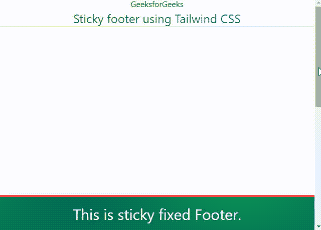

# 如何使用 Tailwind CSS 在底部创建固定/粘性页脚？

> 原文:[https://www . geeksforgeeks . org/如何使用 tailwind-css 创建底部固定粘性页脚/](https://www.geeksforgeeks.org/how-to-create-fixed-sticky-footer-on-the-bottom-using-tailwind-css/)

在本文中，我们将使用 Tailwind CSS 在底部创建一个固定/粘性页脚。[**tailswind CSS**](https://www.geeksforgeeks.org/css-tailwind-introduction/)是一个高度可定制的、实用优先的 CSS 框架，我们可以从这个框架中使用实用类来构建任何设计。使用 Tailwind CSS，我们可以通过简单地添加类来创建一个设计。

**安装:**

**方法 1:通过 npm** 安装顺风

*   **第一步:**

    ```css
    npm init -y
    ```

*   **第二步:**

    ```css
    npm install tailwindcss
    ```

*   **第三步:**现在我们必须通过使用@tailwind 指令将 Tailwind 的基础、组件和实用程序样式注入到我们的 CSS 文件中，从而将 tailwind 添加到我们的 CSS 中。

    ```css
    @tailwind base;  
    @tailwind components;  
    @tailwind utilities;
    ```

*   **步骤 4:** 这是一个可选步骤，用于创建顺风配置文件。

    ```css
    npx tailwindcss init 
    ```

*   **第五步:**

    ```css
    npx tailwindcss build styles.css -o output.css  
    ```

**方法二:通过 CDN 使用顺风**

> <link href="”https://unpkg.com/tailwindcss@^2/dist/tailwind.min.css”" rel="”stylesheet”">

**示例:**在以下示例中，使用了以下类。

类别 *bg-{color}* 用于元素的背景颜色。同样的， *p-{size}* 用于元素的填充， *text-{size}* 用于文本的字体大小， *text-center* 用于将文本向中心对齐， *text-{color}* 用于文本的字体颜色， *border-b-{width}* 用于底部的边框，*border-t【T13 *固定*是针对元素的固定位置， *inset-x-0* 是元素的左右属性， *bottom-0* 是针对bottom 属性。*

## 超文本标记语言

```css
<!DOCTYPE html>
<html>
  <head>
    <meta charset="UTF-8" />
    <link href=
"https://unpkg.com/tailwindcss@^2/dist/tailwind.min.css"
          rel="stylesheet"/>
  </head>
  <body style="height: 1000px">
    <h1 style="color: green; 
               text-align: center">
        GeeksforGeeks
    </h1>
    <header class="text-2xl text-center 
                   text-green-800 border-b-2 
                   border-grey-500">
      Sticky footer using Tailwind CSS
    </header>
    <div>
      <p class="p-2 w-9/12">

      </p>
    </div>
    <footer
      class="bg-green-700
             text-3xl text-white text-center
             border-t-4 border-red-500
             fixed
             inset-x-0
             bottom-0
             p-4">
      This is sticky fixed Footer.
    </footer>
  </body>
</html>
```

**输出:**

