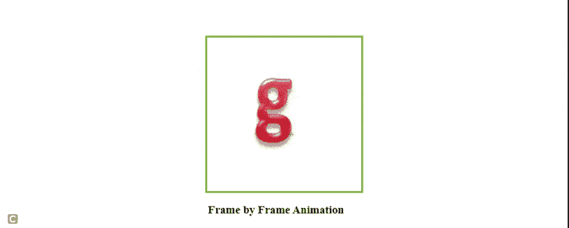

# 如何使用 CSS 和 JavaScript 创建逐帧动画？

> 原文:[https://www . geesforgeks . org/如何使用 css 和 javascript 逐帧创建动画/](https://www.geeksforgeeks.org/how-to-create-frame-by-frame-animation-using-css-and-javascript/)

逐帧动画是一种技术，其中一组图像以特定的顺序一个接一个地显示，在两个连续图像之间保持固定的时间间隔间隙，以使眼睛产生运动错觉。现在，从更技术性的角度来说，我们可以说逐帧动画是一种技术，不同的帧一个接一个地出现，在不同的帧中保持固定的时间间隔间隙，以制造运动的错觉。

我们可以使用 JavaScript[**setInterval()**](https://www.geeksforgeeks.org/java-script-settimeout-setinterval-method/)方法来创建逐帧动画。**设置间隔()**方法用于在每个给定的时间间隔重复特定的功能，因此它可以在帧集合上的逐帧动画中使用，以便它们之间看起来有固定的时间间隔间隙。

**语法:**

```html
setInterval(function, milliseconds);
```

**参数:**

*   **功能:**必须执行的功能。
*   **毫秒:**表示每帧之间时间间隔的长度，单位为毫秒。

**示例:**

## 超文本标记语言

```html
<!DOCTYPE html>
<html>

<head>
    <style>
        img {
            height: 250px;
            width: 250px;
        }

        .center {
            position: absolute;
            top: 50%;
            left: 50%;
            transform: translate(-50%, -50%);
            width: 250px;
            height: 250px;
            border: 3px solid #73AD21;
            padding: 2px;
        }
    </style>
</head>

<body>
    <script>
        var images = new Array()
        images = [
"https://media.geeksforgeeks.org/wp-content/uploads/20210721215006/frame1.PNG",
"https://media.geeksforgeeks.org/wp-content/uploads/20210721215014/frame2-200x190.PNG",
"https://media.geeksforgeeks.org/wp-content/uploads/20210721215021/frame3-200x182.PNG"
        ];

        setInterval("Animate()", 400);
        var x = 0;

        function Animate() {
            document.getElementById("img").src = images[x]
            x++;
            if (images.length == x) {
                x = 0;
            }
        }
    </script>

    <div class="center">
        

        <h3>Frame by Frame Animation</h3>
    </div>
</body>

</html>
```

**输出:**



帧动画