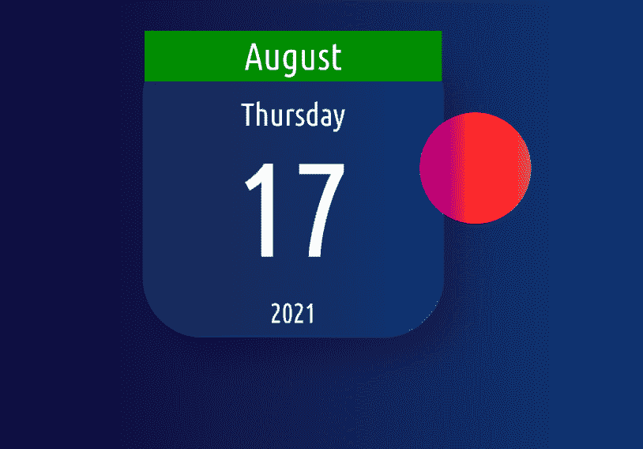

# 如何使用 CSS 创建 Glassmorphism 日历？

> 原文:[https://www . geesforgeks . org/how-create-glassmorphism-calendar-using-CSS/](https://www.geeksforgeeks.org/how-to-create-glassmorphism-calendar-using-css/)

在本文中，我们将看到如何在 CSS 中使用 glassmorphism 效果创建日历&将通过示例了解其实现。使用 [Glassmorphism UI 设计](https://www.geeksforgeeks.org/glassmorphismui-animation/)可以轻松创建 [**Glassmorphism**](https://www.geeksforgeeks.org/glassmorphism-card-hover-effect/) 日历，这是设计领域最新的新兴趋势。这是一种为任何网页设计网页元素样式并提供 3D 和玻璃效果的现代方式。要创建任何 Glassmorphism 日历，您只需要遵循本文下面给出的基本步骤。

**注意:**为了创造一个玻璃般的容器，你只需要记住 3 件事。

1.  不透明度几乎为零的白色背景颜色。
2.  低不透明度和高模糊半径的黑色阴影。
3.  使用[背景滤镜属性**在玻璃后面添加模糊效果。**](https://www.geeksforgeeks.org/css-backdrop-filter-property/)

**方法:**按照以下步骤使用 CSS 创建 Glassmorphism 日历。

*   创建一个日历的基本结构，比如创建一个高度为 400 像素、宽度为 400 像素的日历容器 div。
*   为背景创建渐变图像。
*   将日、月、年、日放入日历容器的一列中
*   您可以添加一些形状，如圆形，您可以在上面放置虚拟玻璃日历，使其看起来像是放置在玻璃下面的形状。
*   为日历和日历正文添加低不透明度的白色背景色。
*   增加一个[框影](https://www.geeksforgeeks.org/css-box-shadow-property/)，会给玻璃增加一个 3d 效果。
*   添加低不透明度和大模糊黑色阴影。

**示例:**以下是使用上述步骤实现 Glassmorphism Calendar 的完整代码。

## 超文本标记语言

```css
<!DOCTYPE html>
<html>

<head>
    <style>
    body {
        min-height: 100vh;
        display: flex;
        justify-content: center;
        align-items: center;
        background: linear-gradient( to right, #000428, #004e92);
    }

    .calendar {
        position: relative;
        width: 260px;
    }

    .calendar .calendar-body {
        display: flex;
        justify-content: center;
        align-items: center;
        flex-direction: column;
        font-size: 30px;
        transform: translate(-50%, -50%);
        width: 400px;
        height: 400px;
        background: rgba(255, 255, 255, 0.1);
        border: 2px solid rgba(255, 255, 255, 0.1);
        box-shadow: 30px 30px 40px rgba(0, 0, 0, 0.2);
        border-radius: 80px;
        backdrop-filter: blur(10px);
    }

    .circle {
        width: 150px;
        height: 150px;
        border-radius: 50%;
        background: linear-gradient(to right, #833ab4, #fd1d1d, #fcb045);
        position: relative;
        left: 170px;
        top: 50px;
    }

    .month {
        color: #fff;
        background: green;
        width: 100%;
        font-size: 1.7em;
        text-align: center;
        padding: 5px 0;
    }

    .day {
        color: #fff;
        font-size: 1.4em;
        margin-top: 20px;
    }

    .date {
        color: #fff;
        font-size: 6em;
        margin-bottom: 20px;
    }

    .year {
        color: #fff;
        font-size: 1.2em;
        margin-bottom: 20px;
    }
    </style>
</head>

<body>
    <div class="calendar">
        <div class="circle"></div>
        <div class="calendar-body">
             <span class="month">August</span>
             <span class="day">Thursday</span> 
             <span class="date">17</span> 
             <span class="year">2021</span> 
        </div>
    </div>
</body>

</html>
```

**输出:**



**支持的浏览器:**

*   谷歌 Chrome
*   微软边缘
*   火狐浏览器
*   歌剧
*   旅行队