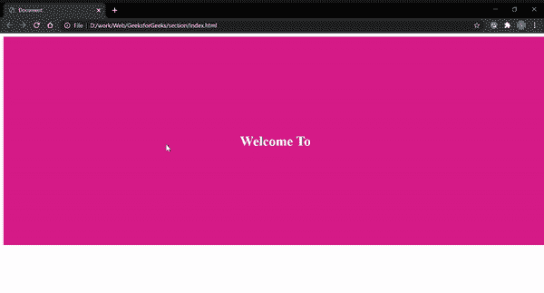

# 如何使用 CSS 创建水平滚动区？

> 原文:[https://www . geesforgeks . org/如何使用-css/](https://www.geeksforgeeks.org/how-to-create-horizontal-scrollable-sections-using-css/) 创建水平可滚动部分

在本文中，我们将看到如何使用 CSS 创建一个水平的可滚动部分。HTML 代码用于创建各部分的基本结构，CSS 代码用于设置样式，

**HTML 代码:**在本节中，我们将创建我们的部分的结构。

**步骤:**

*   用类内容创建一个 div 元素。
*   在我们的内容分区中，创建另一个包含类分区的四个分区。
*   给每个分区四个不同的 id。
*   在每个 div 中包含一个带有适当标题的标题标签。

## 超文本标记语言

```css
<!DOCTYPE html>
<html lang="en">

<body>

    <!-- Main container with class content -->
    <div class="content">

        <!-- Four sections for our code -->
        <div class="section" id="one">

            <!-- Heading tag -->
            <h1>Welcome To</h1>
        </div>
        <div class="section" id="two">
            <h1>Geeks</h1>
        </div>
        <div class="section" id="three">
            <h1>For</h1>
        </div>
        <div class="section" id="four">
            <h1>Geeks</h1>
        </div>
    </div>
</body>
</html>
```

**CSS:** 我们将使用 CSS 给我们的部分一些结构。

## 超文本标记语言

```css
<style>
    /* Adding color to first section */
    #one{
        background-color: #E6358B;
    }

    /* Adding color to second section */
    #two{
        background-color: #22A2AF;
    }

    /* Adding color to third section */
    #three{
        background-color: #7CEC9F;
    }

    /* Adding color to four section */
    #four{
        background-color: #D8A928;
    }

    /* General styling to our main section */
    .content{
        width: 100vw;
        height: 80vh;
        display: flex;
        align-items: center;
        flex-wrap: nowrap;
    }

    /* Styling to each individual section */
    .section{
        width: 100%;
        height: 100%;
        flex: 0 0 auto;
        display: flex;
        align-items: center;
        justify-content: center;
        color: #ffffff;
    }
    /* For hiding scroll bar */
    ::-webkit-scrollbar{
        display: none;
    }
</style>
```

**完整代码:**

## 超文本标记语言

```css
<!DOCTYPE html>
<html lang="en">

<head>
    <style>

        /* Adding color to first section */
        #one {
            background-color: #E6358B;
        }

        /* Adding color to second section */
        #two {
            background-color: #22A2AF;
        }

        /* Adding color to third section */
        #three {
            background-color: #7CEC9F;
        }

        /* Adding color to four section */
        #four {
            background-color: #D8A928;
        }

        /* General styling to our main section */
        .content {
            width: 100vw;
            height: 80vh;
            display: flex;
            align-items: center;
            flex-wrap: nowrap;
        }

        /* Styling to each individual section */
        .section {
            width: 100%;
            height: 100%;
            flex: 0 0 auto;
            display: flex;
            align-items: center;
            justify-content: center;
            color: #ffffff;
        }

        /* For hiding scoll bar */
         ::-webkit-scrollbar {
            display: none;
        }
    </style>
</head>

<body>
    <!-- Main container with class content -->
    <div class="content">

        <!-- Four sections for our code -->
        <div class="section" id="one">

            <!-- Heading tag -->
            <h1>Welcome To</h1>
        </div>

        <div class="section" id="two">
            <h1>Geeks</h1>
        </div>

        <div class="section" id="three">
            <h1>For</h1>
        </div>

        <div class="section" id="four">
            <h1>Geeks</h1>
        </div>
    </div>
</body>

</html>
```

**输出:**

