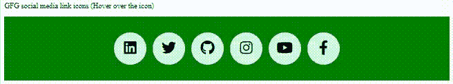

# 如何使用 CSS 创建图标悬停效果？

> 原文:[https://www . geesforgeks . org/如何创建-图标-悬停-效果-使用-css/](https://www.geeksforgeeks.org/how-to-create-icon-hover-effect-using-css/)

[**CSS:悬停选择器:**](https://www.geeksforgeeks.org/css-hover-selector/)***:悬停*选择器(或 CSS 伪类)在用户使用定点设备与元素交互时匹配。它通常在用户用光标(鼠标指针)悬停在元素上时触发**。****

****进场:****

*   ****1:** 当鼠标光标悬停时，所有锚点标签都以 CSS 声明(在大括号内)为目标。**

     ****语法:**

    ```html
    a:hover {
        css declarations;
    }
    ```** 
*   ****2:** 带有类名“图标”的标签在鼠标光标悬停时，其背景颜色将变为蓝色。**

    ****语法:****

    ```html
    .icon:hover {
        background-color: blue;
    } 
    ```

*   ****3:**ID 为“target”的目标元素在悬停时会转换为 1.5 的比例。参考 [CSS 量表](https://www.geeksforgeeks.org/css-scale-function/)**

    ****语法:****

    ```html
    #target:hover {
        transform: scale(1.5);
    }
    ```

**为了让我们的悬停更加朗朗上口和装饰性，我们还可以在其中添加 [CSS 过渡](https://www.geeksforgeeks.org/css-transitions/)。**

****示例:**我们已经使用了*:悬停*选择器和各种 CSS 的组合在社交媒体图标上创建了悬停效果。这个项目一定会帮助你更深层次地理解悬停效果。**

## **超文本标记语言**

```html
<!DOCTYPE html>
<html lang="en" dir="ltr">

<head>
    <meta charset="utf-8">
    <script src=
"https://kit.fontawesome.com/457a315592.js" 
        crossorigin="anonymous">
    </script>

    <style>
        .container {
            background-color: green;
            height: 20vh;
            display: flex;
            justify-content: center;
            align-items: center;
        }

        .link {
            height: 70px;
            width: 70px;
            background-color: #caf7e3;
            border-radius: 35px;
            text-align: center;
            margin: 7px;
            line-height: 80px;
        }

        a i {
            transition: all 0.3s linear;
        }

        a:hover i {
            transform: scale(1.5);
        }

        .youtube:hover {
            color: red;
        }

        .facebook:hover {
            color: blue;
        }

        .instagram:hover {
            color: #e11d74;
        }

        .twitter:hover {
            color: #00adb5;
        }

        .github:hover {
            color: black;
        }

        .linkedin:hover {
            color: #04009a;
        }
    </style>
</head>

<body>
    <p>GFG social media link icons (Hover over the icon)</p>

    <div class="container">
        <a class="link linkedin">
            <i class="fab fa-2x fa-linkedin"></i>
        </a>
        <a class="link twitter">
            <i class="fab fa-2x fa-twitter"></i>
        </a>
        <a class="link github">
            <i class="fab fa-2x fa-github"></i>
        </a>
        <a class="link instagram">
            <i class="fab fa-2x fa-instagram"></i>
        </a>
        <a class="link youtube">
            <i class="fab fa-2x fa-youtube"></i>
        </a>
        <a class="link facebook">
            <i class="fab fa-2x fa-facebook-f"></i>
        </a>
    </div>
</body>

</html>
```

****输出:****

****