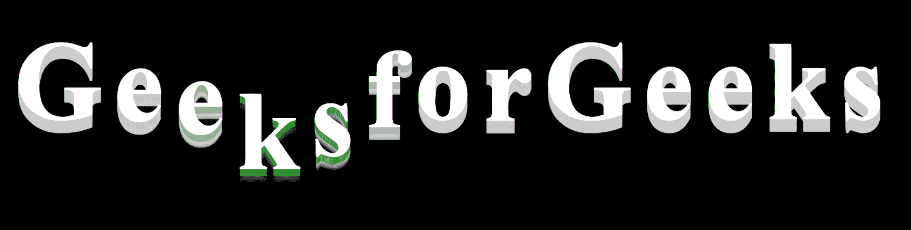
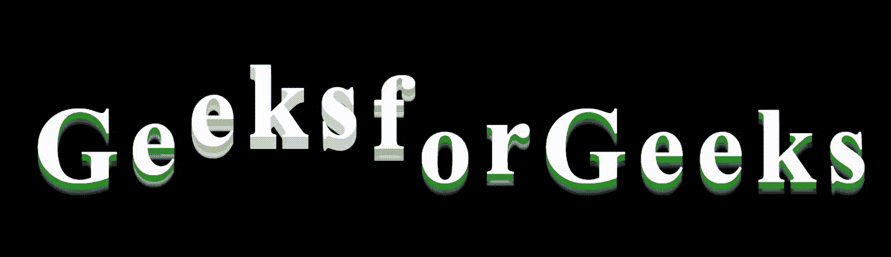

# 如何使用 CSS 创建跳跃文字 3D 动画效果？

> 原文:[https://www . geesforgeks . org/how-create-jumping-text-3d-animation-effect-use-CSS/](https://www.geeksforgeeks.org/how-to-create-jumping-text-3d-animation-effect-using-css/)

在本文中，您将学习使用简单的 HTML 和 CSS 实现**跳跃文本**动画效果。HTML 用于创建页面的结构，CSS 用于设置样式。



**HTML 代码:**在本节中，我们将设计身体的基本结构。

```html
<!DOCTYPE html>
<html lang="en">

<head>
    <meta charset="UTF-8">
    <meta name="viewport" content=
      "width=device-width, initial-scale=1.0">
    <title>Text Jumping effect</title>
    <link rel="stylesheet" href="style.css">
</head>

<body>
    <h1>
        <span>G</span>
        <span>e</span>
        <span>e</span>
        <span>k</span>
        <span>s</span>
        <span>f</span>
        <span>o</span>
        <span>r</span>
        <span>G</span>
        <span>e</span>
        <span>e</span>
        <span>k</span>
        <span>s</span>
    </h1>
</body>

</html>
```

**CSS 代码:**在本节中，我们将使用一些 CSS 属性来设计**跳转文本**。

CSS *文本-阴影*属性适用于为文本创建阴影。它接受由逗号分隔的阴影列表。该列表将应用于文本以进行装饰。元素的 X 和 Y 偏移的某种组合描述了每个阴影。我们使用*@关键帧*作为动画代码。动画是通过从一组 CSS 逐渐变化到另一组 CSS 来创建的。所有样式的变化都以百分比的形式发生，或者使用关键字“从”和“到”发生样式变化，这与 0%和 100%相同。CSS 的设置可以多次更改。

**CSS 代码:**

```html
<style>
    html, body {
        width: 100%;
        height: 100%;
        background: black;
        -webkit-font-smoothing: antialiased;
        display: flex;
        justify-content: center;
        align-items: center;
    }

    h1 {
        height: 100px;
    }

    h1 span {
        position: relative;
        top: 20px;
        display: inline-block;
        animation: bounce .3s ease infinite alternate;
        font-family: 'Titan One'cursive;
        font-size: 80px;
        color: #fff;
        text-shadow: 0 1px 0 green,
            0 2px 0 green,
            0 3px 0 green,
            0 4px 0 green,
            0 5px 0 green,
            0 6px 0 transparent,
            0 7px 0 transparent,
            0 8px 0 transparent,
            0 9px 0 transparent,
            0 10px 10px rgba(0, 0, 0, 0.4);
    }

    h1 span:nth-child(2) {
        animation-delay: .1s;
    }

    h1 span:nth-child(3) {
        animation-delay: .2s;
    }

    h1 span:nth-child(4) {
        animation-delay: .3s;
    }

    h1 span:nth-child(5) {
        animation-delay: .4s;
    }

    h1 span:nth-child(6) {
        animation-delay: .5s;
    }

    h1 span:nth-child(7) {
        animation-delay: .6s;
    }

    h1 span:nth-child(8) {
        animation-delay: .7s;
    }

    @keyframes bounce {
        100% {
            top: -20px;
            text-shadow: 0 1px 0 #CCC,
                0 2px 0 #CCC,
                0 3px 0 #CCC,
                0 4px 0 #CCC,
                0 5px 0 #CCC,
                0 6px 0 #CCC,
                0 7px 0 #CCC,
                0 8px 0 #CCC,
                0 9px 0 #CCC,
                0 50px 25px rgba(0, 0, 0, 0.2);
        }
    }
</style>
```

**完整代码:**是以上两个代码段的组合。

```html
<!DOCTYPE html>
<html lang="en">

<head>
    <meta charset="UTF-8">
    <meta name="viewport" content=
        "width=device-width, initial-scale=1.0">

    <title>Text Jumping effect</title>

    <style>
        html, body {
            width: 100%;
            height: 100%;
            background: black;
            -webkit-font-smoothing: antialiased;
            display: flex;
            justify-content: center;
            align-items: center;
        }

        h1 {
            height: 100px;
        }

        h1 span {
            position: relative;
            top: 20px;
            display: inline-block;
            animation: bounce .3s ease infinite alternate;
            font-family: 'Titan One'cursive;
            font-size: 80px;
            color: #fff;
            text-shadow: 0 1px 0 green,
                0 2px 0 green,
                0 3px 0 green,
                0 4px 0 green,
                0 5px 0 green,
                0 6px 0 transparent,
                0 7px 0 transparent,
                0 8px 0 transparent,
                0 9px 0 transparent,
                0 10px 10px rgba(0, 0, 0, 0.4);
        }

        h1 span:nth-child(2) {
            animation-delay: .1s;
        }

        h1 span:nth-child(3) {
            animation-delay: .2s;
        }

        h1 span:nth-child(4) {
            animation-delay: .3s;
        }

        h1 span:nth-child(5) {
            animation-delay: .4s;
        }

        h1 span:nth-child(6) {
            animation-delay: .5s;
        }

        h1 span:nth-child(7) {
            animation-delay: .6s;
        }

        h1 span:nth-child(8) {
            animation-delay: .7s;
        }

        @keyframes bounce {
            100% {
                top: -20px;
                text-shadow: 0 1px 0 #CCC,
                    0 2px 0 #CCC,
                    0 3px 0 #CCC,
                    0 4px 0 #CCC,
                    0 5px 0 #CCC,
                    0 6px 0 #CCC,
                    0 7px 0 #CCC,
                    0 8px 0 #CCC,
                    0 9px 0 #CCC,
                    0 50px 25px rgba(0, 0, 0, 0.2);
            }
        }
    </style>
</head>

<body>
    <h1>
        <span>G</span>
        <span>e</span>
        <span>e</span>
        <span>k</span>
        <span>s</span>
        <span>f</span>
        <span>o</span>
        <span>r</span>
        <span>G</span>
        <span>e</span>
        <span>e</span>
        <span>k</span>
        <span>s</span>
    </h1>
</body>

</html>
```

**输出:**
