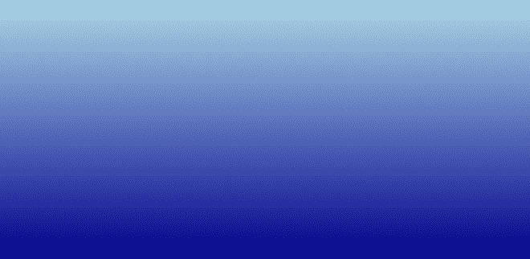
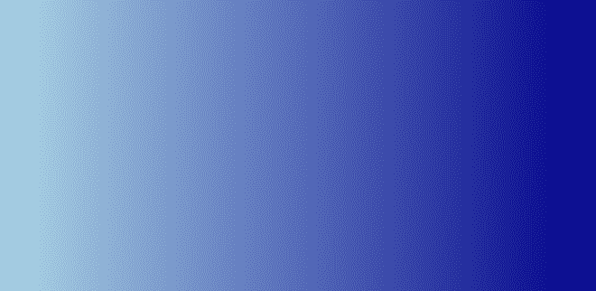
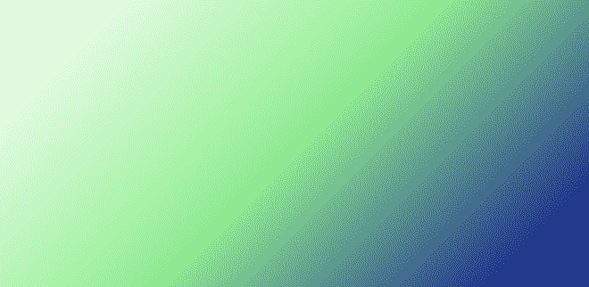
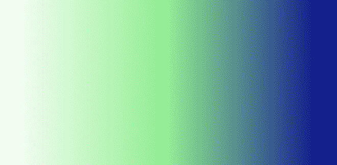
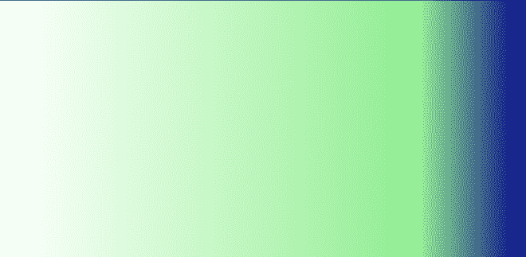

# 如何使用 CSS 创建线性渐变背景？

> 原文:[https://www . geesforgeks . org/如何创建-线性-渐变-背景-使用-css/](https://www.geeksforgeeks.org/how-to-create-linear-gradient-background-using-css/)

在 **CSS** 中，我们可以使用 [**背景色**](https://www.geeksforgeeks.org/css-background-color-property/) 属性将元素的背景色设置为特定的颜色。有时候我们想在使用 [**线性渐变**](https://www.geeksforgeeks.org/css-linear-gradient-function/) 属性设置背景色的时候给元素增加更多的样式。CSS **线性渐变**属性允许您显示两种或多种颜色之间的平滑过渡。

**语法:**

```css
background-image: linear-gradient(direction, color1, color2, ...);
```

**参数:**

*   **方向:**指定过渡的方向。默认值为 180deg(如果未指定)。
*   **颜色 1:** 指定第一种颜色。
*   **颜色 2:** 指定第二种颜色。

**注意:**可以指定任意多的颜色。

**例 1:**

## 超文本标记语言

```css
<!DOCTYPE html>
<html>

<head>
    <style>
        /* Remove the default padding and 
           margin of all HTML tags */
        * {
            margin: 0;
            padding: 0;
        }

        /* Implementation of linear-gradient property */
        #lin_grad {

            /* Set the height of the div to 
               the entire screen */
            height: 100vh;  

            /* linear-gradient syntax */
            background-image: linear-gradient(lightblue, darkblue); 
        }
    </style>
</head>

<body>
    <div id="lin_grad"></div>
</body>

</html>
```

**输出:**



**例 2:** 这演示了方向的设置。在上面的 HTML 代码中，只需更改头部 CSS 部分的“背景图像”属性值，如下所示。

**语法:**

```css
background-image: linear-gradient(to right, lightblue, darkblue)
```

**输出:**



**例 3:** 这演示了方向在度数上的设置。在上面的 HTML 第一段代码中，只需更改头部 CSS 部分的“背景图像”属性值，如下所示。

**语法:**

```css
background-image: linear-gradient(135deg, white, lightgreen, darkblue);
```

**输出:**



**示例 4:** 这演示了每种颜色*的位置的设置。*如果您没有指定颜色的位置，它将被放置在其前面的颜色和后面的颜色中间。下面给出的两个梯度是相等的。在上面的 HTML 第一段代码中，只需更改头部 CSS 部分的“背景图像”，如下所示。

**语法:**

```css
background-image: linear-gradient(90deg, white, lightgreen, darkblue)
background-image: linear-gradient(90deg, white 0%, 
        lightgreen 50%, darkblue 100%)
```

**输出:**



让我们改变浅绿色的%值，看看会发生什么。

**语法:**

```css
background-image: linear-gradient(90deg, white 0%, 
    lightgreen 80%, darkblue 100%)
```

**输出:**

